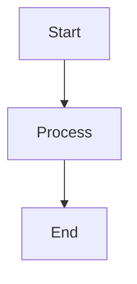

# The Cloud Explorers Documentation

This repository contains the documentation for The Cloud Explorers, built with [DocFX](https://dotnet.github.io/docfx/) and deployed to GitHub Pages.

## Building the Documentation

### Prerequisites

- [.NET SDK 8.0 or later](https://dotnet.microsoft.com/download)
- DocFX (installed automatically via dotnet tool)
- [Node.js 18+](https://nodejs.org/) (required for Mermaid diagram rendering in PDF/Word exports)
- Pandoc (for PDF/Word export)
- wkhtmltopdf (for PDF generation)

### Build Instructions

1. Install DocFX:
   ```bash
   dotnet tool install -g docfx
   ```

2. Build the documentation:
   ```bash
   docfx build docfx.json
   ```

3. Serve locally for preview:
   ```bash
   docfx serve _site
   ```

4. Open your browser to http://localhost:8080

### Generating PDF and Word Documents with Mermaid Diagrams

The build process automatically generates PDF and Word documents from markdown files that have `pdf: true` in their `toc.yml` file. Mermaid diagrams are automatically converted to images during this process.

#### Local Setup for PDF/Word Export

1. Install Pandoc:
   ```bash
   # macOS
   brew install pandoc
   
   # Ubuntu/Debian
   sudo apt-get install pandoc
   
   # Windows
   choco install pandoc
   ```

2. Install wkhtmltopdf:
   ```bash
   # macOS
   brew install wkhtmltopdf
   
   # Ubuntu/Debian
   sudo apt-get install wkhtmltopdf
   
   # Windows
   choco install wkhtmltopdf
   ```

3. Install Mermaid CLI:
   ```bash
   npm install -g @mermaid-js/mermaid-cli
   ```

4. Run the build script:
   ```bash
   # PowerShell
   ./.github/workflows/scripts/build.ps1 -MarkdownRoot docs -OutputRoot _site -DocfxConfig docfx.json
   ```

#### Using Mermaid Diagrams

To add Mermaid diagrams to your documentation, use the standard Mermaid code block syntax:

````markdown

````

The diagrams will:
- Render in the DocFX website using the Mermaid JavaScript library
- Be automatically converted to images when exporting to PDF or Word formats

## Documentation Structure

- `docs/` - Documentation markdown files
- `docs/toc.yml` - Table of contents configuration
- `docfx.json` - DocFX configuration file
- `.github/workflows/docfx.yml` - GitHub Actions workflow for deployment

## Theme

The documentation uses the [SingulinkFX](https://github.com/Singulink/SingulinkFX) theme (v3.0.4), which provides:

- Fully responsive design for all device sizes
- Clean, modern interface familiar to Microsoft .NET documentation users
- Collapsible navigation with support for 4 levels of hierarchy
- Efficient table rendering (empty columns are automatically removed)
- Search functionality
- Mobile-friendly layout
- Bootstrap Icons integration
- Configurable colors and layout options

## Contributing

To add or modify documentation:

1. Edit markdown files in the `docs/` directory
2. Update `docs/toc.yml` if adding new pages
3. Test locally using `docfx serve`
4. Commit and push changes

The site will automatically rebuild and deploy via GitHub Actions.

## License

© 2025 The Cloud Explorers. All rights reserved.
