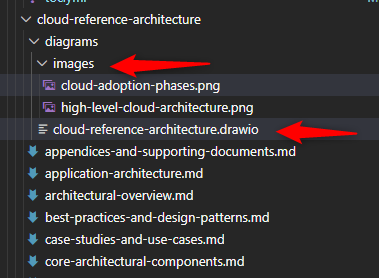
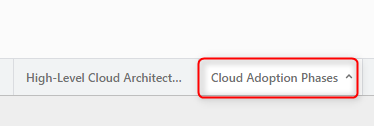
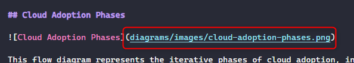

# The Cloud Explorers

This repository contains technical contributions from The Cloud Explorers, built with [DocFX](https://dotnet.github.io/docfx/) and deployed to GitHub Pages.

## Building the Documentation

### Prerequisites

- [.NET SDK 8.0 or later](https://dotnet.microsoft.com/download)
- DocFX (installed automatically via dotnet tool)

### Build Instructions

1. Install DocFX:
   ```bash
   dotnet tool install -g docfx
   ```

2. Install Draw.io Desktop (optional, for diagram export):
   - Download from [draw.io releases](https://github.com/jgraph/drawio-desktop/releases)
   - The build script will automatically detect and use it if available

3. Build the documentation using the build script:
   ```powershell
   .\.github\workflows\scripts\build.ps1
   ```
   
   This script will:
   - Export all Draw.io diagrams to PNG images
   - Build the DocFX site
   - Generate PDF and Word documents where configured

4. Serve locally for preview:
   ```bash
   docfx serve _site
   ```

5. Open your browser to http://localhost:8080

## Documentation Structure

```
docs/
├── index.md                      # Home page
├── toc.yml                       # Main table of contents
├── contribution-guide.md         # Contribution guide
├── architecture/
│   ├── README.md
│   ├── toc.yml
│   ├── cloud-center-of-excellence/
│   │   ├── introduction.md
│   │   ├── toc.yml
│   │   └── diagrams/
│   └── cloud-reference-architecture/
│       ├── introduction.md
│       ├── toc.yml
│       └── diagrams/
└── articles/
```

## Theme

The documentation uses the [SingulinkFX](https://github.com/Singulink/SingulinkFX) theme (v3.0.4), which provides:

- Fully responsive design for all device sizes
- Clean, modern interface familiar to Microsoft .NET documentation users
- Collapsible navigation with support for 4 levels of hierarchy
- Efficient table rendering (empty columns are automatically removed)
- Search functionality
- Mobile-friendly layout
- Bootstrap Icons integration
- Configurable colors and layout options

## Contributing

To add or modify documentation:

1. Edit markdown files in the `docs/` directory
2. Update `docs/toc.yml` if adding new pages
3. Test locally using `docfx serve`
4. Commit and push changes

The site will automatically rebuild and deploy via GitHub Actions.

### Adding Diagrams

To include diagrams in your documentation:

1. **Place Draw.io files** in the `diagrams` directory within your documentation section
   - Example: `docs/architecture/cloud-reference-architecture/diagrams/cloud-reference-architecture.drawio`

   

2. **Build process** - The build script automatically:
   - Detects `.drawio` files in the `diagrams` directory
   - Creates an `images` folder within the same `diagrams` directory
   - Generates PNG images from your Draw.io diagrams
   - **Image names are based on Draw.io tab names**: Each tab in your Draw.io file becomes a separate PNG image with the tab name as the filename (converted to lowercase with spaces replaced by hyphens)

   

3. **Reference in markdown** - Add the diagram to your markdown file using the relative path: `diagrams/images/<tab-name>.png`
   
   

**Example:**

For a page at `docs/architecture/cloud-reference-architecture/introduction.md`:

1. Create your diagram in `docs/architecture/cloud-reference-architecture/diagrams/cloud-reference-architecture.drawio`
2. Add a tab in Draw.io named "Cloud Adoption Phases"
3. The build script generates: `docs/architecture/cloud-reference-architecture/diagrams/images/cloud-adoption-phases.png`
4. Reference it in your markdown:

```markdown

```

**Note:** 
- The `diagrams/images/` folder is auto-generated during the build process—you don't need to create it manually
- Each tab in your Draw.io file generates a separate PNG image with the tab name as the filename

## Contributing

We welcome contributions to The Cloud Explorers! This section will guide you through the contribution process.

### Getting Started with Contributions

#### Prerequisites

Before you begin contributing, make sure you have:

- [.NET SDK 8.0 or later](https://dotnet.microsoft.com/download)
- [Git](https://git-scm.com/downloads)
- A text editor (VS Code, Visual Studio, or your preferred editor)
- DocFX tool (installed using instructions above)

#### Fork and Set Up

1. **Fork and Clone the Repository**
   ```bash
   git clone https://github.com/thecloudexplorers/thecloudexplorers.github.io.git
   cd thecloudexplorers.github.io
   ```

2. **Follow the build instructions above** to set up DocFX and preview locally

### Contribution Workflow

#### Contributing Documentation

1. **Create a Branch**
   ```bash
   git checkout -b users/your-contribution-name/your-implementation-name
   ```

2. **Make Your Changes**
   - Edit markdown files in the `docs/` directory
   - Follow the [Writing Style Guide](#writing-style-guide) below
   - Test your changes locally using `docfx serve`

3. **Update Table of Contents**
   - If adding new pages, update the relevant `toc.yml` file
   - Ensure proper hierarchy and organization

4. **Commit Your Changes**

   ```bash
   git add .
   git commit -m "Description of your changes"
   ```

5. **Push and Create Pull Request**

   ```bash
   git push origin feature/your-contribution-name
   ```

   - Create a pull request on GitHub
   - Provide a clear description of your changes
   - Reference any related issues

### Writing Style Guide

#### General Guidelines

- **Be Clear and Concise**: Write in simple, straightforward language
- **Use Active Voice**: Prefer "Configure the service" over "The service should be configured"
- **Be Consistent**: Follow existing patterns in the documentation
- **Use Proper Markdown**: Follow standard markdown syntax

#### Formatting Standards

- **Headings**: Use proper heading hierarchy (H1 for title, H2 for main sections, H3 for subsections)
- **Code Blocks**: Always specify the language for syntax highlighting
  ````markdown
  ```bash
  # Your command here
  ```
  ````
- **Lists**: Use `-` for unordered lists and `1.` for ordered lists
- **Links**: Use descriptive link text, avoid "click here"
- **Images**: Always include alt text for accessibility

#### Code Examples

- Provide complete, working examples
- Include necessary context and prerequisites
- Add comments to explain complex logic
- Test all code examples before submitting

#### Architecture Documentation

When contributing to architecture documentation:

- Start with context and business objectives
- Explain the "why" before the "how"
- Include diagrams where appropriate
- Document design decisions and trade-offs
- Reference relevant Azure Well-Architected Framework principles

#### Adding a New Section

1. Create a new folder in `docs/` or under the appropriate section
2. Add an `index.md` or `README.md` file
3. Create a `toc.yml` file for navigation
4. Update the parent `toc.yml` to include your new section

#### Table of Contents (toc.yml)

Example structure:

```yaml
- name: Section Name
  href: section-file.md
- name: Section with Children
  items:
    - name: Subsection 1
      href: subsection1.md
    - name: Subsection 2
      href: subsection2.md
```

### Review Process

#### Pull Request Guidelines

- **Title**: Use clear, descriptive titles
- **Description**: Explain what changed and why
- **Screenshots**: Include screenshots for UI/visual changes
- **Testing**: Confirm you've tested locally
- **References**: Link to related issues or discussions

#### What Reviewers Look For

- Accuracy of technical content
- Adherence to style guide
- Proper markdown formatting
- Working links and references
- Clear and understandable writing
- Appropriate diagrams and examples


#### CI/CD Pipeline

- The site automatically builds and deploys via GitHub Actions
- Workflow file: `.github/workflows/docfx.yml`
- Deployment happens on push to the `main` branch
- Check the Actions tab on GitHub for build status

### Getting Help

#### Resources

- [DocFX Documentation](https://dotnet.github.io/docfx/)
- [Markdown Guide](https://www.markdownguide.org/)
- [GitHub Markdown Syntax](https://docs.github.com/en/get-started/writing-on-github)
- [SingulinkFX Theme](https://github.com/Singulink/SingulinkFX)

#### Support

- **Issues**: Open an issue on [GitHub](https://github.com/thecloudexplorers/thecloudexplorers.github.io/issues)
- **Discussions**: Join the conversation in GitHub Discussions
- **Questions**: Tag your questions appropriately in issues

### Best Practices

#### Before Submitting

- [ ] Build and preview locally
- [ ] Check for broken links
- [ ] Verify all images display correctly
- [ ] Run spell check
- [ ] Review markdown formatting
- [ ] Ensure code examples work
- [ ] Update relevant `toc.yml` files

#### Commit Messages

Follow conventional commit format:

- `docs: Add new architecture guide`
- `fix: Correct broken links in contribution guide`
- `feat: Add new diagram for cloud adoption`
- `chore: Update dependencies`

### License

By contributing to this project, you agree that your contributions will be licensed under the same license as the project.

---

Thank you for contributing to The Cloud Explorers! Your efforts help make cloud architecture knowledge accessible to everyone.

## License

© 2025 The Cloud Explorers. All rights reserved.
