# Application Architecture

Application architecture defines how software is structured, deployed, and scaled. This section covers microservices, serverless, containers, and modern DevOps practices.

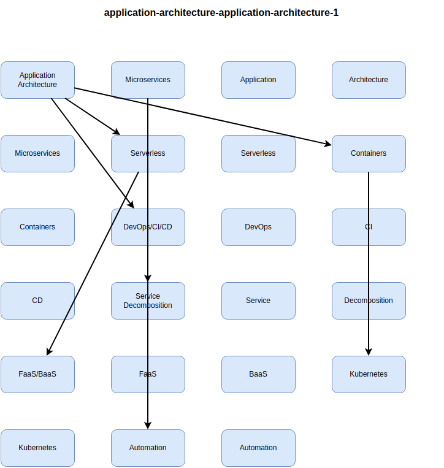


## Microservices Architecture

Microservices decompose applications into small, independent services that can be developed, deployed, and scaled independently.

### Monolithic vs Microservices

**Monolithic Architecture:**

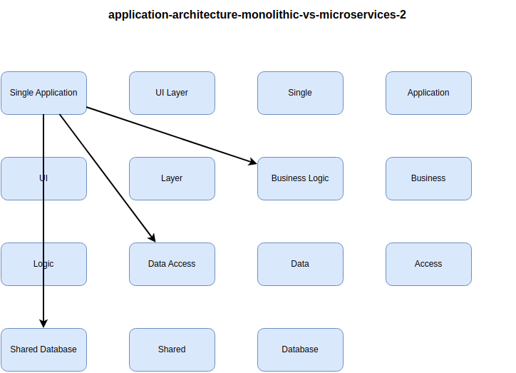


**Microservices Architecture:**

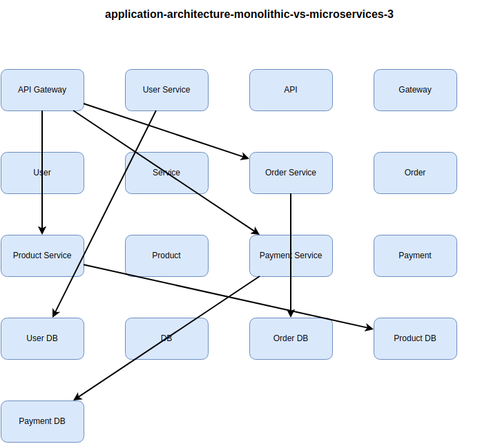


**Architecture Comparison:**

| Aspect | Monolithic | Microservices |
|--------|------------|---------------|
| **Development** | Simple, single codebase | Complex, multiple repos |
| **Deployment** | All-or-nothing | Independent deployment |
| **Scaling** | Scale entire app | Scale individual services |
| **Technology** | Single stack | Polyglot (multiple languages) |
| **Failure Impact** | Entire app fails | Isolated failures |
| **Data Management** | Shared database | Database per service |
| **Team Structure** | Centralized | Autonomous teams |
| **Use Case** | Simple apps, startups | Complex, large-scale systems |

> [!TIP]
> Start with a monolith. Migrate to microservices when team size, complexity, or scaling needs justify the added operational overhead.

### Service Decomposition Strategies

**Decomposition by Business Capability:**

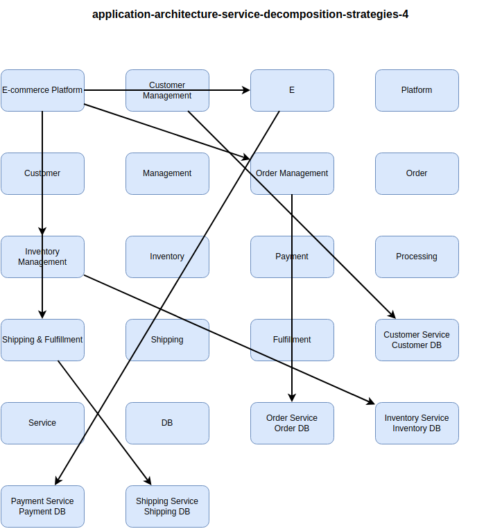


**Decomposition by Subdomain (DDD):**

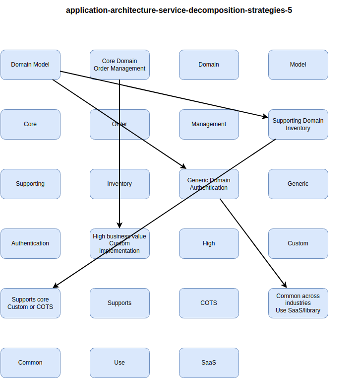


**Bounded Contexts:**

| Context | Responsibility | Data Ownership | Example Entities |
|---------|----------------|----------------|------------------|
| **Order Context** | Order lifecycle management | Orders, Order Items | Order, OrderLine, OrderStatus |
| **Customer Context** | Customer information | Customers, Addresses | Customer, Address, Contact |
| **Inventory Context** | Stock management | Products, Stock Levels | SKU, StockLevel, Warehouse |
| **Payment Context** | Payment processing | Transactions | Payment, Transaction, Invoice |

> [!IMPORTANT]
> Each microservice should own its data. Avoid shared databases - use APIs or events for cross-service data access.

### Communication Patterns

**Synchronous Communication:**

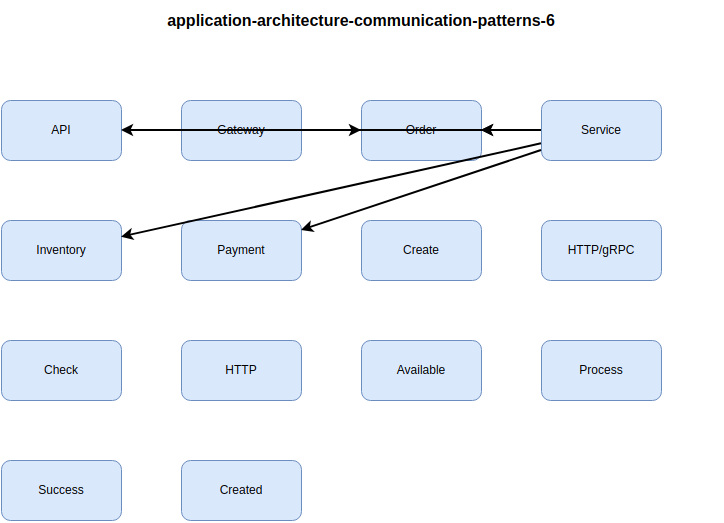


**Asynchronous Communication:**

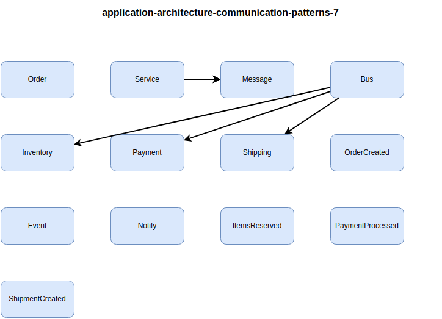


**Communication Comparison:**

| Pattern | Pros | Cons | Use Case |
|---------|------|------|----------|
| **Synchronous (REST/gRPC)** | Simple, immediate response | Coupling, cascading failures | Real-time queries |
| **Asynchronous (Events)** | Loose coupling, resilient | Eventual consistency, complexity | Background processing |
| **Hybrid** | Best of both | Mixed complexity | Most applications |

> [!NOTE]
> Use synchronous for queries (GET requests), asynchronous for commands (POST/PUT/DELETE). This aligns with CQRS principles.

### Service Mesh

Service mesh manages service-to-service communication, providing observability, security, and traffic management.

**Service Mesh Architecture:**

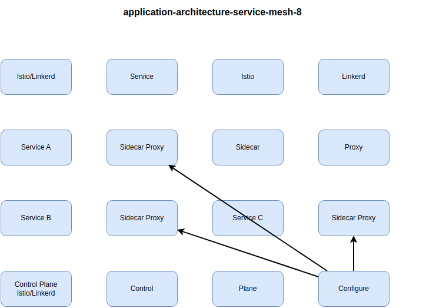


**Service Mesh Features:**

| Feature | Without Service Mesh | With Service Mesh |
|---------|---------------------|-------------------|
| **mTLS** | Manual cert management | Automatic |
| **Retry Logic** | Code in each service | Centralized configuration |
| **Circuit Breaking** | Custom implementation | Built-in |
| **Observability** | Manual instrumentation | Automatic metrics |
| **Traffic Splitting** | Load balancer config | Policy-based |
| **Rate Limiting** | Application code | Sidecar enforcement |

**Service Mesh Products:**

| Product | Type | Features | Use Case |
|---------|------|----------|----------|
| **Istio** | Full-featured | Traffic management, security, observability | Enterprise Kubernetes |
| **Linkerd** | Lightweight | Simple, fast, low overhead | Kubernetes-native |
| **Consul** | Multi-platform | Service discovery, config | Multi-cloud, VMs + K8s |
| **AWS App Mesh** | Managed | AWS integration | AWS ECS/EKS |

> [!TIP]
> Service mesh adds complexity and latency (5-10ms per hop). Only adopt when managing 10+ microservices with complex traffic patterns.

### API Gateway vs Service Mesh

**Architecture Layers:**

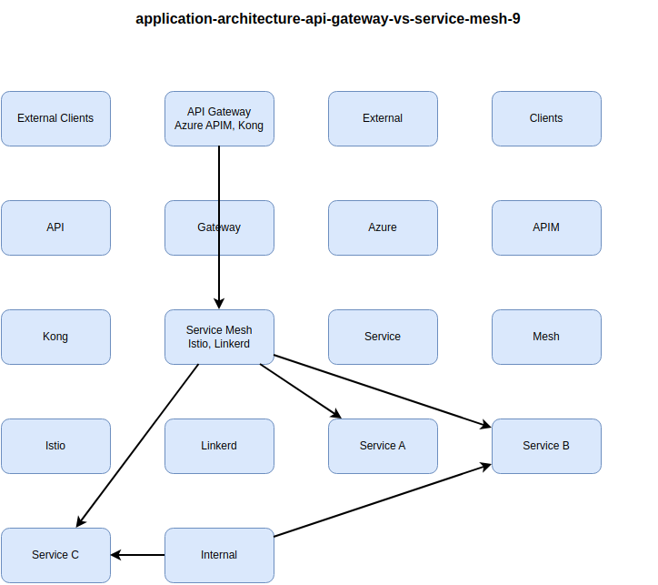


**Responsibility Comparison:**

| Responsibility | API Gateway | Service Mesh |
|----------------|-------------|--------------|
| **Location** | Edge (external traffic) | Internal (service-to-service) |
| **Authentication** | User authentication (OAuth, JWT) | Service authentication (mTLS) |
| **Rate Limiting** | Per client/API key | Per service |
| **Protocol** | HTTP/HTTPS, WebSocket | HTTP, gRPC, TCP |
| **Business Logic** | Request transformation, composition | Traffic routing only |
| **Monetization** | API subscriptions, billing | N/A |

> [!IMPORTANT]
> API Gateway and Service Mesh are complementary. Gateway handles north-south traffic (external), mesh handles east-west traffic (internal).

### Microservices Best Practices

**Design Principles:**

1. **Single Responsibility**: Each service does one thing well
2. **Loose Coupling**: Minimize dependencies between services
3. **High Cohesion**: Related functionality in same service
4. **Autonomous**: Teams can develop/deploy independently
5. **Resilient**: Design for failure (circuit breakers, retries)
6. **Observable**: Logging, metrics, distributed tracing
7. **Secure**: Zero trust, service-to-service authentication

**Anti-Patterns to Avoid:**

| Anti-Pattern | Description | Impact | Solution |
|--------------|-------------|--------|----------|
| **Distributed Monolith** | Tightly coupled microservices | No independence benefits | Proper bounded contexts |
| **Shared Database** | Multiple services, one DB | Coupling, contention | Database per service |
| **Chatty Services** | Too many inter-service calls | Latency, cascading failures | Coarser service boundaries |
| **Nano-Services** | Too fine-grained | Operational overhead | Consolidate related services |
| **God Service** | One service does everything | Single point of failure | Decompose by capability |

> [!CAUTION]
> Microservices introduce distributed system complexity (network failures, eventual consistency, debugging). Ensure benefits outweigh costs before migrating.

## Serverless Computing

Serverless enables running code without managing servers, with automatic scaling and pay-per-execution pricing.

### Function as a Service (FaaS)

**Serverless Architecture:**

-10.png)


**FaaS Platform Comparison:**

| Platform | Languages | Max Duration | Cold Start | Pricing |
|----------|-----------|--------------|------------|---------|
| **Azure Functions** | C#, JavaScript, Python, Java, PowerShell | 10 min (Consumption)<br/>Unlimited (Premium) | 1-3s | Per execution + GB-seconds |
| **AWS Lambda** | Node.js, Python, Java, C#, Go, Ruby | 15 minutes | 100ms-5s | Per request + GB-seconds |
| **Google Cloud Functions** | Node.js, Python, Go, Java | 9 minutes | 100ms-3s | Per invocation + GB-seconds |

**Azure Functions Example:**

```csharp
[FunctionName("ProcessOrder")]
public static async Task<IActionResult> Run(
    [HttpTrigger(AuthorizationLevel.Function, "post", Route = "orders")] HttpRequest req,
    [Queue("orders-processing")] IAsyncCollector<string> outputQueue,
    [CosmosDB("OrdersDB", "Orders", Connection = "CosmosDB")] IAsyncCollector<Order> ordersOut,
    ILogger log)
{
    var order = await JsonSerializer.DeserializeAsync<Order>(req.Body);
    
    // Save to Cosmos DB
    await ordersOut.AddAsync(order);
    
    // Queue for processing
    await outputQueue.AddAsync(order.Id);
    
    log.LogInformation($"Order {order.Id} created");
    
    return new OkObjectResult(new { orderId = order.Id });
}
```

**Serverless Use Cases:**

| Use Case | Trigger | Example |
|----------|---------|---------|
| **HTTP APIs** | HTTP request | REST APIs, webhooks |
| **File Processing** | Blob upload | Image resize, PDF generation |
| **Scheduled Tasks** | Timer | Daily reports, cleanup jobs |
| **Stream Processing** | Event Hub/Kafka | IoT telemetry, log processing |
| **Queue Processing** | Queue message | Async order processing |
| **Database Triggers** | Cosmos DB change feed | Data replication, search indexing |

> [!TIP]
> Serverless is ideal for event-driven, variable workloads. For consistent high traffic, containers or VMs are more cost-effective.

### Cold Start Optimization

**Cold Start Lifecycle:**

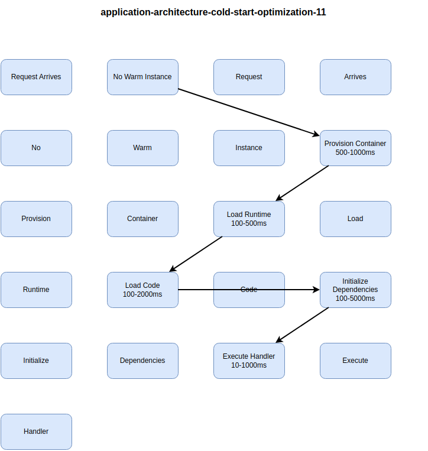


**Cold Start Mitigation:**

| Strategy | Benefit | Cost | Use Case |
|----------|---------|------|----------|
| **Provisioned Concurrency** | No cold starts | High (always-on instances) | Production APIs |
| **Reduce Package Size** | Faster load time | Dev effort | All functions |
| **Connection Pooling** | Reuse connections | Code changes | Database-heavy functions |
| **Keep Warm (Ping)** | Periodic invocation | Extra executions | Low-traffic functions |
| **Lazy Initialization** | Defer non-critical setup | Code complexity | Complex dependencies |

**Azure Functions Premium Plan:**

- Pre-warmed instances: Always ready, no cold start
- VNET integration: Private endpoints
- Unlimited duration: Long-running functions
- Cost: $60-800/month per instance (vs $0.20/million executions Consumption)

> [!NOTE]
> Cold starts primarily affect HTTP APIs. Background processing (queues, timers) tolerates cold starts better since they're asynchronous.

### Backend as a Service (BaaS)

**BaaS Components:**

-12.png)


**BaaS vs FaaS:**

| Aspect | BaaS | FaaS |
|--------|------|------|
| **Abstraction** | High (entire backend) | Medium (code execution) |
| **Control** | Limited | Full code control |
| **Complexity** | Low | Medium |
| **Flexibility** | Fixed features | Custom logic |
| **Use Case** | Mobile apps, MVPs | Custom workflows |

**Firebase Example:**

```javascript
// Client-side code directly accessing BaaS
import { initializeApp } from "firebase/app";
import { getAuth, signInWithPopup, GoogleAuthProvider } from "firebase/auth";
import { getFirestore, collection, addDoc } from "firebase/firestore";

// Authentication
const auth = getAuth();
const provider = new GoogleAuthProvider();
const result = await signInWithPopup(auth, provider);

// Database
const db = getFirestore();
await addDoc(collection(db, "orders"), {
  userId: result.user.uid,
  amount: 99.99,
  timestamp: serverTimestamp()
});
```

> [!CAUTION]
> BaaS couples your application to a specific vendor. For critical applications, evaluate vendor lock-in risks before adoption.

## Containers and Orchestration

Containers package applications with dependencies for consistent deployment across environments.

### Container Basics

**VM vs Container:**

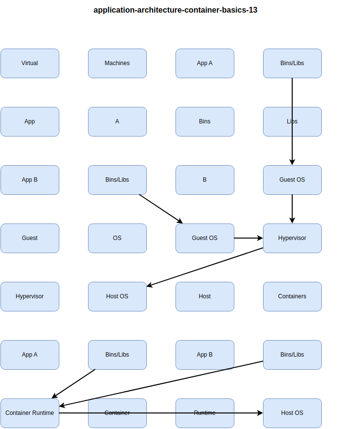


**Comparison:**

| Aspect | Virtual Machine | Container |
|--------|----------------|-----------|
| **Size** | GBs | MBs |
| **Startup** | Minutes | Seconds |
| **Isolation** | Complete (hardware) | Process-level |
| **Overhead** | High | Low |
| **Density** | 10s per host | 100s per host |
| **Use Case** | Full OS, strong isolation | Microservices, cloud-native |

**Dockerfile Example:**

```dockerfile
# Multi-stage build for smaller image
FROM mcr.microsoft.com/dotnet/sdk:8.0 AS build
WORKDIR /app
COPY *.csproj .
RUN dotnet restore
COPY . .
RUN dotnet publish -c Release -o out

FROM mcr.microsoft.com/dotnet/aspnet:8.0 AS runtime
WORKDIR /app
COPY --from=build /app/out .
EXPOSE 80
ENTRYPOINT ["dotnet", "MyApp.dll"]
```

**Container Best Practices:**

1. **Minimal Base Images**: Use alpine or distroless for smaller attack surface
2. **Multi-Stage Builds**: Separate build and runtime dependencies
3. **Immutable Images**: Never modify running containers
4. **Non-Root User**: Run as non-privileged user
5. **Single Process**: One process per container
6. **Health Checks**: Implement liveness/readiness probes
7. **Scan for Vulnerabilities**: Use Trivy, Snyk, or Azure Defender

> [!IMPORTANT]
> Never store secrets in container images. Use secret management (Azure Key Vault, AWS Secrets Manager, Kubernetes Secrets).

### Kubernetes Architecture

**Kubernetes Components:**

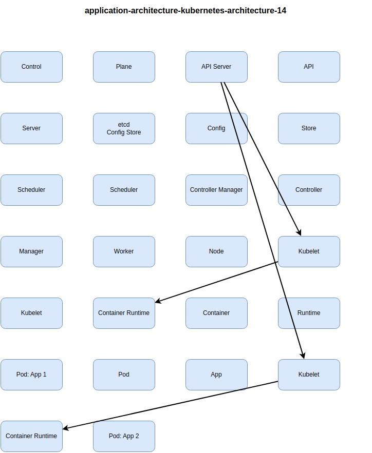


**Kubernetes Resources:**

| Resource | Purpose | Example |
|----------|---------|---------|
| **Pod** | Smallest deployable unit | 1-N containers |
| **Deployment** | Manages ReplicaSets | Stateless apps |
| **StatefulSet** | Manages stateful apps | Databases, caches |
| **Service** | Load balancing, discovery | Expose pods |
| **Ingress** | HTTP routing | External access |
| **ConfigMap** | Configuration data | App settings |
| **Secret** | Sensitive data | Passwords, keys |
| **PersistentVolumeClaim** | Storage | Database data |

**Deployment YAML:**

```yaml
apiVersion: apps/v1
kind: Deployment
metadata:
  name: webapp
spec:
  replicas: 3
  selector:
    matchLabels:
      app: webapp
  template:
    metadata:
      labels:
        app: webapp
    spec:
      containers:
      - name: webapp
        image: myregistry.azurecr.io/webapp:v1.2.3
        ports:
        - containerPort: 80
        env:
        - name: DATABASE_URL
          valueFrom:
            secretKeyRef:
              name: db-secret
              key: connection-string
        resources:
          requests:
            cpu: 100m
            memory: 128Mi
          limits:
            cpu: 500m
            memory: 512Mi
        livenessProbe:
          httpGet:
            path: /health/live
            port: 80
          initialDelaySeconds: 30
          periodSeconds: 10
        readinessProbe:
          httpGet:
            path: /health/ready
            port: 80
          initialDelaySeconds: 5
          periodSeconds: 5
---
apiVersion: v1
kind: Service
metadata:
  name: webapp-service
spec:
  type: LoadBalancer
  selector:
    app: webapp
  ports:
  - port: 80
    targetPort: 80
```

> [!NOTE]
> Always set resource requests and limits. Requests reserve resources, limits prevent resource exhaustion. Without limits, one pod can consume all node resources.

### Managed Kubernetes Services

**Service Comparison:**

| Service | Provider | Key Features | Pricing |
|---------|----------|--------------|---------|
| **Azure Kubernetes Service (AKS)** | Azure | Free control plane, Azure integration | Nodes only |
| **Amazon Elastic Kubernetes Service (EKS)** | AWS | $0.10/hour control plane, AWS integration | Control plane + nodes |
| **Google Kubernetes Engine (GKE)** | Google Cloud | Autopilot mode, multi-cluster | Control plane + nodes |
| **Red Hat OpenShift** | Multi-cloud | Enterprise features, built-in CI/CD | Subscription-based |

**AKS Features:**

- **Azure Integration**: Entra ID auth, Azure Monitor, Key Vault
- **Virtual Nodes**: Serverless burst to Azure Container Instances
- **Cluster Autoscaler**: Auto-scale node pools
- **Azure Policy**: Enforce governance policies
- **Dev Spaces**: Inner-loop development
- **Private Cluster**: API server in VNET

> [!TIP]
> Use managed Kubernetes (AKS, EKS, GKE) instead of self-hosting. Control plane management, upgrades, and security patches are complex and time-consuming.

### Helm and Package Management

**Helm Architecture:**

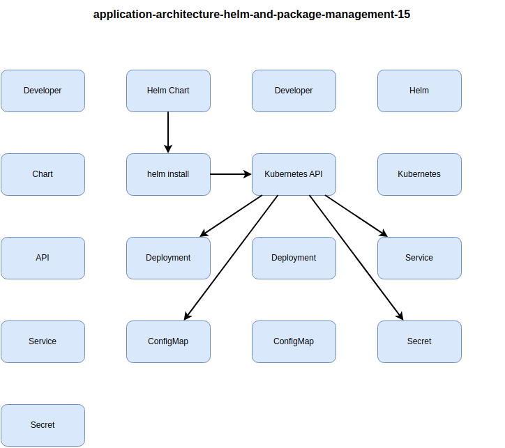


**Helm Chart Structure:**

```
mychart/
├── Chart.yaml          # Chart metadata
├── values.yaml         # Default configuration
├── templates/
│   ├── deployment.yaml
│   ├── service.yaml
│   ├── ingress.yaml
│   └── _helpers.tpl    # Template helpers
└── charts/             # Dependencies
```

**values.yaml:**

```yaml
replicaCount: 3

image:
  repository: myregistry.azurecr.io/webapp
  tag: "1.2.3"
  pullPolicy: IfNotPresent

service:
  type: LoadBalancer
  port: 80

resources:
  limits:
    cpu: 500m
    memory: 512Mi
  requests:
    cpu: 100m
    memory: 128Mi

autoscaling:
  enabled: true
  minReplicas: 3
  maxReplicas: 10
  targetCPUUtilizationPercentage: 80
```

**Helm Commands:**

```bash
# Install chart
helm install myapp ./mychart -f values-prod.yaml

# Upgrade release
helm upgrade myapp ./mychart --set image.tag=1.2.4

# Rollback to previous release
helm rollback myapp 1

# List releases
helm list

# Uninstall
helm uninstall myapp
```

> [!IMPORTANT]
> Use Helm for complex Kubernetes applications with multiple resources. For simple apps (1-2 Deployments), plain YAML manifests may be simpler.

## DevOps and Continuous Integration/Delivery (CI/CD)

DevOps combines development and operations practices to deliver software faster and more reliably.

### CI/CD Pipeline

**Pipeline Stages:**


**CI/CD Tools:**

| Tool | Type | Strengths | Use Case |
|------|------|-----------|----------|
| **Azure DevOps** | Platform | Azure integration, work items | Enterprise, Azure |
| **GitHub Actions** | CI/CD | GitHub integration, marketplace | Open source, cloud-native |
| **GitLab CI/CD** | Platform | All-in-one DevOps | Self-hosted, compliance |
| **Jenkins** | CI/CD | Flexible, plugins | Legacy systems |
| **CircleCI** | CI/CD SaaS | Docker-first, fast builds | Cloud-native apps |
| **Argo CD** | GitOps | Kubernetes-native | K8s deployments |

**GitHub Actions Example:**

```yaml
name: CI/CD Pipeline

on:
  push:
    branches: [main]
  pull_request:
    branches: [main]

jobs:
  build:
    runs-on: ubuntu-latest
    
    steps:
    - uses: actions/checkout@v3
    
    - name: Setup .NET
      uses: actions/setup-dotnet@v3
      with:
        dotnet-version: 8.0.x
    
    - name: Restore dependencies
      run: dotnet restore
    
    - name: Build
      run: dotnet build --no-restore
    
    - name: Test
      run: dotnet test --no-build --verbosity normal
    
    - name: Publish
      run: dotnet publish -c Release -o ./publish
    
    - name: Build Docker image
      run: docker build -t myapp:${{ github.sha }} .
    
    - name: Push to ACR
      run: |
        az acr login --name myregistry
        docker tag myapp:${{ github.sha }} myregistry.azurecr.io/myapp:${{ github.sha }}
        docker push myregistry.azurecr.io/myapp:${{ github.sha }}
    
    - name: Deploy to AKS
      run: |
        az aks get-credentials --resource-group myRG --name myAKS
        kubectl set image deployment/myapp myapp=myregistry.azurecr.io/myapp:${{ github.sha }}
        kubectl rollout status deployment/myapp
```

### Deployment Strategies

**Blue-Green Deployment:**

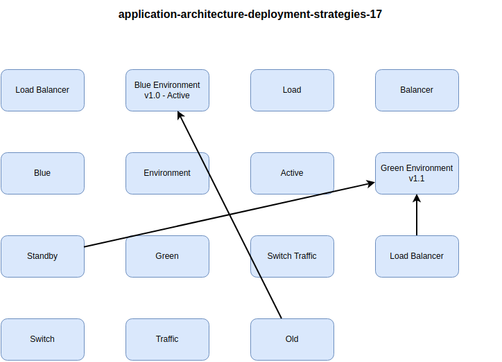


**Canary Deployment:**

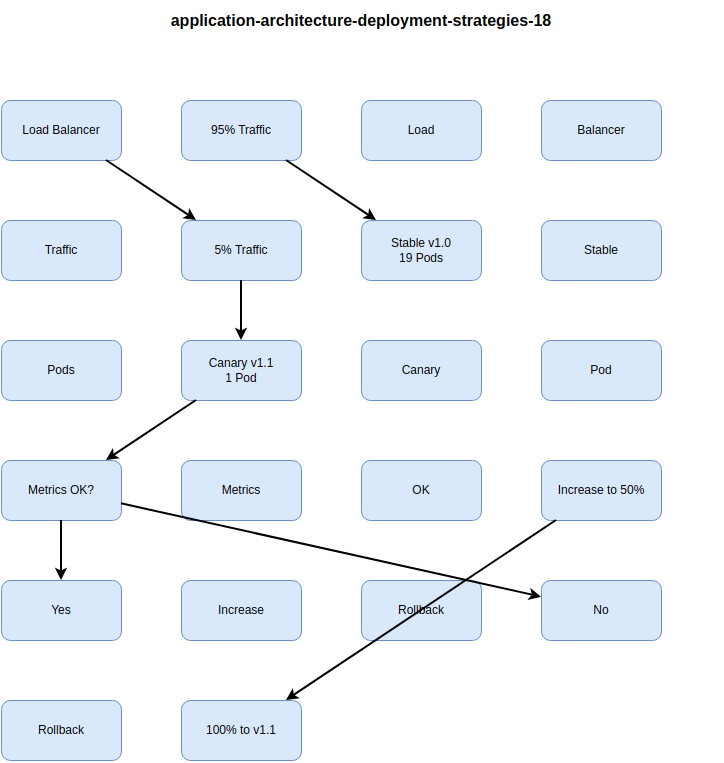


**Strategy Comparison:**

| Strategy | Rollback Speed | Resource Cost | Risk | Complexity | Use Case |
|----------|----------------|---------------|------|------------|----------|
| **Recreate** | N/A (downtime) | Low | High | Low | Dev environments |
| **Rolling** | Slow | Medium | Medium | Low | Standard deployments |
| **Blue-Green** | Instant | High (2x resources) | Low | Medium | Zero-downtime |
| **Canary** | Fast | Low | Very low | High | High-risk changes |
| **A/B Testing** | Fast | Low | Low | High | Feature experiments |

**Kubernetes Canary with Argo Rollouts:**

```yaml
apiVersion: argoproj.io/v1alpha1
kind: Rollout
metadata:
  name: webapp
spec:
  replicas: 20
  strategy:
    canary:
      steps:
      - setWeight: 5     # 5% traffic to canary
      - pause: {duration: 10m}
      - setWeight: 25
      - pause: {duration: 10m}
      - setWeight: 50
      - pause: {duration: 10m}
      - setWeight: 75
      - pause: {duration: 10m}
      analysis:
        templates:
        - templateName: error-rate
        args:
        - name: service-name
          value: webapp
  template:
    # ... pod template
```

> [!TIP]
> Use blue-green for critical applications requiring instant rollback. Use canary for gradual rollout with automated rollback based on metrics.

### Infrastructure as Code (IaC)

**IaC Benefits:**

-19.png)


**Terraform Example:**

```hcl
# Azure Kubernetes Service
resource "azurerm_kubernetes_cluster" "aks" {
  name                = "aks-production"
  location            = "East US"
  resource_group_name = azurerm_resource_group.rg.name
  dns_prefix          = "aks-prod"
  kubernetes_version  = "1.28.3"

  default_node_pool {
    name       = "default"
    node_count = 3
    vm_size    = "Standard_D4s_v3"
    
    enable_auto_scaling = true
    min_count           = 3
    max_count           = 10
  }

  identity {
    type = "SystemAssigned"
  }

  network_profile {
    network_plugin = "azure"
    network_policy = "calico"
  }

  azure_active_directory_role_based_access_control {
    managed            = true
    azure_rbac_enabled = true
  }

  tags = {
    Environment = "Production"
    ManagedBy   = "Terraform"
  }
}

# Azure Container Registry
resource "azurerm_container_registry" "acr" {
  name                = "myregistryprod"
  resource_group_name = azurerm_resource_group.rg.name
  location            = azurerm_resource_group.rg.location
  sku                 = "Premium"
  admin_enabled       = false

  georeplications {
    location = "West US"
    tags     = {}
  }
}

# Role assignment for AKS to pull from ACR
resource "azurerm_role_assignment" "aks_acr" {
  scope                = azurerm_container_registry.acr.id
  role_definition_name = "AcrPull"
  principal_id         = azurerm_kubernetes_cluster.aks.kubelet_identity[0].object_id
}
```

### Monitoring and Observability

**DORA Metrics (DevOps Research and Assessment):**

| Metric | Elite | High | Medium | Low | How to Measure |
|--------|-------|------|--------|-----|----------------|
| **Deployment Frequency** | Multiple/day | Weekly-monthly | Monthly-biannually | <Biannually | CI/CD pipeline data |
| **Lead Time for Changes** | <1 hour | 1 day-1 week | 1 week-1 month | >1 month | Commit to production |
| **Time to Restore Service** | <1 hour | <1 day | 1 day-1 week | >1 week | Incident duration |
| **Change Failure Rate** | 0-15% | 16-30% | 31-45% | >45% | Failed deployments / total |

**Application Insights Integration:**

```csharp
// ASP.NET Core
public void ConfigureServices(IServiceCollection services)
{
    services.AddApplicationInsightsTelemetry();
    services.AddApplicationInsightsTelemetryProcessor<CustomTelemetryProcessor>();
}

// Track custom metrics
telemetryClient.TrackMetric("OrdersProcessed", 1);
telemetryClient.TrackEvent("OrderPlaced", new Dictionary<string, string>
{
    { "OrderId", order.Id },
    { "Amount", order.Total.ToString() }
});

// Track dependencies
var operation = telemetryClient.StartOperation<DependencyTelemetry>("PaymentGateway");
try
{
    await paymentService.ProcessAsync(payment);
    telemetryClient.StopOperation(operation);
}
catch (Exception ex)
{
    operation.Telemetry.Success = false;
    telemetryClient.TrackException(ex);
    throw;
}
```

> [!IMPORTANT]
> Implement observability from day one. Retrofitting logging, metrics, and tracing is significantly more difficult than building it in initially.

**Real-World Example:**

A SaaS company improved DORA metrics:

- **Deployment Frequency**: From weekly to multiple times per day (CI/CD automation)
- **Lead Time**: From 2 weeks to 1 day (automated testing, feature flags)
- **MTTR**: From 4 hours to 30 minutes (improved monitoring, runbooks)
- **Change Failure Rate**: From 25% to 5% (canary deployments, automated rollback)
- **Result**: 10x faster feature delivery, improved customer satisfaction
