# Architectural Overview

## Cloud Service Models (IaaS, PaaS, SaaS)

Cloud service models define the level of control and responsibility shared between the cloud provider and the customer. Understanding these models is crucial for selecting the right services for your workloads.

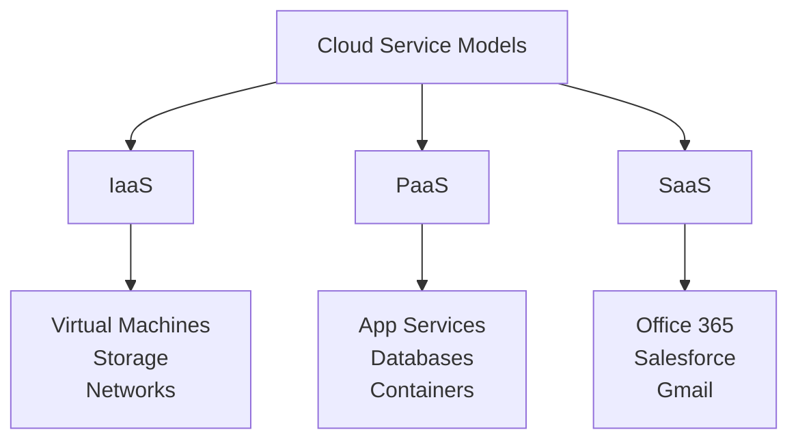

### Infrastructure as a Service (IaaS)

IaaS provides virtualized computing resources over the internet, offering the highest level of flexibility and control over IT resources.

**Key Characteristics:**
- Full control over virtual machines, storage, and networking
- Customer manages OS, middleware, runtime, and applications
- Pay-as-you-go pricing model
- Rapid scaling capabilities

**Examples:**

| Provider | Service | Use Case |
|----------|---------|----------|
| **Azure** | Virtual Machines | Hosting custom Windows/Linux workloads with full OS control |
| **AWS** | EC2 (Elastic Compute Cloud) | Running scalable compute capacity for web applications |
| **Google Cloud** | Compute Engine | High-performance VMs for data analytics and ML workloads |
| **Azure** | Blob Storage | Object storage for unstructured data, backups, and archives |
| **AWS** | S3 (Simple Storage Service) | Scalable object storage for data lakes and content distribution |

**Real-World Scenario:**
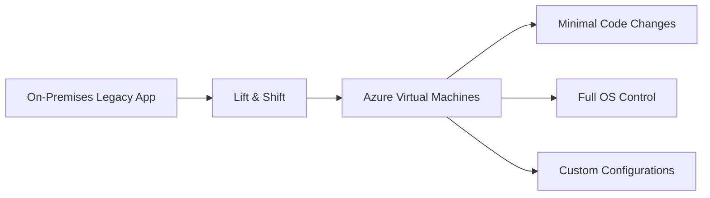

A financial services company migrates its legacy trading platform to Azure Virtual Machines, maintaining full control over the application stack while benefiting from cloud elasticity and disaster recovery capabilities.

> [!TIP]
> Use IaaS when you need maximum control, have specialized configurations, or are performing a lift-and-shift migration of existing applications.

### Platform as a Service (PaaS)

PaaS provides a complete development and deployment environment in the cloud, eliminating infrastructure management complexity.

**Key Characteristics:**
- Managed infrastructure (OS, middleware, runtime)
- Focus on application development and deployment
- Built-in scalability and high availability
- Integrated development tools and services

**Examples:**

| Provider | Service | Use Case |
|----------|---------|----------|
| **Azure** | App Service | Hosting web applications and REST APIs with auto-scaling |
| **AWS** | Elastic Beanstalk | Deploying and scaling web apps without infrastructure management |
| **Google Cloud** | App Engine | Serverless platform for building highly scalable applications |
| **Azure** | SQL Database | Managed relational database with automatic backups and patching |
| **AWS** | RDS (Relational Database Service) | Managed databases (MySQL, PostgreSQL, SQL Server) |
| **Azure** | Container Apps | Serverless containers with built-in scaling and networking |

**Architecture Pattern:**
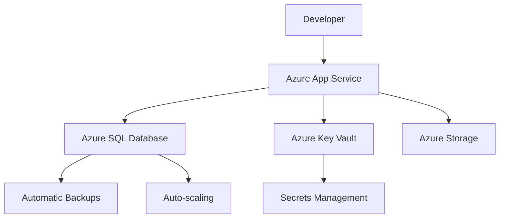

**Real-World Scenario:**

An e-commerce startup builds a modern web application using Azure App Service for the frontend API, Azure SQL Database for transactional data, and Azure Cosmos DB for product catalogs. The platform automatically handles scaling during peak shopping seasons without manual intervention.

> [!IMPORTANT]
> PaaS is ideal for development teams that want to focus on application logic rather than infrastructure management, accelerating time-to-market.

### Software as a Service (SaaS)

SaaS delivers fully functional software applications over the internet on a subscription basis, with the provider managing all aspects of the infrastructure and application.

**Key Characteristics:**
- Ready-to-use applications accessible via web browser
- No infrastructure or software maintenance required
- Subscription-based pricing (per user/per month)
- Automatic updates and patches
- Multi-tenant architecture

**Examples:**

| Category | Service | Use Case |
|----------|---------|----------|
| **Productivity** | Microsoft 365 | Email, document collaboration, video conferencing |
| **CRM** | Salesforce | Customer relationship management and sales automation |
| **Communication** | Slack | Team messaging and collaboration |
| **HR** | Workday | Human capital management and payroll |
| **Analytics** | Tableau Online | Business intelligence and data visualization |
| **Marketing** | HubSpot | Marketing automation and CRM |

**SaaS Architecture:**
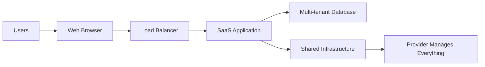

**Real-World Scenario:**

A mid-sized company adopts Microsoft 365 for all employees, providing email, SharePoint collaboration, Teams communication, and Office applications. IT staff no longer need to manage email servers, apply security patches, or handle software updates.

> [!NOTE]
> SaaS is best for standardized business applications where customization requirements are minimal and time-to-value is critical.

### Comparison Matrix

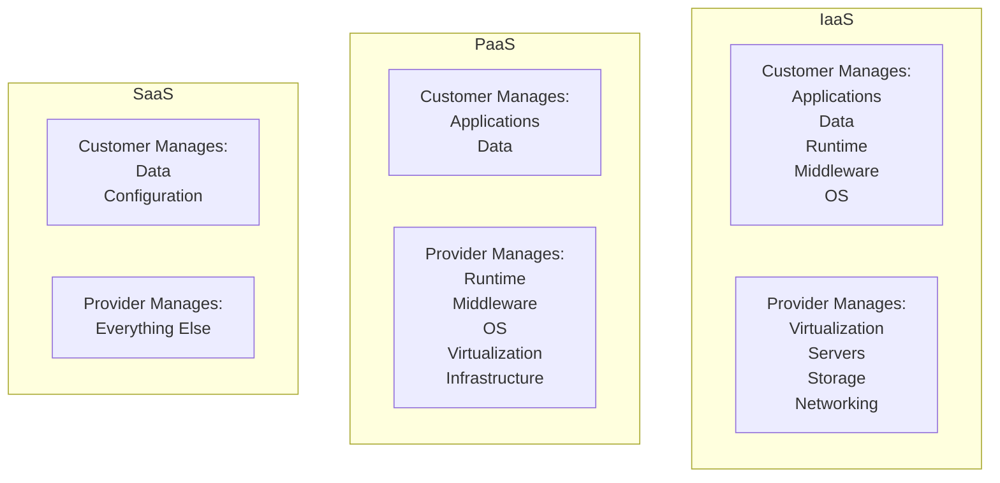

| Aspect | IaaS | PaaS | SaaS |
|--------|------|------|------|
| **Control** | High | Medium | Low |
| **Flexibility** | Maximum | Moderate | Minimal |
| **Management Overhead** | High | Low | Minimal |
| **Time to Deploy** | Days/Weeks | Hours/Days | Minutes |
| **Ideal For** | Custom applications, legacy migrations | Modern app development | Standard business apps |
| **Examples** | Azure VMs, AWS EC2 | Azure App Service, Heroku | Office 365, Salesforce |

## Cloud Deployment Models (Public, Private, Hybrid, Multi-cloud)

Cloud deployment models define where cloud infrastructure is deployed and who manages it. The choice impacts security, compliance, cost, and operational complexity.

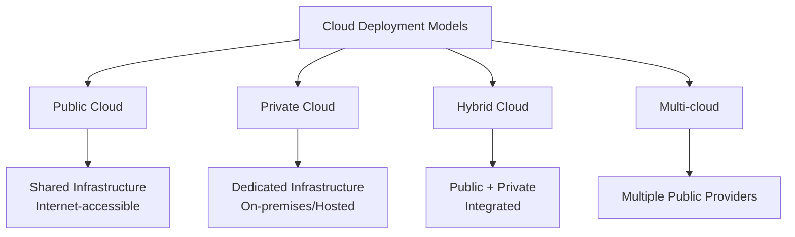

### Public Cloud

Public cloud services are delivered over the public internet and shared across multiple organizations (multi-tenancy).

**Key Characteristics:**
- Shared infrastructure managed by cloud provider
- Pay-per-use pricing model
- No capital expenditure required
- Elastic scalability
- Global availability

**Major Public Cloud Providers:**

| Provider | Global Regions | Key Services |
|----------|----------------|--------------|
| **Microsoft Azure** | 60+ regions | Compute, Storage, AI/ML, IoT, Networking |
| **AWS (Amazon Web Services)** | 30+ regions | EC2, S3, Lambda, RDS, CloudFront |
| **Google Cloud Platform (GCP)** | 35+ regions | Compute Engine, BigQuery, Kubernetes Engine |
| **Oracle Cloud** | 40+ regions | Autonomous Database, Cloud Applications |
| **IBM Cloud** | 60+ datacenters | Watson AI, Cloud Foundry, Bare Metal |

**Architecture Example:**
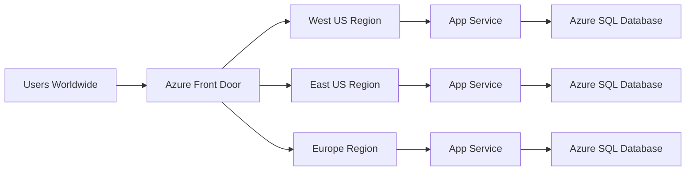

**Real-World Scenario:**

A social media startup builds its entire platform on AWS, leveraging EC2 for compute, S3 for media storage, RDS for databases, and CloudFront for global content delivery. The company scales from 1,000 to 10 million users without investing in physical infrastructure.

> [!TIP]
> Public cloud is ideal for startups, development/testing environments, and applications requiring rapid scaling and global reach.

### Private Cloud

Private cloud infrastructure is dedicated to a single organization, either hosted on-premises or by a third-party provider.

**Key Characteristics:**
- Dedicated infrastructure for single organization
- Enhanced security and control
- Customizable to meet specific requirements
- Compliance with regulatory requirements
- Higher capital and operational costs

**Implementation Options:**

| Type | Description | Examples |
|------|-------------|----------|
| **On-Premises** | Infrastructure in your own datacenter | VMware vSphere, OpenStack, Azure Stack HCI |
| **Hosted Private Cloud** | Dedicated infrastructure at provider facility | Azure Dedicated Host, AWS Outposts, IBM Cloud Private |
| **Virtual Private Cloud** | Isolated section of public cloud | Azure VNet, AWS VPC, Google VPC |

**Architecture Example:**
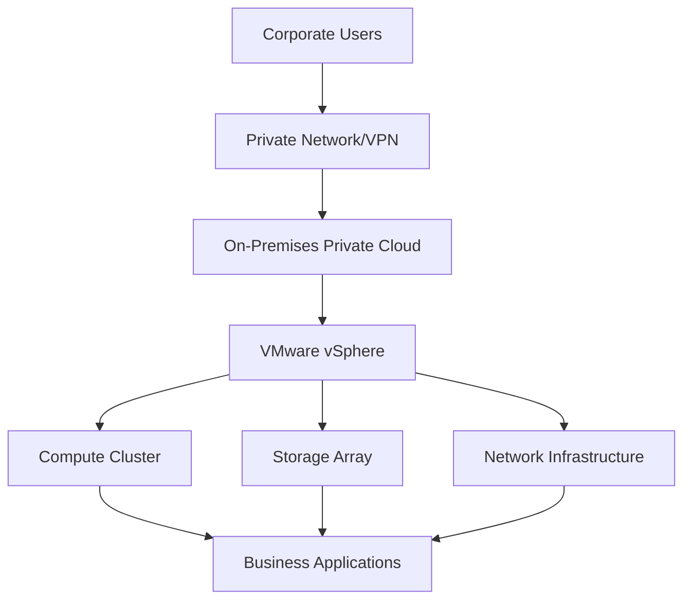

**Real-World Scenario:**

A healthcare organization implements a private cloud using Azure Stack HCI in their datacenter to host patient management systems, ensuring HIPAA compliance and maintaining full control over sensitive medical data while benefiting from Azure's cloud services.

> [!IMPORTANT]
> Private cloud is essential for organizations with strict regulatory requirements, data sovereignty needs, or specialized security controls.

### Hybrid Cloud

Hybrid cloud combines public and private clouds with orchestration between them, enabling data and applications to move between environments.

**Key Characteristics:**
- Integration of public and private infrastructure
- Workload portability between environments
- Optimized cost and performance
- Flexibility to choose deployment location per workload
- Unified management and security

**Hybrid Cloud Technologies:**

| Technology | Purpose | Example |
|------------|---------|---------|
| **Azure Arc** | Extend Azure services to any infrastructure | Manage on-premises Kubernetes with Azure |
| **AWS Outposts** | Bring AWS infrastructure on-premises | Run AWS services in your datacenter |
| **Google Anthos** | Multi-cloud and hybrid application platform | Deploy apps across GCP, AWS, and on-premises |
| **VMware Cloud** | Hybrid cloud infrastructure | Seamless workload migration between environments |

**Hybrid Architecture Pattern:**
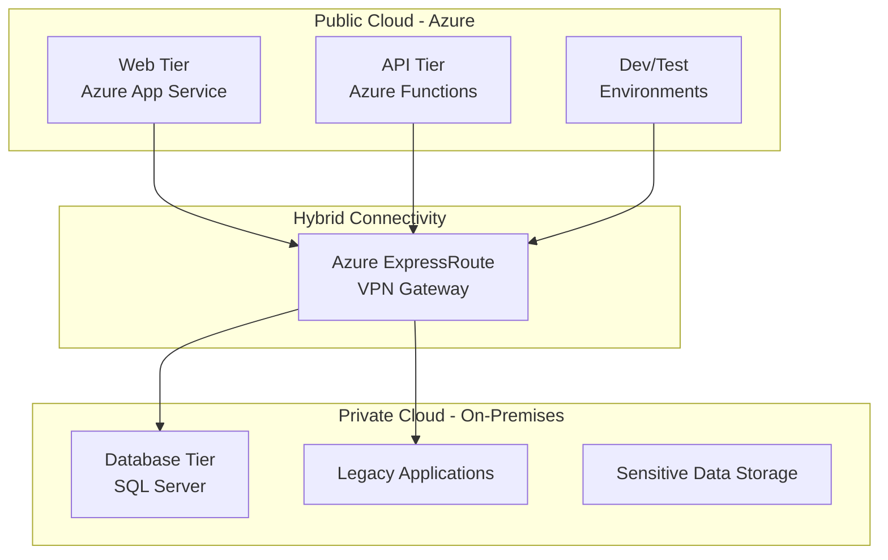

**Real-World Scenario:**

A financial institution runs customer-facing web applications on Azure for scalability and global reach, while maintaining core banking systems and customer data on-premises private cloud infrastructure to meet regulatory compliance. Azure ExpressRoute provides secure, low-latency connectivity between environments.

**Benefits of Hybrid Cloud:**

1. **Regulatory Compliance**: Keep sensitive data on-premises while using public cloud for other workloads
2. **Cloud Bursting**: Handle peak loads by scaling to public cloud temporarily
3. **Gradual Migration**: Migrate applications incrementally to avoid disruption
4. **Cost Optimization**: Use optimal environment for each workload (e.g., on-premises for steady-state, cloud for variable workloads)

> [!NOTE]
> Hybrid cloud requires careful planning for networking, security, identity management, and data synchronization between environments.

### Multi-cloud

Multi-cloud strategy involves using services from multiple public cloud providers simultaneously to avoid vendor lock-in and leverage best-of-breed services.

**Key Characteristics:**
- Services from multiple cloud providers
- Avoids vendor lock-in
- Leverages provider-specific strengths
- Increased complexity in management
- Requires cloud-agnostic tools and practices

**Multi-cloud Architecture:**
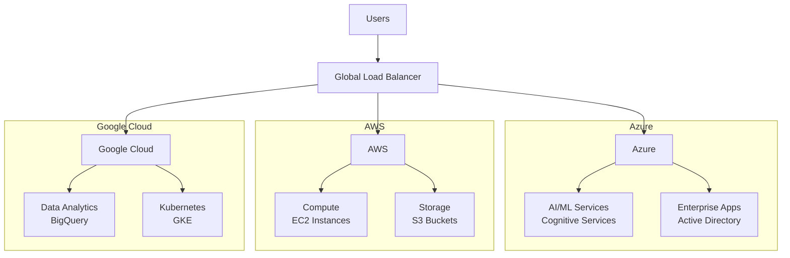

**Multi-cloud Strategy Examples:**

| Scenario | Azure | AWS | Google Cloud | Rationale |
|----------|-------|-----|--------------|-----------|
| **Best-of-Breed** | Active Directory, AI Services | EC2, Lambda | BigQuery, GKE | Leverage each provider's strengths |
| **Geographic Coverage** | Europe operations | US operations | Asia operations | Optimize for regional compliance and latency |
| **Disaster Recovery** | Primary workloads | DR/backup site | - | Cross-provider redundancy |
| **Development** | Production | Staging | Development/Testing | Separate environments by provider |

**Multi-cloud Management Tools:**

- **Kubernetes**: Container orchestration across clouds
- **Terraform**: Infrastructure as Code for multi-cloud provisioning
- **Ansible**: Configuration management across environments
- **Cloud Management Platforms**: VMware CloudHealth, Flexera, CloudBolt

**Real-World Scenario:**

A global media company uses:
- **AWS** for primary content delivery (S3 + CloudFront) due to its extensive CDN network
- **Google Cloud** for video transcoding and AI/ML analytics (BigQuery, Cloud Video Intelligence)
- **Azure** for enterprise applications and Office 365 integration

This approach lets them leverage AWS's CDN capabilities, Google's data analytics strengths, and Azure's enterprise tooling.

**Challenges and Considerations:**

> [!CAUTION]
> Multi-cloud increases operational complexity. Ensure you have:
> - Centralized monitoring and logging
> - Consistent security policies across providers
> - Cloud-agnostic CI/CD pipelines
> - Cross-trained teams familiar with multiple platforms

### Deployment Model Comparison

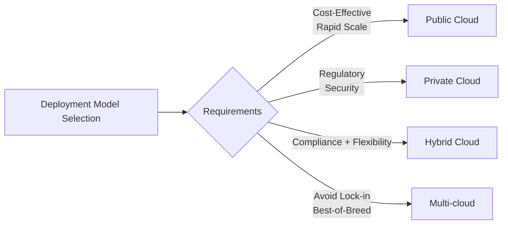

| Criteria | Public Cloud | Private Cloud | Hybrid Cloud | Multi-cloud |
|----------|--------------|---------------|--------------|-------------|
| **Cost** | Low (OpEx) | High (CapEx) | Medium | Variable |
| **Scalability** | Excellent | Limited | Good | Excellent |
| **Control** | Low | High | Medium | Medium |
| **Complexity** | Low | Medium | High | Very High |
| **Security** | Shared responsibility | Full control | Mixed | Complex |
| **Best For** | Startups, web apps | Regulated industries | Enterprises | Large enterprises |

> [!TIP]
> **Selection Guidance:**
> - Start with **Public Cloud** for new applications and rapid innovation
> - Choose **Private Cloud** when compliance and data sovereignty are critical
> - Adopt **Hybrid Cloud** for gradual migration and workload optimization
> - Consider **Multi-cloud** only when you have mature cloud operations and specific requirements
