# Best Practices and Design Patterns

Best practices and design patterns are proven solutions to common cloud architecture challenges, improving reliability, performance, and maintainability.

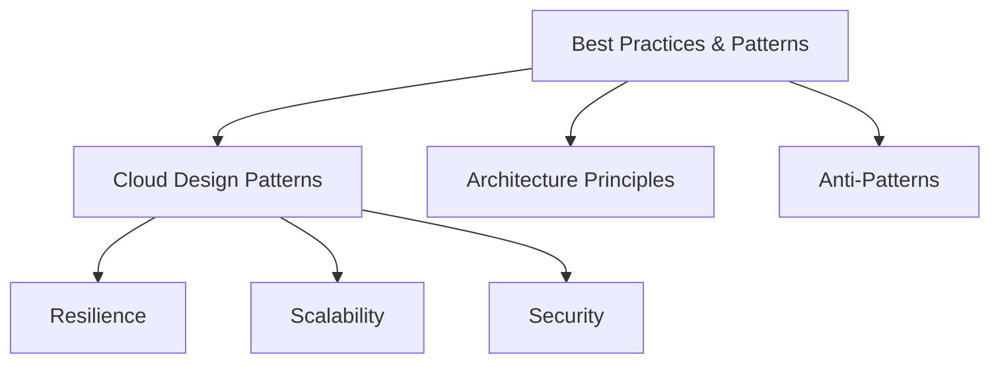
```mermaid
graph TB
    A[Best Practices & Patterns] --> B[Cloud Design Patterns]
    A --> C[Architecture Principles]
    A --> D[Anti-Patterns]
    
    B --> E[Resilience]
    B --> F[Scalability]
    B --> G[Security]
```

## Architectural Best Practices

Cloud architecture best practices provide a foundation for building robust, secure, and cost-effective systems.

### The Twelve-Factor App

The Twelve-Factor App methodology defines best practices for building modern cloud-native applications.

**Twelve Factors:**

| Factor | Principle | Cloud Implementation |
|--------|-----------|---------------------|
| **1. Codebase** | One codebase tracked in version control | Git repository per service |
| **2. Dependencies** | Explicitly declare dependencies | package.json, requirements.txt, pom.xml |
| **3. Config** | Store config in environment | Environment variables, Key Vault |
| **4. Backing Services** | Treat backing services as attached resources | Connection strings, service endpoints |
| **5. Build, Release, Run** | Separate build and run stages | CI/CD pipelines |
| **6. Processes** | Execute as stateless processes | Store state in Redis/database |
| **7. Port Binding** | Export services via port binding | Containers expose ports |
| **8. Concurrency** | Scale out via process model | Horizontal scaling, container orchestration |
| **9. Disposability** | Fast startup and graceful shutdown | Container lifecycle, health probes |
| **10. Dev/Prod Parity** | Keep environments similar | IaC, immutable infrastructure |
| **11. Logs** | Treat logs as event streams | Centralized logging (Log Analytics) |
| **12. Admin Processes** | Run admin tasks as one-off processes | Kubernetes Jobs, Azure Functions |

**Example: Config as Environment Variables:**

```yaml
# Kubernetes Deployment
apiVersion: apps/v1
kind: Deployment
metadata:
  name: webapp
spec:
  template:
    spec:
      containers:
      - name: app
        image: myapp:latest
        env:
        - name: DATABASE_URL
          valueFrom:
            secretKeyRef:
              name: db-credentials
              key: connection-string
        - name: API_KEY
          valueFrom:
            secretKeyRef:
              name: api-secrets
              key: third-party-key
        - name: LOG_LEVEL
          value: "info"
        - name: FEATURE_FLAG_NEW_UI
          value: "true"
```

> [!IMPORTANT]
> Never hardcode configuration in code. Use environment variables or secret management services (Azure Key Vault, AWS Secrets Manager).

### Cloud Architecture Principles

**SOLID Principles for Cloud:**

| Principle | Cloud Application | Example |
|-----------|-------------------|---------|
| **Single Responsibility** | Microservices do one thing | Order service only handles orders |
| **Open/Closed** | Extend via APIs, don't modify core | Plugin architecture, webhooks |
| **Liskov Substitution** | Interfaces for backing services | Swap SQL for NoSQL via abstraction |
| **Interface Segregation** | Focused APIs | Separate read/write APIs (CQRS) |
| **Dependency Inversion** | Depend on abstractions | Inject database interface |

**CAP Theorem:**

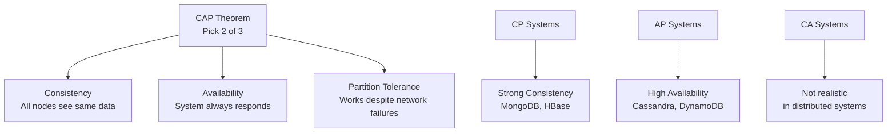
```mermaid
graph TB
    A[CAP Theorem<br/>Pick 2 of 3] --> B[Consistency<br/>All nodes see same data]
    A --> C[Availability<br/>System always responds]
    A --> D[Partition Tolerance<br/>Works despite network failures]
    
    E[CP Systems] --> F[Strong Consistency<br/>MongoDB, HBase]
    G[AP Systems] --> H[High Availability<br/>Cassandra, DynamoDB]
    I[CA Systems] --> J[Not realistic<br/>in distributed systems]
```

**CAP Trade-offs:**

| System Type | Prioritizes | Trade-off | Use Case |
|-------------|-------------|-----------|----------|
| **CP** | Consistency + Partition Tolerance | Availability (may refuse requests) | Financial transactions, inventory |
| **AP** | Availability + Partition Tolerance | Consistency (eventual consistency) | Social media feeds, analytics |
| **CA** | Consistency + Availability | Partition Tolerance (single-node only) | Traditional RDBMS |

> [!NOTE]
> In cloud environments, network partitions are inevitable. Choose between CP (consistency) or AP (availability) based on business requirements.

### Design for Failure

**Failure Assumption:**

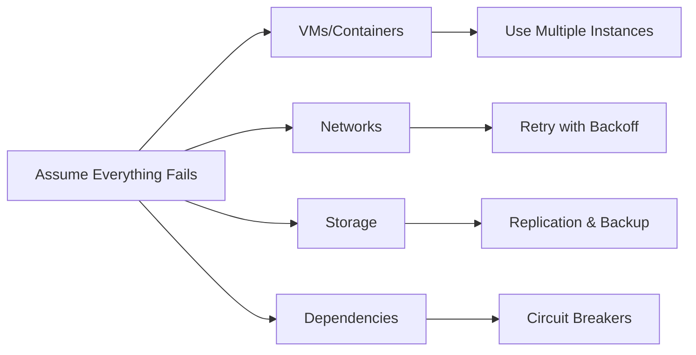
```mermaid
graph LR
    A[Assume Everything Fails] --> B[VMs/Containers]
    A --> C[Networks]
    A --> D[Storage]
    A --> E[Dependencies]
    
    B --> F[Use Multiple Instances]
    C --> G[Retry with Backoff]
    D --> H[Replication & Backup]
    E --> I[Circuit Breakers]
```

**Resilience Patterns:**

| Pattern | Purpose | Implementation | Use Case |
|---------|---------|----------------|----------|
| **Retry** | Handle transient failures | Exponential backoff | Network glitches |
| **Circuit Breaker** | Stop calling failing services | Open/half-open/closed states | Cascading failures |
| **Bulkhead** | Isolate failures | Separate thread pools | Resource exhaustion |
| **Timeout** | Prevent indefinite waits | Set max duration | Slow dependencies |
| **Fallback** | Provide degraded service | Cache, default values | Dependency unavailable |

**Circuit Breaker State Machine:**

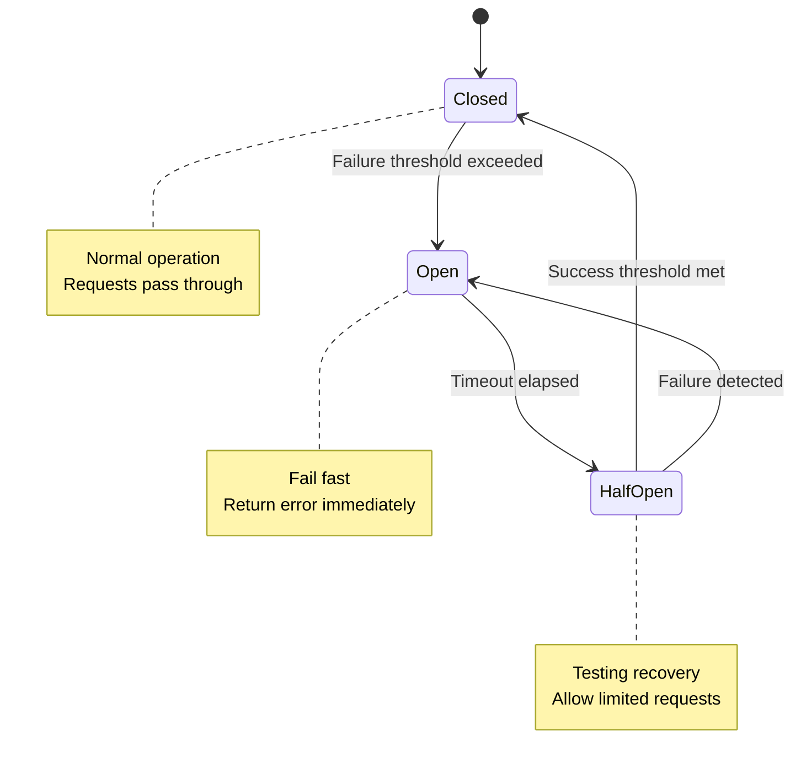
```mermaid
stateDiagram-v2
    [*] --> Closed
    Closed --> Open: Failure threshold exceeded
    Open --> HalfOpen: Timeout elapsed
    HalfOpen --> Closed: Success threshold met
    HalfOpen --> Open: Failure detected
    
    note right of Closed: Normal operation<br/>Requests pass through
    note right of Open: Fail fast<br/>Return error immediately
    note right of HalfOpen: Testing recovery<br/>Allow limited requests
```

**Circuit Breaker Implementation (Polly):**

```csharp
var circuitBreakerPolicy = Policy
    .Handle<HttpRequestException>()
    .CircuitBreakerAsync(
        exceptionsAllowedBeforeBreaking: 5,
        durationOfBreak: TimeSpan.FromSeconds(30),
        onBreak: (ex, duration) =>
        {
            logger.LogWarning("Circuit breaker opened for {Duration}s", duration.TotalSeconds);
        },
        onReset: () =>
        {
            logger.LogInformation("Circuit breaker reset");
        }
    );

var retryPolicy = Policy
    .Handle<HttpRequestException>()
    .WaitAndRetryAsync(
        retryCount: 3,
        sleepDurationProvider: attempt => TimeSpan.FromSeconds(Math.Pow(2, attempt)),
        onRetry: (ex, timespan, retryCount, context) =>
        {
            logger.LogWarning("Retry {RetryCount} after {Delay}s", retryCount, timespan.TotalSeconds);
        }
    );

// Combine policies
var policyWrap = Policy.WrapAsync(retryPolicy, circuitBreakerPolicy);

// Use policy
var response = await policyWrap.ExecuteAsync(() => 
    httpClient.GetAsync("https://api.example.com/data")
);
```

> [!TIP]
> Always implement timeouts. Without timeouts, a slow dependency can exhaust thread pools and cause cascading failures.

### Idempotency

Idempotency ensures operations can be safely retried without unintended side effects.

**Idempotent Operations:**

| HTTP Method | Idempotent? | Why |
|-------------|-------------|-----|
| **GET** | ✅ Yes | Read-only, no state change |
| **PUT** | ✅ Yes | Replace entire resource |
| **DELETE** | ✅ Yes | Deleting twice = same result |
| **POST** | ❌ No | Creates new resource each time |
| **PATCH** | ⚠️ Depends | Depends on implementation |

**Idempotency Key Pattern:**

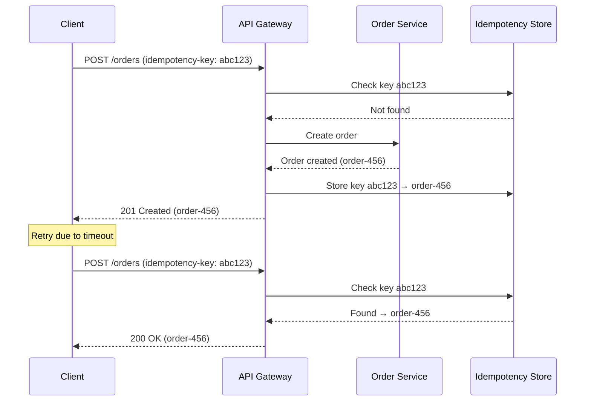
```mermaid
sequenceDiagram
    participant Client
    participant API Gateway
    participant Order Service
    participant Idempotency Store
    
    Client->>API Gateway: POST /orders (idempotency-key: abc123)
    API Gateway->>Idempotency Store: Check key abc123
    Idempotency Store-->>API Gateway: Not found
    API Gateway->>Order Service: Create order
    Order Service-->>API Gateway: Order created (order-456)
    API Gateway->>Idempotency Store: Store key abc123 → order-456
    API Gateway-->>Client: 201 Created (order-456)
    
    Note over Client: Retry due to timeout
    Client->>API Gateway: POST /orders (idempotency-key: abc123)
    API Gateway->>Idempotency Store: Check key abc123
    Idempotency Store-->>API Gateway: Found → order-456
    API Gateway-->>Client: 200 OK (order-456)
```

**Idempotency Implementation:**

```csharp
[HttpPost]
public async Task<IActionResult> CreateOrder(
    [FromBody] CreateOrderRequest request,
    [FromHeader(Name = "Idempotency-Key")] string idempotencyKey)
{
    if (string.IsNullOrEmpty(idempotencyKey))
        return BadRequest("Idempotency-Key header required");
    
    // Check if request already processed
    var existingOrder = await idempotencyStore.GetAsync(idempotencyKey);
    if (existingOrder != null)
    {
        logger.LogInformation("Duplicate request with key {Key}, returning existing order {OrderId}", 
            idempotencyKey, existingOrder.Id);
        return Ok(existingOrder);
    }
    
    // Process new request
    var order = await orderService.CreateAsync(request);
    
    // Store idempotency key
    await idempotencyStore.SetAsync(idempotencyKey, order, TimeSpan.FromHours(24));
    
    return CreatedAtAction(nameof(GetOrder), new { id = order.Id }, order);
}
```

> [!IMPORTANT]
> Implement idempotency for all mutating operations (POST, PUT, PATCH, DELETE) to enable safe retries and prevent duplicate transactions.

## Design Patterns for Scalability, Security, and High Availability

Cloud design patterns solve recurring problems in cloud architecture.

### Scalability Patterns

**1. Queue-Based Load Leveling:**

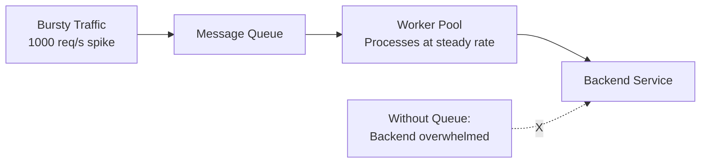
```mermaid
graph LR
    A[Bursty Traffic<br/>1000 req/s spike] --> B[Message Queue]
    B --> C[Worker Pool<br/>Processes at steady rate]
    C --> D[Backend Service]
    
    E[Without Queue:<br/>Backend overwhelmed] -.X.-> D
```

**Use Case**: Decouple front-end from back-end to handle traffic spikes.

**Example**: E-commerce checkout queue during Black Friday sale.

**2. Throttling Pattern:**

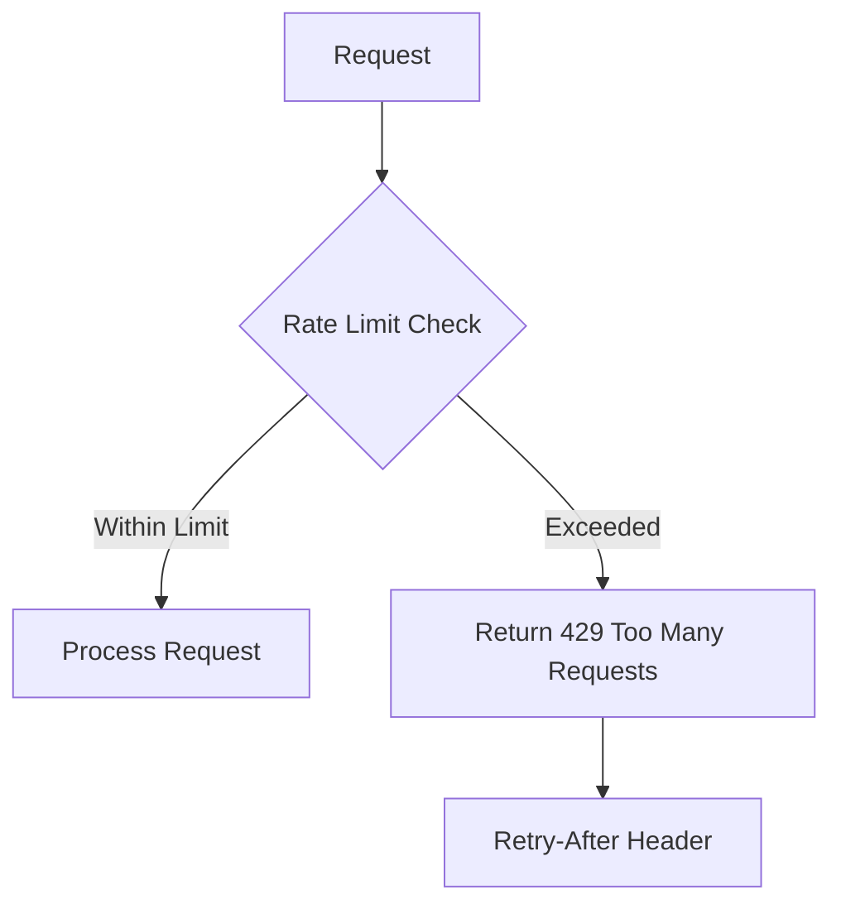
```mermaid
graph TD
    A[Request] --> B{Rate Limit Check}
    B -->|Within Limit| C[Process Request]
    B -->|Exceeded| D[Return 429 Too Many Requests]
    D --> E[Retry-After Header]
```

**Implementation**:

```csharp
// Rate limiting with ASP.NET Core
services.AddRateLimiter(options =>
{
    options.GlobalLimiter = PartitionedRateLimiter.Create<HttpContext, string>(context =>
        RateLimitPartition.GetFixedWindowLimiter(
            partitionKey: context.User.Identity?.Name ?? context.Request.Headers.Host.ToString(),
            factory: partition => new FixedWindowRateLimiterOptions
            {
                AutoReplenishment = true,
                PermitLimit = 100,
                Window = TimeSpan.FromMinutes(1)
            }));
});
```

**3. Competing Consumers Pattern:**

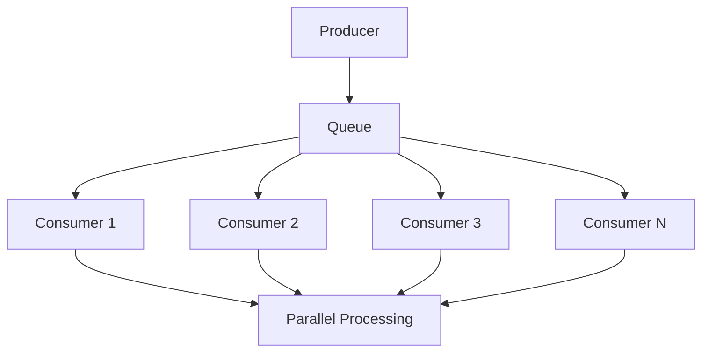
```mermaid
graph TB
    A[Producer] --> B[Queue]
    B --> C[Consumer 1]
    B --> D[Consumer 2]
    B --> E[Consumer 3]
    B --> F[Consumer N]
    
    C --> G[Parallel Processing]
    D --> G
    E --> G
    F --> G
```

**Use Case**: Process messages in parallel for higher throughput.

**Example**: Video transcoding service with multiple workers.

**4. Sharding Pattern:**

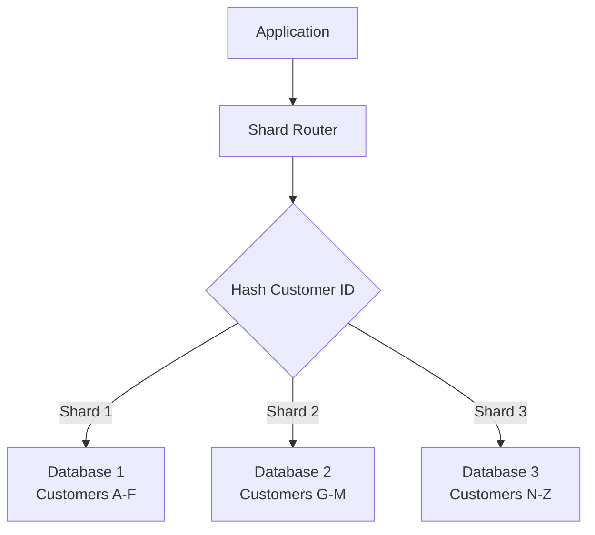
```mermaid
graph TB
    A[Application] --> B[Shard Router]
    B --> C{Hash Customer ID}
    C -->|Shard 1| D[Database 1<br/>Customers A-F]
    C -->|Shard 2| E[Database 2<br/>Customers G-M]
    C -->|Shard 3| F[Database 3<br/>Customers N-Z]
```

**Use Case**: Distribute data across multiple databases for horizontal scaling.

**Example**: Multi-tenant SaaS application sharding by tenant ID.

### Security Patterns

**1. Valet Key Pattern:**

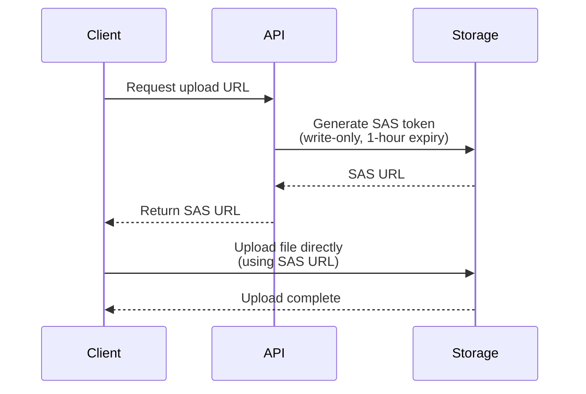
```mermaid
sequenceDiagram
    participant Client
    participant API
    participant Storage
    
    Client->>API: Request upload URL
    API->>Storage: Generate SAS token<br/>(write-only, 1-hour expiry)
    Storage-->>API: SAS URL
    API-->>Client: Return SAS URL
    Client->>Storage: Upload file directly<br/>(using SAS URL)
    Storage-->>Client: Upload complete
```

**Benefits**:

- Offload data transfer from API
- Fine-grained access control
- Time-limited access
- No credentials in client

**Azure Blob SAS Token:**

```csharp
public string GenerateUploadUrl(string blobName)
{
    var containerClient = new BlobContainerClient(connectionString, "uploads");
    var blobClient = containerClient.GetBlobClient(blobName);
    
    // Create SAS token valid for 1 hour with write-only permission
    var sasBuilder = new BlobSasBuilder
    {
        BlobContainerName = "uploads",
        BlobName = blobName,
        Resource = "b",
        StartsOn = DateTimeOffset.UtcNow,
        ExpiresOn = DateTimeOffset.UtcNow.AddHours(1)
    };
    sasBuilder.SetPermissions(BlobSasPermissions.Write | BlobSasPermissions.Create);
    
    var sasToken = blobClient.GenerateSasUri(sasBuilder);
    return sasToken.ToString();
}
```

**2. Gatekeeper Pattern:**

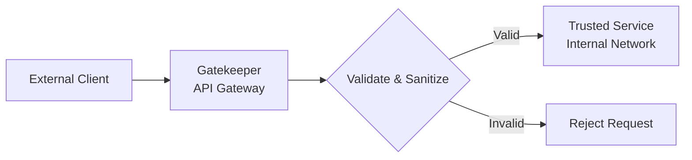
```mermaid
graph LR
    A[External Client] --> B[Gatekeeper<br/>API Gateway]
    B --> C{Validate & Sanitize}
    C -->|Valid| D[Trusted Service<br/>Internal Network]
    C -->|Invalid| E[Reject Request]
```

**Use Case**: Minimize attack surface by validating requests before reaching internal services.

**Example**: API Gateway performing input validation, rate limiting, and authentication.

**3. Federated Identity Pattern:**

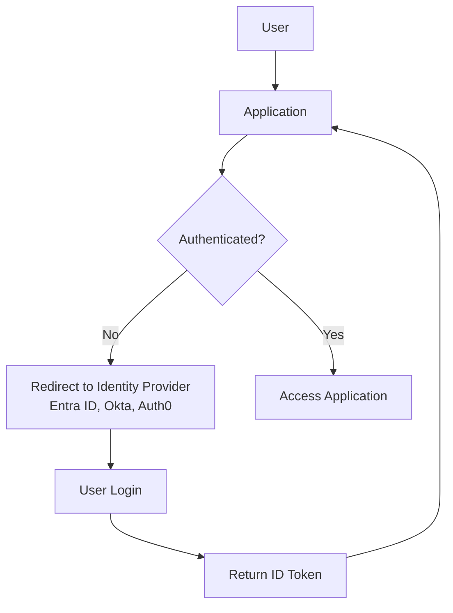
```mermaid
graph TB
    A[User] --> B[Application]
    B --> C{Authenticated?}
    C -->|No| D[Redirect to Identity Provider<br/>Entra ID, Okta, Auth0]
    D --> E[User Login]
    E --> F[Return ID Token]
    F --> B
    C -->|Yes| G[Access Application]
```

**Benefits**:

- Single Sign-On (SSO)
- Centralized identity management
- No password storage in application
- Support for MFA, conditional access

**4. Claim Check Pattern:**

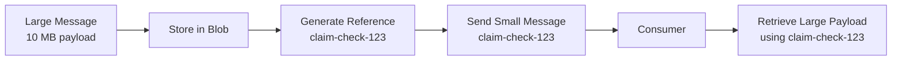
```mermaid
graph LR
    A[Large Message<br/>10 MB payload] --> B[Store in Blob]
    B --> C[Generate Reference<br/>claim-check-123]
    C --> D[Send Small Message<br/>claim-check-123]
    D --> E[Consumer]
    E --> F[Retrieve Large Payload<br/>using claim-check-123]
```

**Use Case**: Send large messages through message queues with size limits.

**Example**: Send video file reference via Service Bus, download actual file from Blob Storage.

### High Availability Patterns

**1. Health Endpoint Monitoring:**

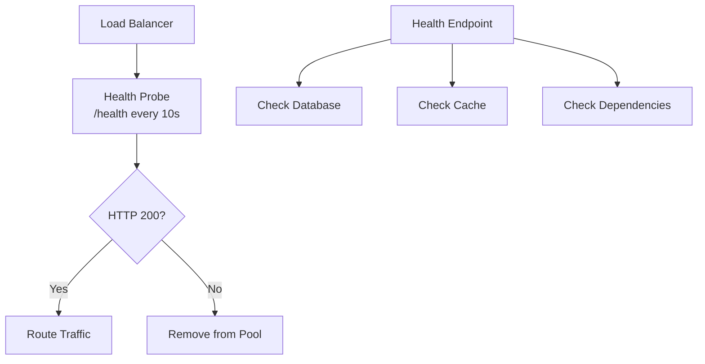
```mermaid
graph TD
    A[Load Balancer] --> B[Health Probe<br/>/health every 10s]
    B --> C{HTTP 200?}
    C -->|Yes| D[Route Traffic]
    C -->|No| E[Remove from Pool]
    
    F[Health Endpoint] --> G[Check Database]
    F --> H[Check Cache]
    F --> I[Check Dependencies]
```

**Health Check Implementation:**

```csharp
public class HealthCheckController : ControllerBase
{
    [HttpGet("/health/live")]
    public IActionResult Liveness()
    {
        // Simple check: is the process running?
        return Ok(new { status = "healthy" });
    }
    
    [HttpGet("/health/ready")]
    public async Task<IActionResult> Readiness()
    {
        // Deep check: are dependencies available?
        var dbHealthy = await CheckDatabaseAsync();
        var cacheHealthy = await CheckCacheAsync();
        
        if (dbHealthy && cacheHealthy)
            return Ok(new { status = "ready" });
        else
            return StatusCode(503, new { status = "not ready" });
    }
}
```

> [!NOTE]
> Implement separate liveness (should restart?) and readiness (ready for traffic?) probes. Liveness failures trigger restarts; readiness failures remove from load balancer.

**2. Retry Pattern with Exponential Backoff:**

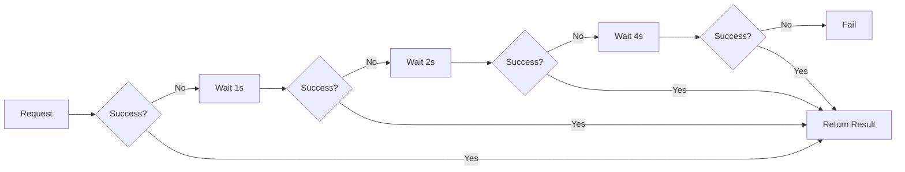
```mermaid
graph LR
    A[Request] --> B{Success?}
    B -->|No| C[Wait 1s]
    C --> D{Success?}
    D -->|No| E[Wait 2s]
    E --> F{Success?}
    F -->|No| G[Wait 4s]
    G --> H{Success?}
    H -->|No| I[Fail]
    B -->|Yes| J[Return Result]
    D -->|Yes| J
    F -->|Yes| J
    H -->|Yes| J
```

**Exponential Backoff Formula:**

```
wait_time = base_delay * (2 ^ attempt) + random_jitter
```

**Example**: base_delay=1s, attempts: 1s, 2s, 4s, 8s, 16s

**3. Bulkhead Pattern:**

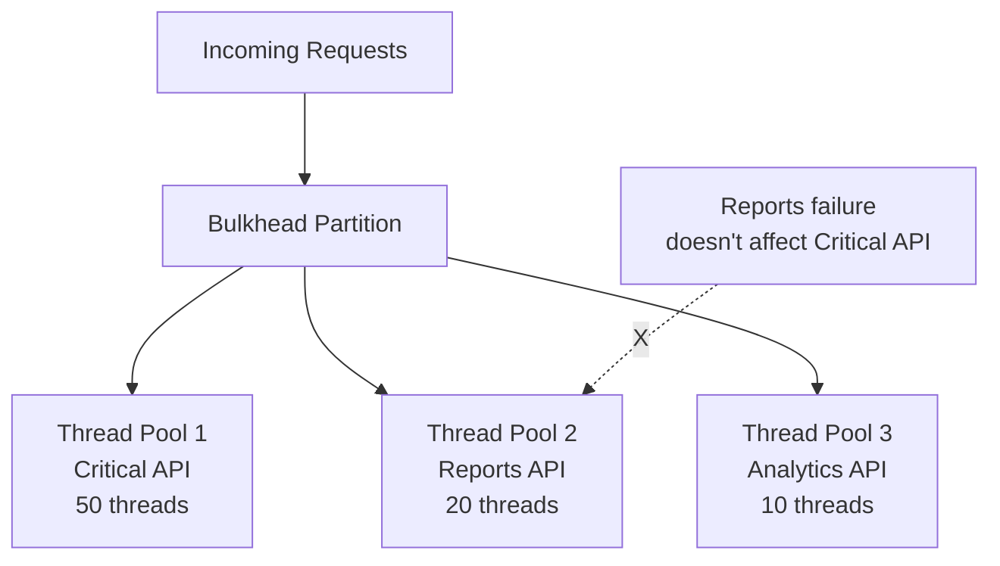
```mermaid
graph TB
    A[Incoming Requests] --> B[Bulkhead Partition]
    
    B --> C[Thread Pool 1<br/>Critical API<br/>50 threads]
    B --> D[Thread Pool 2<br/>Reports API<br/>20 threads]
    B --> E[Thread Pool 3<br/>Analytics API<br/>10 threads]
    
    F[Reports failure<br/>doesn't affect Critical API] -.X.-> D
```

**Use Case**: Isolate resources so failure in one area doesn't cascade.

**Example**: Separate Kubernetes pods for critical and non-critical services.

**4. Compensating Transaction Pattern:**

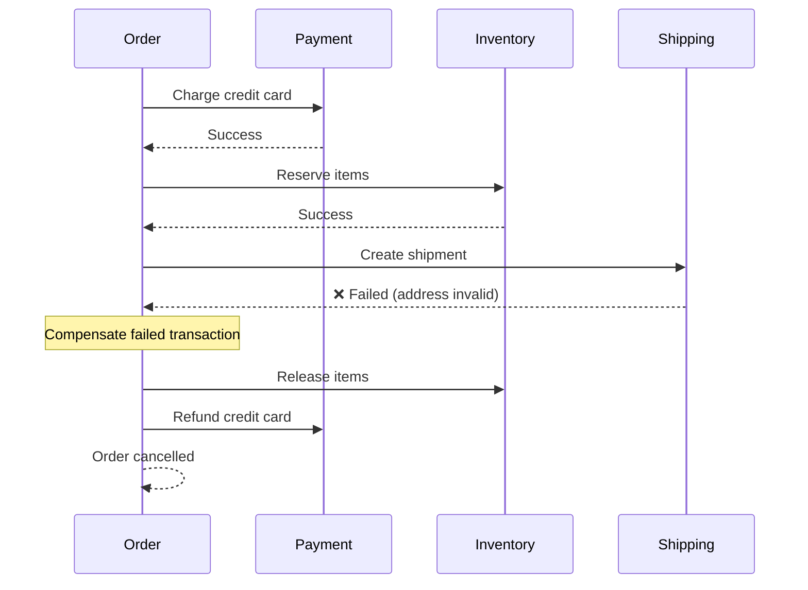
```mermaid
sequenceDiagram
    participant Order
    participant Payment
    participant Inventory
    participant Shipping
    
    Order->>Payment: Charge credit card
    Payment-->>Order: Success
    Order->>Inventory: Reserve items
    Inventory-->>Order: Success
    Order->>Shipping: Create shipment
    Shipping-->>Order: ❌ Failed (address invalid)
    
    Note over Order: Compensate failed transaction
    Order->>Inventory: Release items
    Order->>Payment: Refund credit card
    Order-->>Order: Order cancelled
```

**Use Case**: Undo completed operations when later steps fail in distributed transactions.

**Example**: Saga pattern in microservices for order processing.

**5. Cache-Aside Pattern:**

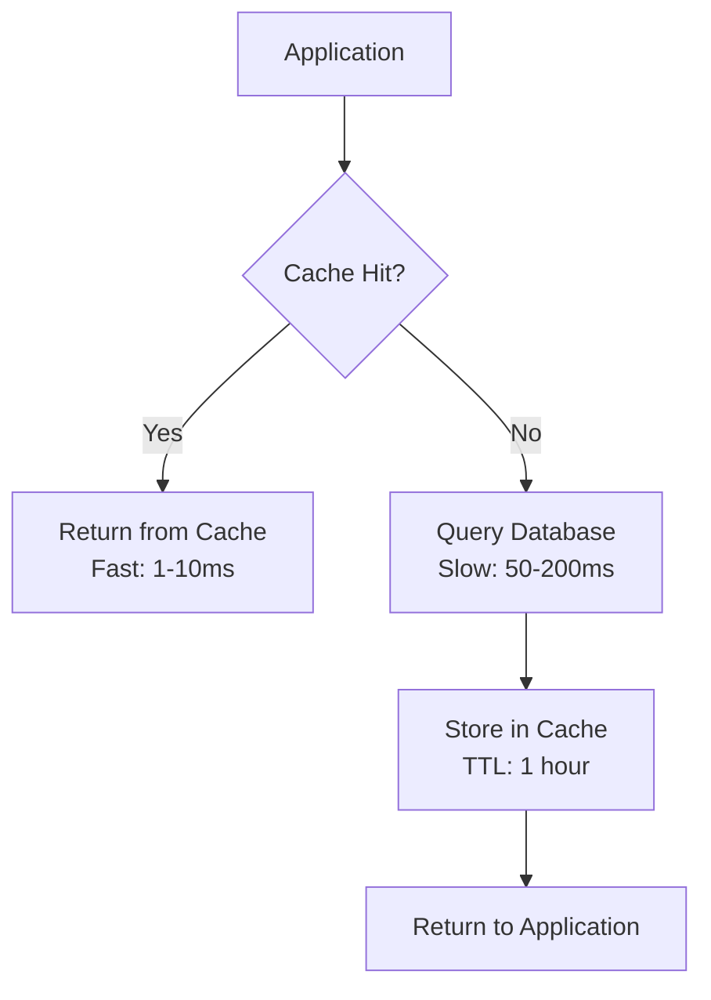
```mermaid
graph TD
    A[Application] --> B{Cache Hit?}
    B -->|Yes| C[Return from Cache<br/>Fast: 1-10ms]
    B -->|No| D[Query Database<br/>Slow: 50-200ms]
    D --> E[Store in Cache<br/>TTL: 1 hour]
    E --> F[Return to Application]
```

**Implementation**:

```csharp
public async Task<Product> GetProductAsync(int id)
{
    var cacheKey = $"product:{id}";
    
    // Try cache first
    var cached = await cache.GetAsync<Product>(cacheKey);
    if (cached != null)
    {
        logger.LogInformation("Cache hit for product {ProductId}", id);
        return cached;
    }
    
    // Cache miss - query database
    logger.LogInformation("Cache miss for product {ProductId}, querying database", id);
    var product = await database.Products.FindAsync(id);
    
    // Store in cache for 1 hour
    await cache.SetAsync(cacheKey, product, TimeSpan.FromHours(1));
    
    return product;
}
```

### Cloud-Native Patterns

**6. Strangler Fig Pattern:**

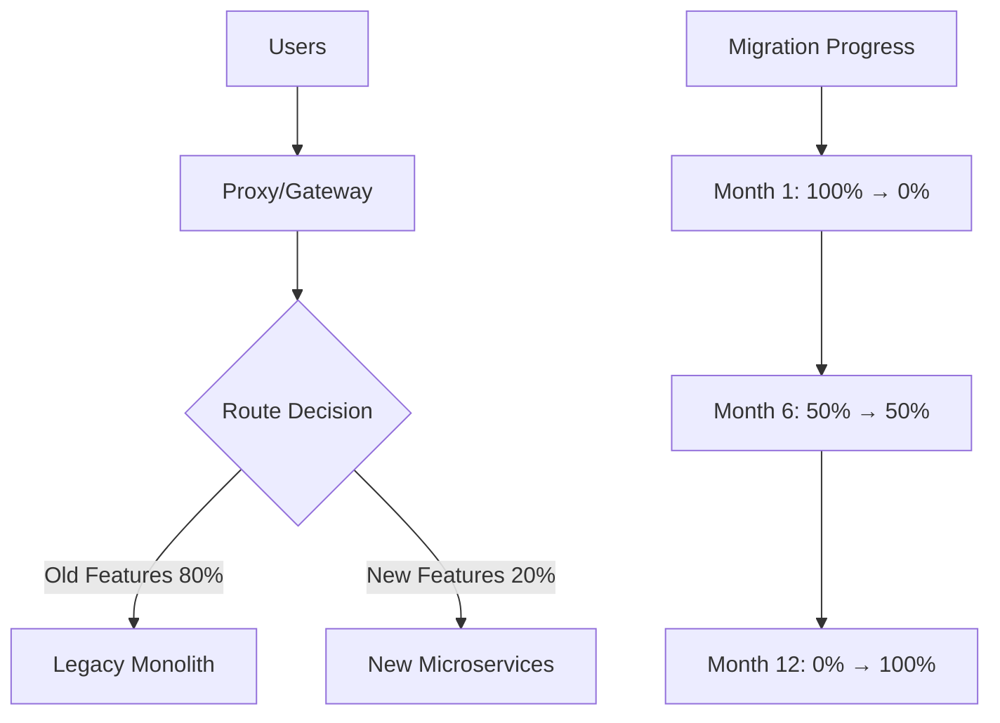
```mermaid
graph TB
    A[Users] --> B[Proxy/Gateway]
    
    B --> C{Route Decision}
    C -->|Old Features 80%| D[Legacy Monolith]
    C -->|New Features 20%| E[New Microservices]
    
    F[Migration Progress] --> G[Month 1: 100% → 0%]
    G --> H[Month 6: 50% → 50%]
    H --> I[Month 12: 0% → 100%]
```

**Use Case**: Gradually migrate from legacy system to new architecture without big-bang rewrite.

**Example**: Migrate monolith to microservices one domain at a time.

**7. Sidecar Pattern:**

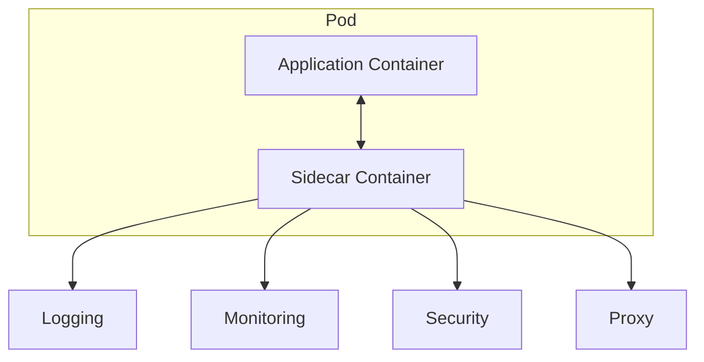
```mermaid
graph TB
    subgraph "Pod"
        A[Application Container] <--> B[Sidecar Container]
    end
    
    B --> C[Logging]
    B --> D[Monitoring]
    B --> E[Security]
    B --> F[Proxy]
```

**Use Cases**:

- **Logging**: Fluentd sidecar ships logs to centralized system
- **Security**: Istio Envoy proxy for mTLS
- **Monitoring**: Prometheus exporter sidecar
- **Configuration**: Consul agent for dynamic config

**8. Ambassador Pattern:**

```mermaid
graph LR
    A[Application] --> B[Ambassador<br/>Proxy Container]
    B --> C[Retry Logic]
    B --> D[Circuit Breaker]
    B --> E[Metrics]
    B --> F[TLS Termination]
    F --> G[External Service]
```

**Use Case**: Offload network-related concerns to separate container.

**Example**: Envoy proxy handling retries, timeouts, and metrics.

**9. Anti-Corruption Layer:**

```mermaid
graph LR
    A[New System] --> B[Anti-Corruption Layer<br/>Adapter/Facade]
    B --> C[Translation]
    C --> D[Legacy System]
    
    E[Clean Domain Model] --> A
    F[Legacy Data Model] --> D
```

**Use Case**: Protect new system from complexity of legacy system during migration.

**Example**: Adapter translating legacy SOAP APIs to modern REST APIs.

## Anti-patterns to Avoid

Anti-patterns are common but ineffective solutions that create more problems than they solve.

### Architecture Anti-Patterns

**1. Big Ball of Mud:**

**Problem**: No clear architecture, everything is tightly coupled.

```mermaid
graph TB
    A[UI] <--> B[Business Logic]
    B <--> C[Database]
    A <--> C
    B <--> D[External API]
    A <--> D
    C <--> D
```

**Symptoms**:

- Hard to understand or modify
- Changes in one area break others
- No clear boundaries
- Shared database across all modules

**Solution**: Refactor into microservices with clear boundaries and domain-driven design.

**2. Distributed Monolith:**

**Problem**: Microservices architecture but with tight coupling.

```mermaid
graph TB
    A[Service A] --> B[Service B]
    B --> C[Service C]
    C --> D[Service A]
    A --> E[Shared Database]
    B --> E
    C --> E
    
    F[Cannot deploy independently] --> G[No benefits of microservices]
```

**Symptoms**:

- Services call each other synchronously
- Shared database
- Cannot deploy services independently
- Cascading failures

**Solution**: Use asynchronous messaging, separate databases per service (database-per-service pattern).

**3. Chatty I/O:**

**Problem**: Too many small, frequent calls to external services.

```mermaid
graph LR
    A[Application] --> B[Call 1: Get User]
    A --> C[Call 2: Get Orders]
    A --> D[Call 3: Get Products]
    A --> E[Call 4: Get Reviews]
    A --> F[...100 more calls]
    
    G[Total Latency:<br/>100 calls × 50ms = 5 seconds]
```

**Symptoms**:

- N+1 query problem
- High latency due to network round trips
- Increased load on backend services

**Solution**:

- Batch API endpoints (e.g., `/api/users/1,2,3,4,5`)
- GraphQL for flexible queries
- Server-side join/aggregation
- Caching

**4. Noisy Neighbor:**

**Problem**: One tenant/workload consumes excessive resources, affecting others.

```mermaid
graph TB
    A[Shared Resources] --> B[Tenant A<br/>Normal: 10% CPU]
    A --> C[Tenant B<br/>Runaway: 80% CPU]
    A --> D[Tenant C<br/>Starved: 5% CPU]
    A --> E[Tenant D<br/>Starved: 5% CPU]
```

**Symptoms**:

- Performance degradation for some tenants
- Unpredictable response times
- Resource exhaustion

**Solution**:

- Resource quotas and limits
- Separate instance per large tenant
- Throttling and rate limiting
- Multi-tenant isolation

**5. Retry Storm:**

**Problem**: Multiple clients retry failed requests simultaneously, overwhelming system.

```mermaid
graph TB
    A[Service Outage] --> B[1000 Clients<br/>All Retry Immediately]
    B --> C[10,000 Requests<br/>in 1 Second]
    C --> D[Service Overwhelmed<br/>Cannot Recover]
```

**Symptoms**:

- Service cannot recover after initial failure
- Exponential load increase
- Extended downtime

**Solution**:

- Exponential backoff with jitter
- Circuit breakers
- Rate limiting
- Graceful degradation

**6. God Service:**

**Problem**: One service handles too many responsibilities.

```mermaid
graph TB
    A[God Service] --> B[User Management]
    A --> C[Order Processing]
    A --> D[Inventory]
    A --> E[Payment]
    A --> F[Shipping]
    A --> G[Reporting]
    A --> H[Notifications]
```

**Symptoms**:

- Large, complex codebase
- Difficult to scale specific functions
- Single point of failure
- Long deployment times

**Solution**: Decompose into microservices by business capability.

### Security Anti-Patterns

**7. Hardcoded Secrets:**

```csharp
// ❌ Anti-pattern
public class DatabaseConnection
{
    private const string ConnectionString = 
        "Server=db.example.com;User=admin;Password=P@ssw0rd123";
}
```

**Problems**:

- Secrets in source control
- Cannot rotate without code change
- Security breach if code leaked

**Solution**:

```csharp
// ✅ Best practice
public class DatabaseConnection
{
    private readonly string _connectionString;
    
    public DatabaseConnection(IConfiguration configuration)
    {
        _connectionString = configuration["Database:ConnectionString"];
        // Or from Key Vault: await keyVaultClient.GetSecretAsync("db-connection-string");
    }
}
```

**8. Security by Obscurity:**

**Problem**: Relying on secrecy rather than proven security mechanisms.

**Examples**:

- Custom encryption algorithms
- Obscure port numbers
- Hiding security vulnerabilities instead of fixing

**Solution**: Use industry-standard security practices (TLS, OAuth 2.0, bcrypt, etc.).

**9. Open Storage Buckets:**

```bash
# ❌ Anti-pattern: Public S3 bucket
aws s3api put-bucket-acl --bucket my-bucket --acl public-read

# ✅ Best practice: Private bucket with specific IAM permissions
aws s3api put-bucket-acl --bucket my-bucket --acl private
```

**Real-World Breach**: Capital One breach (2019) - 106 million customer records exposed via misconfigured S3 bucket.

### Performance Anti-Patterns

**10. Synchronous Waiting:**

```csharp
// ❌ Anti-pattern: Blocking synchronous calls
public OrderResponse CreateOrder(OrderRequest request)
{
    var payment = paymentService.ProcessPayment(request.Payment); // Blocks 2s
    var inventory = inventoryService.Reserve(request.Items);       // Blocks 1s
    var shipping = shippingService.CreateShipment(request.Address); // Blocks 1s
    return new OrderResponse(); // Total: 4 seconds
}

// ✅ Best practice: Parallel async calls
public async Task<OrderResponse> CreateOrderAsync(OrderRequest request)
{
    var paymentTask = paymentService.ProcessPaymentAsync(request.Payment);
    var inventoryTask = inventoryService.ReserveAsync(request.Items);
    var shippingTask = shippingService.CreateShipmentAsync(request.Address);
    
    await Task.WhenAll(paymentTask, inventoryTask, shippingTask); // Total: 2 seconds (parallel)
    return new OrderResponse();
}
```

**11. No Caching:**

**Problem**: Repeatedly fetching same data from slow source.

```csharp
// ❌ Anti-pattern: Query database on every request
public async Task<Product> GetProduct(int id)
{
    return await database.Products.FindAsync(id); // 50-200ms latency
}

// ✅ Best practice: Cache-aside pattern
public async Task<Product> GetProduct(int id)
{
    var cacheKey = $"product:{id}";
    var cached = await cache.GetAsync<Product>(cacheKey);
    if (cached != null) return cached; // 1-5ms latency
    
    var product = await database.Products.FindAsync(id);
    await cache.SetAsync(cacheKey, product, TimeSpan.FromHours(1));
    return product;
}
```

**12. Premature Optimization:**

**Problem**: Optimizing before measuring and identifying bottlenecks.

**Example**: Implementing complex caching before understanding access patterns.

**Solution**: "Measure twice, optimize once" - profile first, then optimize hot paths.

> [!CAUTION]
> "Premature optimization is the root of all evil." - Donald Knuth. Focus on correctness and maintainability first, optimize when performance issues are proven.

### Operational Anti-Patterns

**13. No Monitoring or Logging:**

**Problem**: Cannot diagnose issues without visibility.

**Symptoms**:

- "It works on my machine"
- Cannot reproduce production issues
- Long MTTR (Mean Time To Recovery)

**Solution**: Implement comprehensive observability (metrics, logs, traces) from day one.

**14. Manual Deployments:**

**Problem**: Error-prone, slow, inconsistent deployments.

**Solution**: Automated CI/CD pipelines with rollback capabilities.

**15. No Disaster Recovery Plan:**

**Problem**: Data loss or extended downtime when disaster strikes.

**Solution**:

- Regular backups with tested restore procedures
- Multi-region failover
- Documented runbooks
- Quarterly DR drills

**16. Alert Fatigue:**

**Problem**: Too many alerts, important ones get ignored.

**Symptoms**:

- Alerts for non-critical issues
- Duplicate alerts
- No prioritization
- On-call ignores pages

**Solution**:

- Alert only on customer-impacting issues
- Aggregate related alerts
- Clear severity levels
- Auto-remediation for known issues

**Real-World Example:**

A company improved architecture by eliminating anti-patterns:

- **Removed Distributed Monolith**: Migrated to event-driven microservices (50% reduction in coupling)
- **Fixed Chatty I/O**: Introduced GraphQL and caching (10x faster page loads)
- **Implemented Secrets Management**: Migrated to Key Vault (eliminated hardcoded secrets)
- **Added Caching**: Redis for hot data (95% cache hit rate, 5x performance)
- **Automated Deployments**: GitHub Actions CI/CD (20 deployments/day vs 1/week)
- **Result**: 99.99% uptime, 10x deployment frequency, zero security incidents

> [!IMPORTANT]
> Recognize and refactor anti-patterns early. Technical debt compounds over time, making refactoring exponentially more expensive.
