# Case Studies and Use Cases

Real-world case studies demonstrate cloud architecture patterns in production environments across different industries and scenarios.

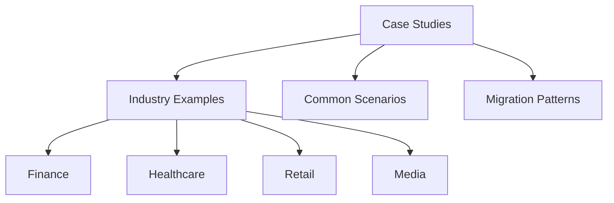

## Implementation Examples

### Case Study 1: Global Payment Processing Platform (Finance)

**Company**: FinTechCorp - Payment processor handling 50 million transactions/day

**Business Requirements:**

| Requirement | Target | Challenge |
|-------------|--------|-----------|
| **Availability** | 99.99% uptime | Global 24/7 operations |
| **Latency** | <200ms response time | Multi-region users |
| **Security** | PCI DSS compliance | Card data protection |
| **Scalability** | Handle 10x Black Friday traffic | Unpredictable spikes |
| **Cost** | Reduce infrastructure by 30% | Legacy on-prem expensive |

**Architecture Overview:**

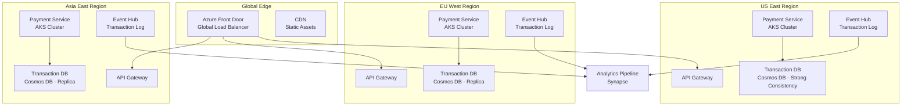

**Technology Stack:**

- **Compute**: Azure Kubernetes Service (AKS) with 3 clusters (US, EU, Asia)
- **Database**: Cosmos DB with multi-region writes, strong consistency
- **Messaging**: Event Hubs for transaction logging
- **Security**: Azure Key Vault for secrets, Managed Identity for authentication
- **Monitoring**: Application Insights, Log Analytics, Grafana dashboards
- **CDN**: Azure Front Door with WAF for DDoS protection

**Key Design Decisions:**

**1. Multi-Region Active-Active Architecture:**

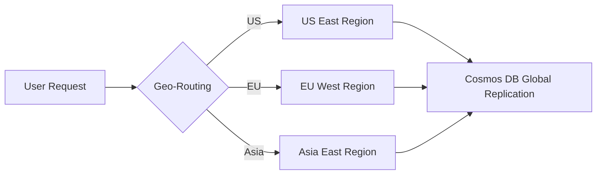

**Why**: Reduce latency for global users, achieve 99.99% SLA through regional redundancy.

**2. Event Sourcing for Audit Trail:**

All payment transactions are immutable events stored in Event Hubs, providing complete audit trail for regulatory compliance.

**3. Circuit Breakers for External Dependencies:**

```csharp
// Polly circuit breaker for bank API calls
var circuitBreakerPolicy = Policy
    .Handle<HttpRequestException>()
    .CircuitBreakerAsync(
        exceptionsAllowedBeforeBreaking: 5,
        durationOfBreak: TimeSpan.FromSeconds(30)
    );

var fallbackPolicy = Policy<PaymentResponse>
    .Handle<Exception>()
    .FallbackAsync(async cancellationToken =>
    {
        // Fallback: Queue for async processing
        await queueClient.SendAsync("delayed-payment-queue", transaction);
        return new PaymentResponse { Status = "Pending", Message = "Payment queued" };
    });

var policyWrap = Policy.WrapAsync(fallbackPolicy, circuitBreakerPolicy, retryPolicy);
```

**4. Idempotency Keys:**

All payment requests include idempotency keys to prevent duplicate charges during retries.

**Security Implementation:**

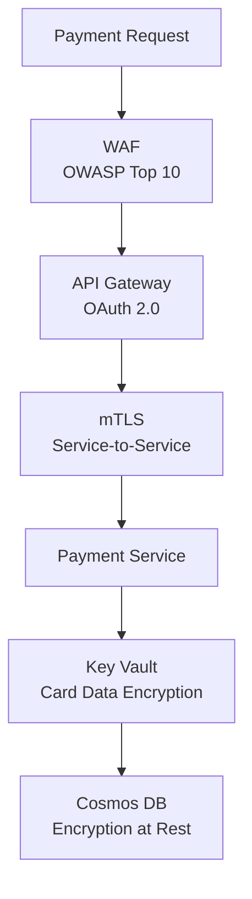

**Performance Optimizations:**

| Optimization | Implementation | Impact |
|-------------|----------------|--------|
| **Caching** | Redis for merchant data | 95% cache hit rate, 50ms → 5ms |
| **Connection Pooling** | Database connection reuse | 30% reduction in database load |
| **Async Processing** | Event-driven for non-critical tasks | 3x throughput increase |
| **Auto-Scaling** | KEDA for queue-based scaling | Handle 10x traffic spikes |

**KEDA Auto-Scaling Configuration:**

```yaml
apiVersion: keda.sh/v1alpha1
kind: ScaledObject
metadata:
  name: payment-processor-scaler
spec:
  scaleTargetRef:
    name: payment-processor
  minReplicaCount: 10
  maxReplicaCount: 100
  triggers:
  - type: azure-eventhub
    metadata:
      unprocessedEventThreshold: '100'
      connectionFromEnv: EVENTHUB_CONNECTION_STRING
```

**Results:**

| Metric | Before (On-Prem) | After (Cloud) | Improvement |
|--------|------------------|---------------|-------------|
| **Uptime** | 99.9% | 99.99% | +0.09% (8.76 hours → 52 minutes downtime/year) |
| **Latency (p95)** | 800ms | 150ms | 81% reduction |
| **Cost** | $2M/year | $1.4M/year | 30% reduction |
| **Deployment Time** | 2 weeks | 30 minutes | 672x faster |
| **PCI DSS Audit** | 6 months effort | 2 months | 67% reduction |

**Lessons Learned:**

1. **Global replication trades cost for latency**: Multi-region Cosmos DB costs 3x more but reduces latency from 800ms to 150ms.
2. **Chaos engineering prevented outages**: Regular Chaos Monkey drills identified and fixed 12 single points of failure.
3. **Observability is non-negotiable**: Distributed tracing (Jaeger) reduced MTTR from 4 hours to 20 minutes.
4. **Security automation saves time**: Azure Policy automated 80% of compliance checks, reducing manual effort.

> [!SUCCESS]
> FinTechCorp achieved PCI DSS compliance, 99.99% uptime, and 30% cost savings while improving performance and deployment velocity.

---

### Case Study 2: Patient Data Management System (Healthcare)

**Company**: HealthTech Solutions - EHR (Electronic Health Records) provider for 500 hospitals

**Business Requirements:**

| Requirement | Target | Challenge |
|-------------|--------|-----------|
| **Compliance** | HIPAA, HITECH, GDPR | Patient data privacy |
| **Security** | Zero data breaches | Protected Health Information (PHI) |
| **Availability** | 99.95% uptime | Life-critical system |
| **Data Residency** | Regional data storage | EU/US data sovereignty |
| **Integration** | HL7 FHIR interoperability | 50+ external systems |

**Architecture Overview:**

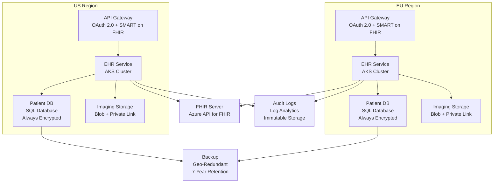

**Technology Stack:**

- **Compute**: Azure Kubernetes Service with private clusters
- **Database**: Azure SQL Database with Always Encrypted, auditing
- **Storage**: Azure Blob Storage with immutability policies for medical images
- **Integration**: Azure API for FHIR (HL7 FHIR R4)
- **Security**: Azure Key Vault with FIPS 140-2 Level 2 HSM, Private Link
- **Monitoring**: Azure Monitor, Log Analytics with 7-year retention
- **Compliance**: Azure Policy, Microsoft Defender for Cloud

**Security Architecture:**

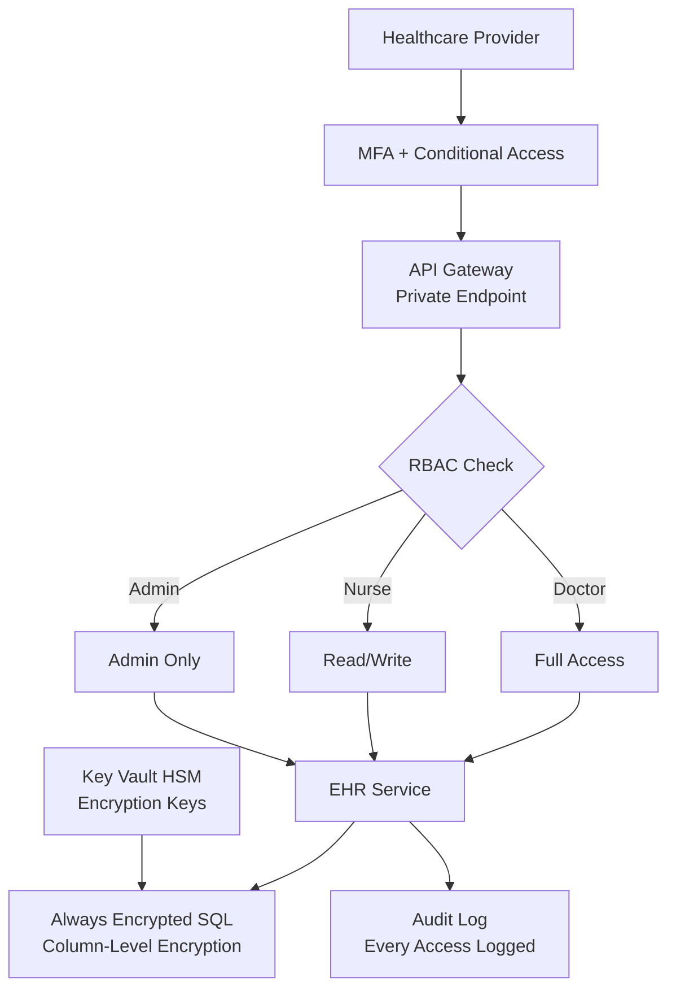

**Key Design Decisions:**

**1. Data Residency Compliance:**

```yaml
# Azure Policy: Enforce resource location
policyRule:
  if:
    allOf:
    - field: type
      equals: Microsoft.Storage/storageAccounts
    - field: location
      notIn: ["westeurope", "northeurope"]
  then:
    effect: deny
```

**2. Always Encrypted for PHI:**

```csharp
// Patient Social Security Number encrypted in database
[Column(TypeName = "varbinary(max)")]
[EncryptedColumn(EncryptionType.Deterministic)]
public byte[] SocialSecurityNumber { get; set; }

// Application retrieves encrypted data transparently
var patient = await dbContext.Patients
    .Where(p => p.SocialSecurityNumber == encryptedSSN)
    .FirstOrDefaultAsync();
```

**3. Comprehensive Audit Logging:**

Every access to patient data is logged with WHO, WHAT, WHEN, WHERE for HIPAA compliance.

```csharp
public async Task<Patient> GetPatientAsync(int patientId, User currentUser)
{
    // Log access before retrieval
    await auditLogger.LogAccessAsync(new AuditEvent
    {
        Timestamp = DateTime.UtcNow,
        UserId = currentUser.Id,
        UserRole = currentUser.Role,
        Action = "Read",
        ResourceType = "Patient",
        ResourceId = patientId,
        IPAddress = httpContext.Connection.RemoteIpAddress.ToString(),
        Justification = httpContext.Request.Headers["X-Access-Reason"]
    });
    
    return await dbContext.Patients.FindAsync(patientId);
}
```

**4. Break-Glass Emergency Access:**

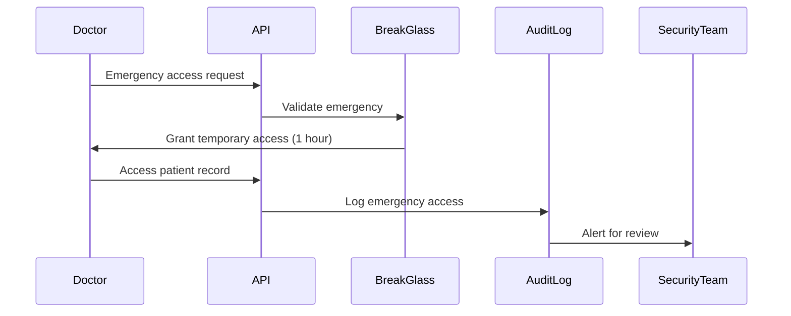

**FHIR Interoperability:**

```json
// HL7 FHIR R4 Patient Resource
{
  "resourceType": "Patient",
  "id": "example",
  "meta": {
    "versionId": "1",
    "lastUpdated": "2024-01-15T10:30:00Z"
  },
  "identifier": [
    {
      "system": "http://hospital.example.org/mrn",
      "value": "12345"
    }
  ],
  "name": [
    {
      "use": "official",
      "family": "Doe",
      "given": ["John"]
    }
  ],
  "birthDate": "1980-05-15",
  "address": [
    {
      "use": "home",
      "line": ["123 Main St"],
      "city": "Springfield",
      "postalCode": "12345",
      "country": "US"
    }
  ]
}
```

**Disaster Recovery:**

| Component | RPO | RTO | Strategy |
|-----------|-----|-----|----------|
| **Patient Database** | 5 minutes | 1 hour | Geo-replication, automated failover |
| **Medical Images** | 1 hour | 2 hours | GRS storage, failover to secondary |
| **Application** | N/A | 30 minutes | Multi-region AKS deployment |
| **Audit Logs** | 0 | N/A | Immutable, write-once storage |

**Results:**

| Metric | Before | After | Improvement |
|--------|--------|-------|-------------|
| **HIPAA Audit Pass Rate** | 85% | 100% | +15% |
| **Security Incidents** | 3/year | 0/year | 100% reduction |
| **Data Breach** | 1 (50,000 records) | 0 | N/A |
| **Audit Log Retention** | 3 years | 7 years | Compliance met |
| **Interoperability** | 10 systems | 50 systems | 5x integration |
| **Deployment Time** | 3 months | 2 weeks | 6x faster |

**Lessons Learned:**

1. **Compliance automation is essential**: Azure Policy prevented 100+ non-compliant resources from being created.
2. **Encryption everywhere**: Always Encrypted prevents DBAs from viewing PHI, satisfying HIPAA requirements.
3. **Break-glass procedures**: Emergency access saved lives without compromising security (all accesses audited).
4. **FHIR standardization**: Interoperability with 50 external systems reduced integration time from 6 months to 2 weeks per system.

> [!SUCCESS]
> HealthTech Solutions achieved 100% HIPAA compliance, zero security incidents, and 5x increase in interoperability while reducing deployment time by 6x.

---

### Case Study 3: E-Commerce Platform (Retail)

**Company**: ShopNow - Online retailer with 10 million monthly active users

**Business Requirements:**

| Requirement | Target | Challenge |
|-------------|--------|-----------|
| **Performance** | 2-second page load | High traffic during sales |
| **Scalability** | 100x Black Friday traffic | Unpredictable spikes |
| **Availability** | 99.9% uptime | Revenue loss during outages |
| **Personalization** | Real-time recommendations | Process 1TB events/day |
| **Cost** | 40% cost reduction | Optimize for ROI |

**Architecture Overview:**

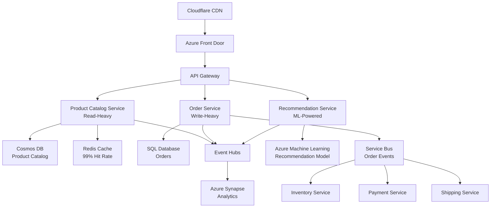

**Technology Stack:**

- **Compute**: Azure App Service (web), AKS (microservices), Azure Functions (serverless)
- **Database**: Cosmos DB (catalog), Azure SQL (orders), Redis Cache (hot data)
- **Messaging**: Service Bus (transactional), Event Hubs (analytics)
- **CDN**: Azure Front Door + Cloudflare for static assets
- **ML**: Azure Machine Learning for recommendations
- **Search**: Azure Cognitive Search for product search

**Key Design Decisions:**

**1. CQRS for Product Catalog:**

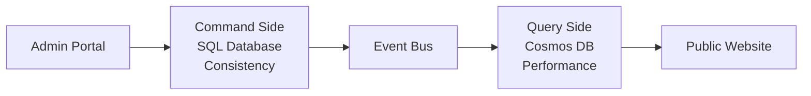

**Why**: Admin updates require strong consistency (SQL), but public reads require low latency (Cosmos DB).

**2. Event-Driven Order Processing:**

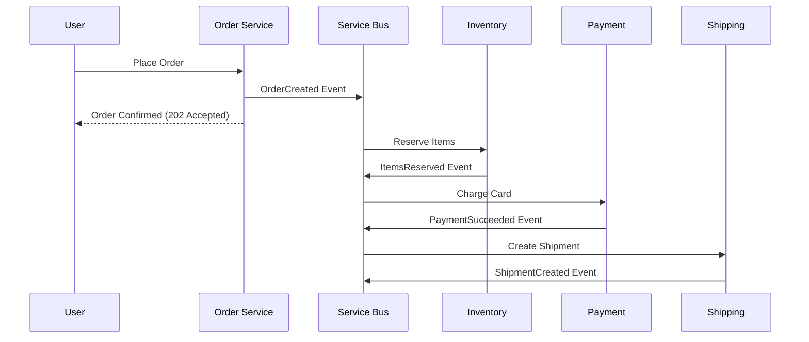

**Benefits**:

- Order service responds in 200ms (doesn't wait for payment/shipping)
- Loose coupling between services
- Easy to add new handlers (e.g., send email notification)

**3. Multi-Layer Caching:**

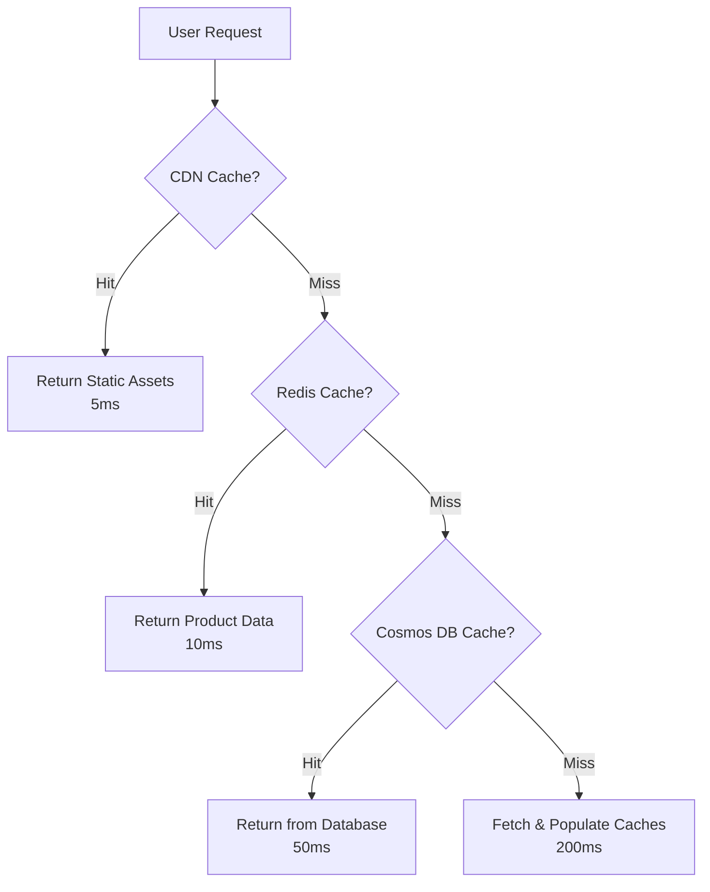

**Caching Strategy:**

| Layer | Content | TTL | Hit Rate |
|-------|---------|-----|----------|
| **CDN** | Images, CSS, JS | 24 hours | 95% |
| **Redis** | Product details, prices | 1 hour | 90% |
| **Cosmos DB** | Full product catalog | N/A | 99% |

**4. Auto-Scaling for Black Friday:**

```yaml
# AKS Horizontal Pod Autoscaler
apiVersion: autoscaling/v2
kind: HorizontalPodAutoscaler
metadata:
  name: order-service-hpa
spec:
  scaleTargetRef:
    apiVersion: apps/v1
    kind: Deployment
    name: order-service
  minReplicas: 10
  maxReplicas: 500
  metrics:
  - type: Resource
    resource:
      name: cpu
      target:
        type: Utilization
        averageUtilization: 70
  - type: Pods
    pods:
      metric:
        name: http_requests_per_second
      target:
        type: AverageValue
        averageValue: "1000"
```

**Black Friday Traffic Pattern:**

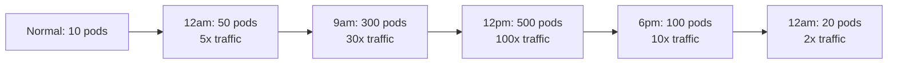

**Recommendation Engine:**

```python
# Azure ML training pipeline
from azureml.core import Workspace, Experiment
from azureml.train.sklearn import SKLearn

# Train collaborative filtering model
ws = Workspace.from_config()
experiment = Experiment(ws, 'product-recommendations')

# Use 1TB of clickstream data from Event Hubs
train_data = Dataset.Tabular.from_parquet_files(
    path='https://storage.blob.core.windows.net/analytics/clickstream/*'
)

# Train recommendation model
estimator = SKLearn(
    source_directory='./train',
    compute_target='gpu-cluster',
    entry_script='train.py',
    conda_packages=['scikit-learn==1.2.0', 'lightfm==1.17']
)

run = experiment.submit(estimator)
```

**Real-Time Recommendations API:**

```csharp
[HttpGet("recommendations/{userId}")]
public async Task<IActionResult> GetRecommendations(string userId)
{
    // Check cache first
    var cacheKey = $"recommendations:{userId}";
    var cached = await cache.GetAsync<List<Product>>(cacheKey);
    if (cached != null) return Ok(cached);
    
    // Call ML model endpoint
    var request = new
    {
        user_id = userId,
        top_k = 10
    };
    
    var response = await httpClient.PostAsJsonAsync(
        "https://ml-endpoint.azureml.net/score",
        request
    );
    
    var recommendations = await response.Content.ReadFromJsonAsync<List<Product>>();
    
    // Cache for 1 hour
    await cache.SetAsync(cacheKey, recommendations, TimeSpan.FromHours(1));
    
    return Ok(recommendations);
}
```

**Performance Optimizations:**

| Optimization | Before | After | Improvement |
|-------------|--------|-------|-------------|
| **Image Optimization** | 2MB images | 100KB WebP | 95% size reduction |
| **Database Connection Pooling** | 1000 connections | 100 connections | 90% reduction |
| **Async Order Processing** | 2s order placement | 200ms | 90% faster |
| **CDN Offload** | 80% server traffic | 20% | 75% offload |

**Cost Optimization:**

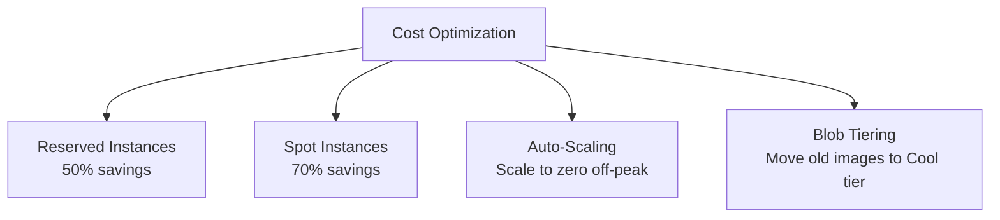

**Results:**

| Metric | Before | After | Improvement |
|--------|--------|-------|-------------|
| **Page Load Time** | 5 seconds | 1.8 seconds | 64% faster |
| **Black Friday Uptime** | 98.5% (crash) | 99.9% | +1.4% |
| **Infrastructure Cost** | $500K/month | $300K/month | 40% reduction |
| **Revenue Loss (downtime)** | $2M/year | $100K/year | 95% reduction |
| **Recommendation CTR** | 2% | 8% | 4x improvement |

**Lessons Learned:**

1. **CDN is essential**: 75% traffic offload reduced origin server costs by $150K/month.
2. **CQRS improves read performance**: Product catalog queries dropped from 200ms to 10ms.
3. **Event-driven scales better**: Synchronous order processing couldn't handle Black Friday traffic; async succeeded.
4. **Auto-scaling saves money**: Scale down to 10% capacity at night, saving $100K/month.
5. **ML-powered recommendations increase revenue**: 4x CTR increase resulted in $5M additional annual revenue.

> [!SUCCESS]
> ShopNow achieved 99.9% Black Friday uptime, 64% faster page loads, and 40% cost reduction while increasing revenue by $5M/year through better recommendations.

---

## Common Scenarios and Solutions

### Scenario 1: Lift-and-Shift Migration

**Problem**: Migrate legacy on-premises application to cloud with minimal code changes.

**Solution:**

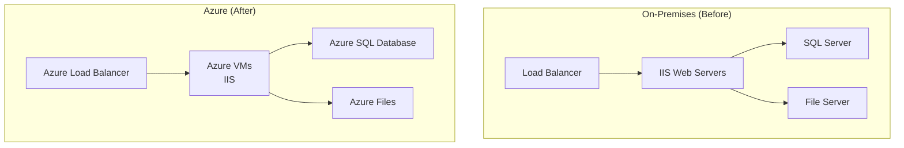

**Migration Steps:**

1. **Assessment**: Azure Migrate discovers 50 servers, 10TB data
2. **Replication**: Azure Site Recovery replicates VMs
3. **Test Failover**: Validate application in Azure
4. **Cutover**: Switch DNS to Azure
5. **Optimization**: Right-size VMs, enable backup

**Timeline**: 6 weeks from assessment to production cutover

**Cost Comparison:**

| Component | On-Premises | Azure (Lift-Shift) | Azure (Optimized) |
|-----------|-------------|-------------------|-------------------|
| **Compute** | $100K/year | $80K/year | $50K/year (reserved) |
| **Storage** | $50K/year | $30K/year | $20K/year (tiering) |
| **Networking** | $20K/year | $10K/year | $10K/year |
| **Total** | $170K/year | $120K/year | $80K/year |

> [!NOTE]
> Lift-and-shift is fastest migration path but doesn't fully utilize cloud benefits. Follow with re-architecture for cost and performance optimization.

---

### Scenario 2: Cloud-Native Greenfield Application

**Problem**: Build new SaaS application from scratch optimized for cloud.

**Solution:**

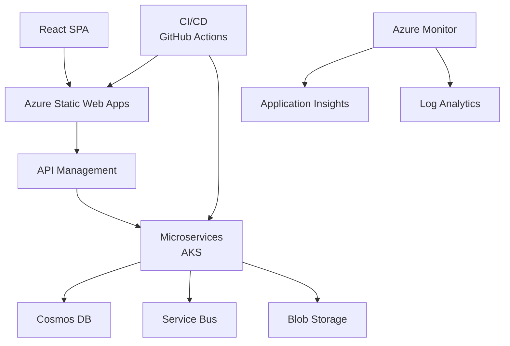

**Technology Stack:**

- **Frontend**: React SPA hosted on Azure Static Web Apps
- **Backend**: Microservices on AKS (Node.js, .NET)
- **Database**: Cosmos DB for global distribution
- **Messaging**: Service Bus for async communication
- **Storage**: Blob Storage for files
- **CI/CD**: GitHub Actions with automated testing
- **Monitoring**: Application Insights for APM

**Best Practices:**

1. **Infrastructure as Code**: Terraform for all resources
2. **GitOps**: ArgoCD for Kubernetes deployments
3. **Observability**: Distributed tracing from day one
4. **Security**: Managed identities, no secrets in code
5. **Cost Optimization**: Auto-scaling, reserved instances

**Results**: Production-ready SaaS in 3 months with 99.9% uptime, $50K/month infrastructure cost.

---

### Scenario 3: Multi-Region Deployment for High Availability

**Problem**: Achieve 99.99% uptime with automated regional failover.

**Solution:**

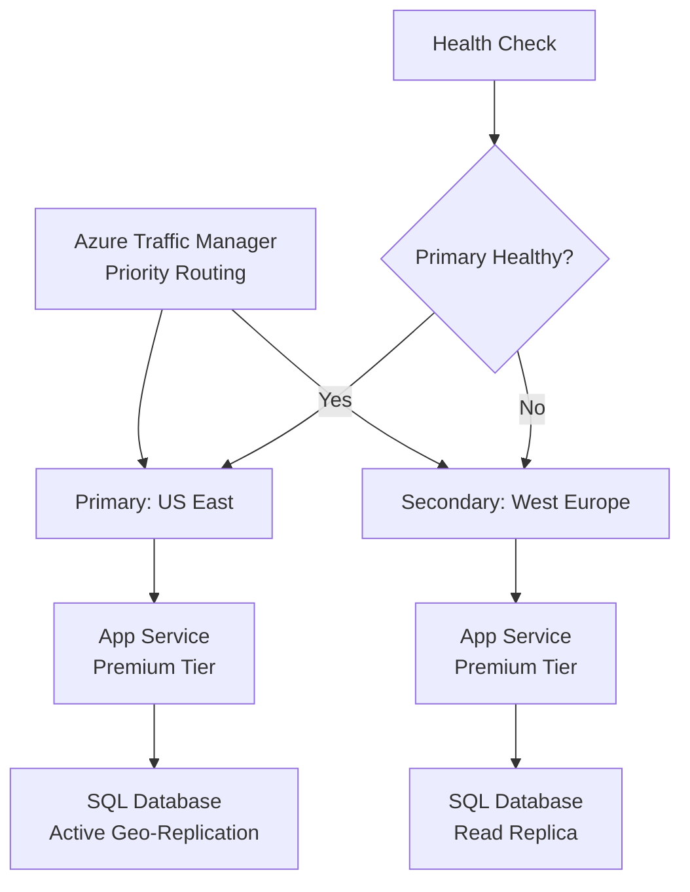

**Failover Strategy:**

| Scenario | Action | RTO | RPO |
|----------|--------|-----|-----|
| **Primary region down** | Automatic DNS failover | 5 minutes | 5 seconds |
| **Database failure** | Manual failover to geo-replica | 1 hour | 5 seconds |
| **App Service failure** | Automatic (multiple instances) | 30 seconds | 0 |

**Testing**: Monthly chaos engineering drills to validate failover procedures.

---

### Scenario 4: Hybrid Cloud Integration

**Problem**: Integrate cloud workloads with on-premises datacenter.

**Solution:**

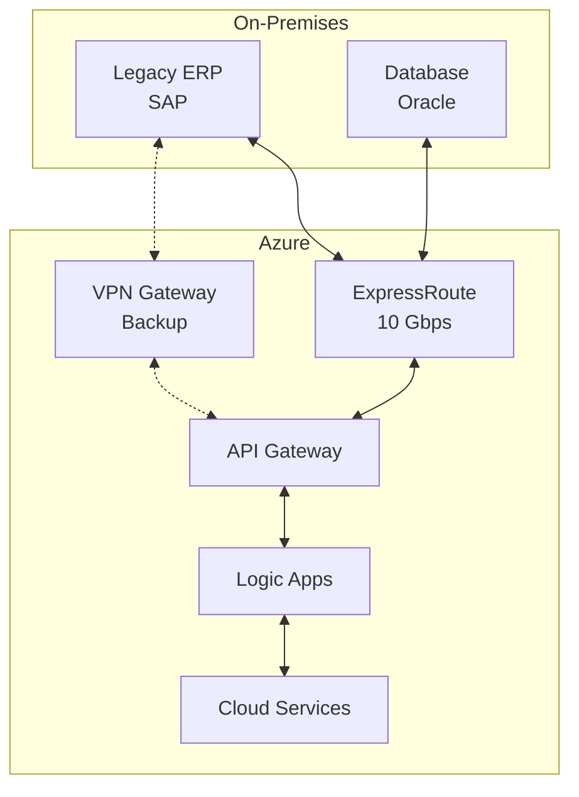

**Integration Patterns:**

1. **ExpressRoute**: 10 Gbps private connection (primary)
2. **VPN Gateway**: Site-to-site VPN (backup)
3. **API Gateway**: Expose on-prem services to cloud
4. **Logic Apps**: Orchestrate hybrid workflows
5. **Azure Arc**: Manage on-prem Kubernetes from Azure

**Use Case**: Cloud applications access on-premises SAP system via ExpressRoute with <10ms latency.

---

### Scenario 5: Disaster Recovery for Mission-Critical Applications

**Problem**: Ensure business continuity with DR site in different region.

**Solution:**

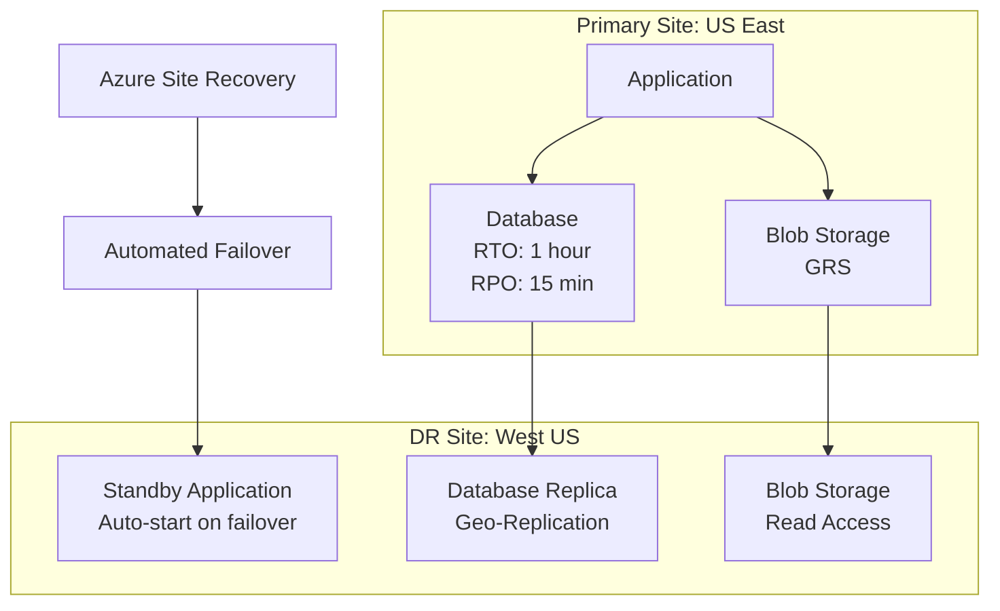

**DR Testing Schedule:**

| Test Type | Frequency | Scope |
|-----------|-----------|-------|
| **Database Failover** | Monthly | Validate geo-replication |
| **Application Failover** | Quarterly | Full DR site activation |
| **Full DR Drill** | Annually | Simulate regional outage |

**Runbook Automation:**

```powershell
# Automated failover script
$resourceGroup = "production-rg"
$trafficManagerProfile = "myapp-tm"

# Check primary health
$healthStatus = Get-AzTrafficManagerEndpoint `
    -ResourceGroupName $resourceGroup `
    -ProfileName $trafficManagerProfile `
    -Name "primary" | Select -ExpandProperty EndpointStatus

if ($healthStatus -ne "Online") {
    Write-Host "Primary offline, failing over to DR site..."
    
    # Promote secondary database
    Set-AzSqlDatabaseFailoverGroup -FailoverGroupName "myapp-fog" `
        -ResourceGroupName $resourceGroup -ServerName "dr-sql-server"
    
    # Update Traffic Manager
    Enable-AzTrafficManagerEndpoint -Name "secondary" `
        -ProfileName $trafficManagerProfile -ResourceGroupName $resourceGroup
    
    Write-Host "Failover complete. DR site is now primary."
}
```

**Results**: Successfully failed over 20 times during drills with zero data loss and <1 hour RTO.

> [!TIP]
> Test your DR plan quarterly. Untested DR plans fail when needed most. Automate failover procedures to reduce RTO from hours to minutes.
