# Core Architectural Components

This section details the fundamental building blocks of cloud architecture that form the foundation of any cloud solution.

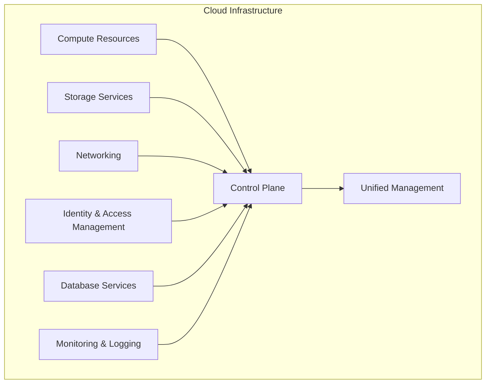

## Computing Resources

Computing resources provide the processing power for applications and workloads in the cloud. Selecting the right compute option is critical for performance, cost, and scalability.

### Virtual Machines (VMs)

Virtual machines provide Infrastructure as a Service (IaaS) with full control over the operating system and environment.

**Key Features:**

- Complete control over OS configuration
- Support for Windows, Linux, and specialized distributions
- Vertical scaling (resize) and horizontal scaling (scale sets)
- Persistent and ephemeral disk options
- Spot/Reserved instances for cost optimization

**Examples:**

| Provider | Service | Specifications | Best For |
|----------|---------|---------------|----------|
| **Azure** | Virtual Machines (B, D, E, F series) | 1-128 vCPUs, 0.5-3,892 GB RAM | General purpose, compute-optimized, memory-optimized |
| **AWS** | EC2 (T, M, C, R, X instances) | Flexible sizing, ARM/x86 | Diverse workload types, burstable performance |
| **Google Cloud** | Compute Engine | Custom machine types | Tailored VM configurations |

**Architecture Pattern:**

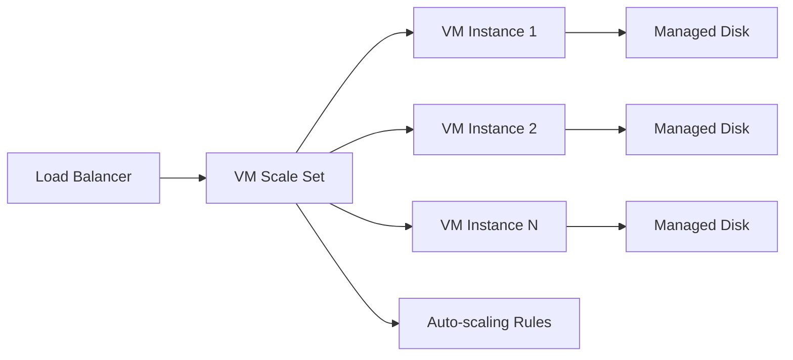

**Real-World Example:**

An e-commerce platform uses Azure Virtual Machine Scale Sets with auto-scaling rules that add instances during peak shopping hours and scale down during off-peak times, reducing costs while maintaining performance.

> [!TIP]
> Use VM Scale Sets or Auto Scaling Groups for applications that need horizontal scaling. Reserve instances or savings plans can reduce costs by 40-60% for steady-state workloads.

### Containers

Containers provide lightweight, portable application packaging that includes dependencies and runtime.

**Container Services:**

| Service Type | Azure | AWS | Google Cloud | Use Case |
|--------------|-------|-----|--------------|----------|
| **Container Orchestration** | Azure Kubernetes Service (AKS) | Elastic Kubernetes Service (EKS) | Google Kubernetes Engine (GKE) | Complex microservices |
| **Serverless Containers** | Azure Container Apps | AWS Fargate | Cloud Run | Event-driven, minimal ops |
| **Container Registry** | Azure Container Registry | ECR (Elastic Container Registry) | Artifact Registry | Image storage |

**Kubernetes Architecture:**

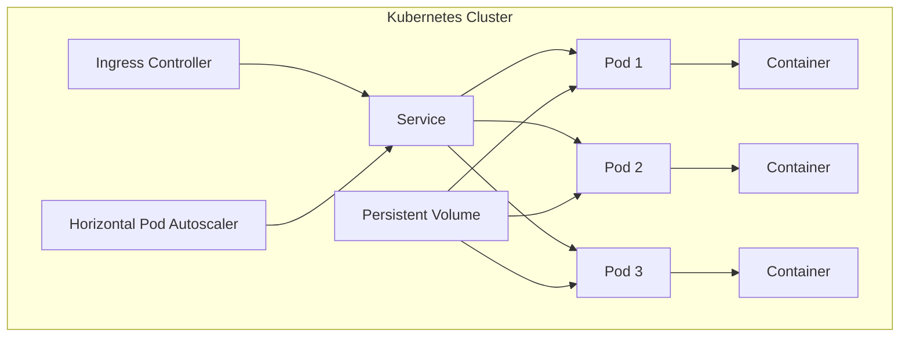

**Real-World Example:**

A SaaS company deploys microservices on AKS, using namespaces for multi-tenancy, Horizontal Pod Autoscaler for dynamic scaling, and Azure Container Registry for private image storage.

> [!IMPORTANT]
> Containers are ideal for microservices architectures but require orchestration expertise. Start with managed services like AKS, EKS, or GKE for production workloads.

### Serverless Computing

Serverless computing allows you to run code without managing infrastructure, paying only for actual execution time.

**Serverless Compute Options:**

| Provider | Service | Trigger Types | Runtime Support |
|----------|---------|---------------|-----------------|
| **Azure** | Azure Functions | HTTP, Timer, Queue, Event Grid | .NET, Node.js, Python, Java, PowerShell |
| **AWS** | Lambda | API Gateway, S3, DynamoDB, EventBridge | Node.js, Python, Java, Go, Ruby, .NET |
| **Google Cloud** | Cloud Functions | HTTP, Pub/Sub, Storage | Node.js, Python, Go, Java, Ruby, PHP, .NET |

**Serverless Architecture Pattern:**

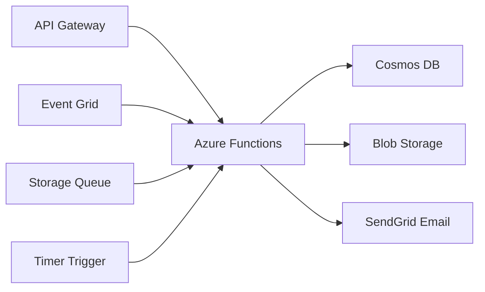

**Cost Comparison Example:**

| Workload Type | VM (24/7) | Serverless (Actual Usage) | Savings |
|---------------|-----------|---------------------------|---------|
| API with 1M requests/month | $73/month | $20/month | 73% |
| Scheduled job (10 min/day) | $73/month | $1.50/month | 98% |
| Always-on service | $73/month | $150/month | -105% (worse) |

**Real-World Example:**

An image processing service uses AWS Lambda triggered by S3 uploads to generate thumbnails, process metadata, and update DynamoDB, scaling automatically from 0 to thousands of concurrent executions.

> [!NOTE]
> Serverless is cost-effective for event-driven and variable workloads but can be expensive for consistent, high-volume traffic. Consider cold start latency for user-facing applications.

## Storage Services

Cloud storage services provide scalable, durable, and highly available data storage for various use cases.

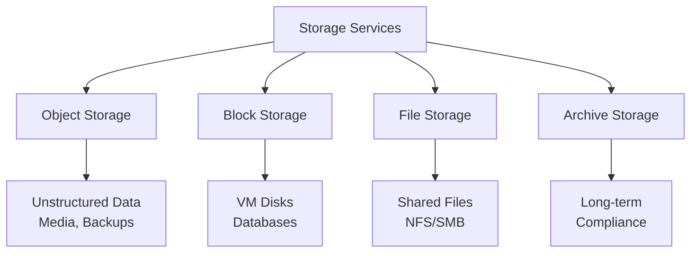

### Object Storage

Object storage is designed for unstructured data with unlimited scalability and HTTP/REST access.

**Object Storage Services:**

| Provider | Service | Storage Tiers | Unique Features |
|----------|---------|---------------|-----------------|
| **Azure** | Blob Storage | Hot, Cool, Cold, Archive | Lifecycle policies, immutable storage |
| **AWS** | S3 (Simple Storage Service) | Standard, IA, Glacier | Object Lock, cross-region replication |
| **Google Cloud** | Cloud Storage | Standard, Nearline, Coldline, Archive | Uniform bucket-level access |

**Storage Tiers & Pricing Example:**

| Tier | Use Case | Storage Cost (per GB/month) | Retrieval Cost |
|------|----------|----------------------------|----------------|
| **Hot/Standard** | Frequently accessed data | $0.018 | Free |
| **Cool/Infrequent Access** | Backups, accessed monthly | $0.010 | $0.01 per GB |
| **Archive/Glacier** | Compliance, rarely accessed | $0.002 | $0.02 per GB + hours delay |

**Object Storage Architecture:**

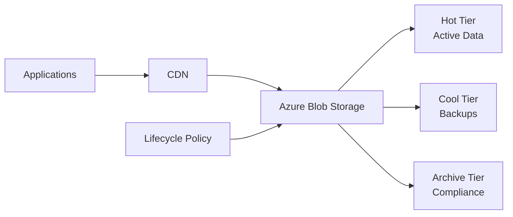

**Real-World Example:**

A media streaming platform stores active content in Azure Blob Hot tier with CDN caching, moves content older than 90 days to Cool tier, and archives shows no longer in production to Archive tier, reducing storage costs by 70%.

> [!TIP]
> Implement lifecycle management policies to automatically transition objects between storage tiers based on age or access patterns, optimizing costs without manual intervention.

### Block Storage

Block storage provides persistent disk volumes for virtual machines and databases with low-latency performance.

**Block Storage Options:**

| Provider | Service | Performance Tiers | Max IOPS | Max Throughput |
|----------|---------|-------------------|----------|----------------|
| **Azure** | Managed Disks | Standard HDD, Standard SSD, Premium SSD, Ultra Disk | 160,000 | 4,000 MB/s |
| **AWS** | EBS (Elastic Block Store) | gp3, io2, st1, sc1 | 64,000 | 1,000 MB/s |
| **Google Cloud** | Persistent Disk | Standard, Balanced, SSD, Extreme | 100,000 | 1,200 MB/s |

**Use Cases:**

- **Database storage**: High IOPS for transactional databases (SQL Server, Oracle, MySQL)
- **Boot volumes**: OS disks for virtual machines
- **Application data**: Persistent storage for stateful applications

> [!IMPORTANT]
> Choose Premium SSD or io2 volumes for production databases requiring consistent low-latency performance. Standard disks are suitable for dev/test and non-critical workloads.

### File Storage

File storage provides fully managed file shares accessible via SMB/NFS protocols.

**File Storage Services:**

| Provider | Service | Protocol Support | Max Size | Performance |
|----------|---------|------------------|----------|-------------|
| **Azure** | Azure Files | SMB 3.0, NFS 4.1 | 100 TiB | Up to 10,000 IOPS |
| **AWS** | EFS (Elastic File System) | NFS 4.0, 4.1 | Petabytes | Scalable |
| **Google Cloud** | Filestore | NFS 3.0 | 100 TiB | Up to 1.2 GB/s |

**File Storage Architecture:**

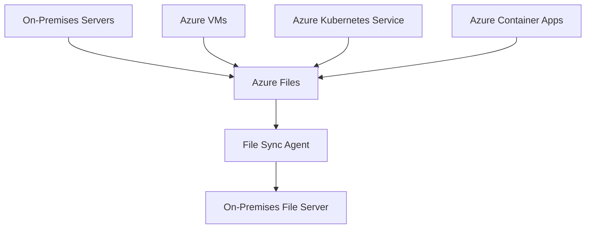

**Real-World Example:**

An enterprise uses Azure Files Premium with Azure File Sync to enable hybrid file sharing between on-premises offices and cloud workloads, providing centralized storage with local caching.

## Networking

Cloud networking enables secure, reliable connectivity between resources, users, and on-premises infrastructure.

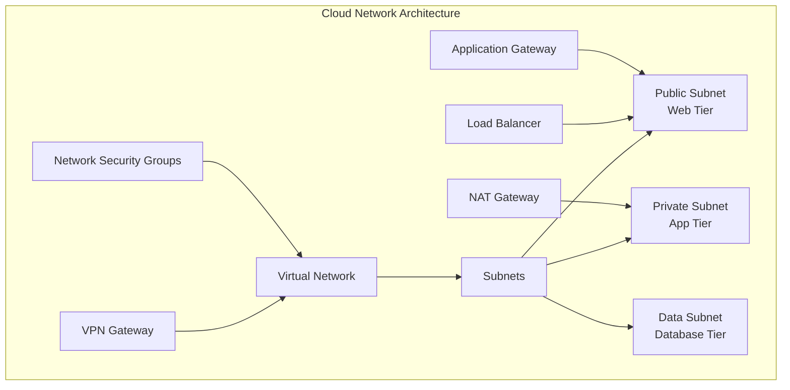

### Virtual Networks (VNet/VPC)

Virtual networks provide isolated network environments in the cloud with customizable IP address spaces.

**Virtual Network Features:**

| Feature | Azure (VNet) | AWS (VPC) | Purpose |
|---------|--------------|-----------|---------|
| **IP Address Range** | CIDR blocks (10.0.0.0/8 to /16) | CIDR blocks (10.0.0.0/8 to /16) | Private address space |
| **Subnets** | Multiple per VNet | Multiple per VPC | Segmentation and isolation |
| **DNS** | Azure-provided or custom | Route 53 | Name resolution |
| **Peering** | VNet peering, global peering | VPC peering | Network connectivity |

**Network Segmentation Example:**

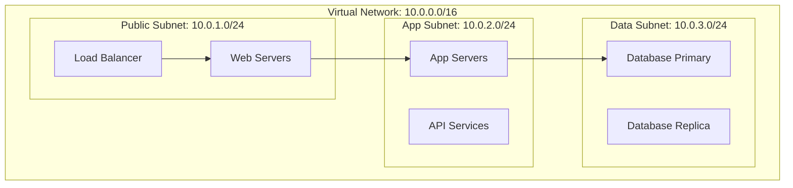

**Best Practices:**

- **CIDR Planning**: Use non-overlapping address spaces (10.0.0.0/8, 172.16.0.0/12, 192.168.0.0/16)
- **Subnet Sizing**: Plan for growth, reserve address space for future expansion
- **Network Isolation**: Use separate subnets for different tiers (web, app, data)

> [!CAUTION]
> Once a VNet/VPC is created with a specific CIDR block, it cannot be changed. Plan your address space carefully to accommodate future growth and peering requirements.

### Load Balancing

Load balancers distribute traffic across multiple instances for high availability and scalability.

**Load Balancer Types:**

| Type | Azure | AWS | Layer | Use Case |
|------|-------|-----|-------|----------|
| **Network (L4)** | Azure Load Balancer | Network Load Balancer | TCP/UDP | High performance, low latency |
| **Application (L7)** | Application Gateway | Application Load Balancer | HTTP/HTTPS | SSL termination, path-based routing |
| **Global** | Azure Front Door | CloudFront + Global Accelerator | HTTP/HTTPS | Multi-region, CDN |
| **Internal** | Internal Load Balancer | Internal ALB/NLB | Private | Backend services |

**Load Balancing Architecture:**

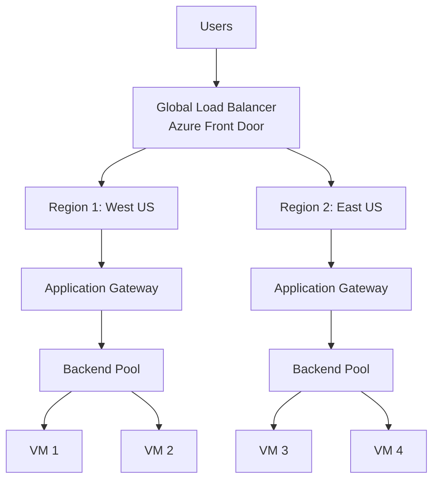

> [!TIP]
> Use Application Load Balancers (L7) for HTTP/HTTPS traffic to leverage advanced features like SSL offloading, path-based routing, and Web Application Firewall (WAF) integration.

### Content Delivery Network (CDN)

CDNs cache content at edge locations globally, reducing latency and improving user experience.

**CDN Services:**

| Provider | Service | Edge Locations | Features |
|----------|---------|----------------|----------|
| **Azure** | Azure CDN, Front Door | 180+ PoPs | Dynamic site acceleration, WAF |
| **AWS** | CloudFront | 400+ PoPs | Lambda@Edge, origin shield |
| **Google Cloud** | Cloud CDN | 190+ PoPs | HTTP/3, signed URLs |
| **Cloudflare** | Cloudflare CDN | 310+ cities | DDoS protection, Workers |

**CDN Architecture:**

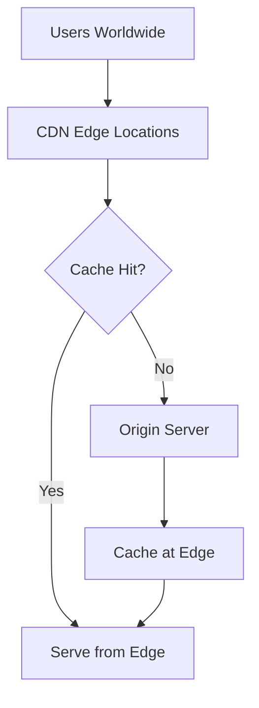

**Real-World Example:**

A video streaming platform uses Azure CDN with Front Door to cache video content globally, reducing origin load by 90% and improving playback quality with <50ms latency for 95% of users.

### Hybrid Connectivity

Hybrid connectivity options enable secure connections between on-premises infrastructure and cloud resources.

**Connectivity Options:**

| Type | Azure | AWS | Bandwidth | Latency | Security |
|------|-------|-----|-----------|---------|----------|
| **VPN** | VPN Gateway | Site-to-Site VPN | Up to 10 Gbps | Variable (internet) | IPsec encrypted |
| **Dedicated** | ExpressRoute | Direct Connect | 50 Mbps - 100 Gbps | Low, consistent | Private connection |
| **Software** | Third-party NVA | Transit Gateway | Varies | Variable | Encrypted tunnels |

**Hybrid Network Architecture:**

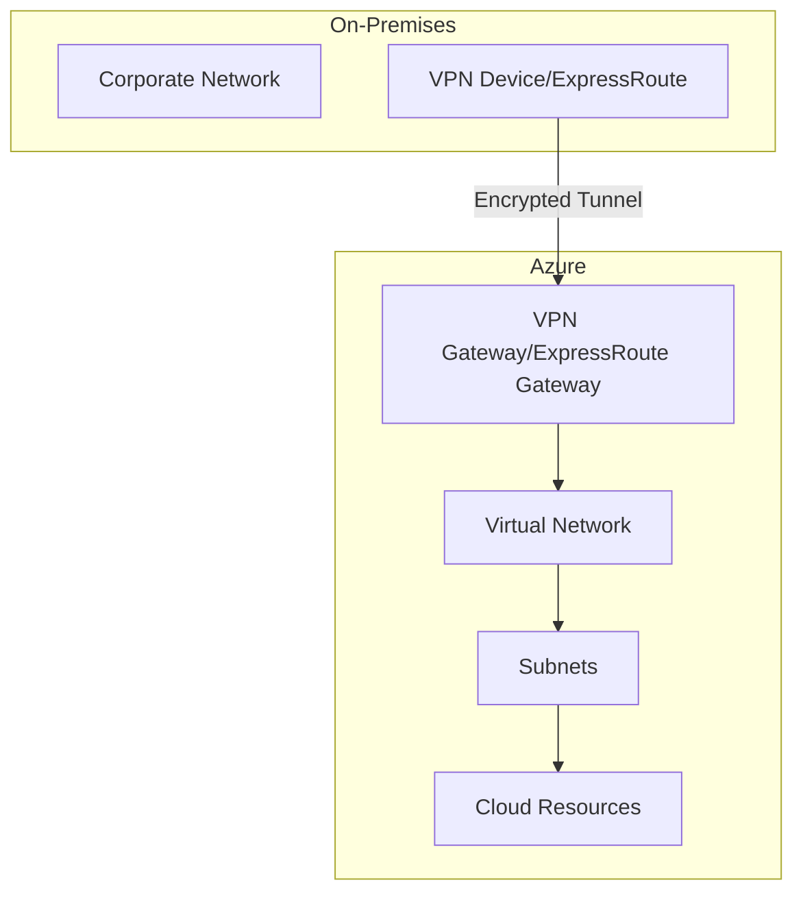

> [!IMPORTANT]
> For production workloads requiring consistent performance and SLAs, use dedicated connections (ExpressRoute/Direct Connect) instead of VPN over the internet.

## Identity and Access Management (IAM)

IAM controls who can access resources and what actions they can perform, forming the foundation of cloud security.

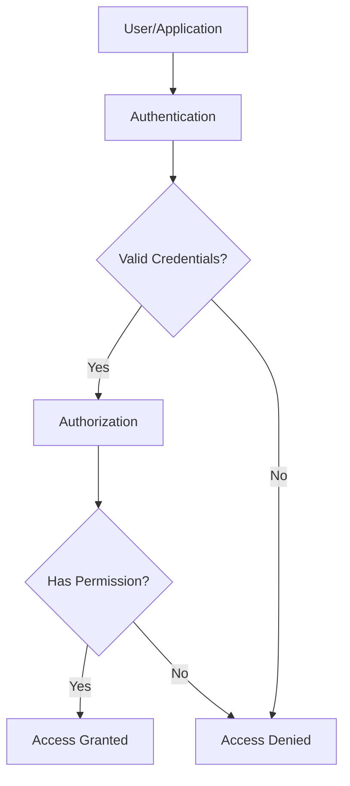

### Identity Providers

**Cloud Identity Services:**

| Provider | Service | Features |
|----------|---------|----------|
| **Azure** | Microsoft Entra ID (Azure AD) | SSO, MFA, Conditional Access, B2B/B2C |
| **AWS** | IAM, IAM Identity Center | Policies, roles, federation, SSO |
| **Google Cloud** | Cloud Identity, IAM | Workforce identity, workload identity |

### Authentication Methods

**Multi-Factor Authentication (MFA):**

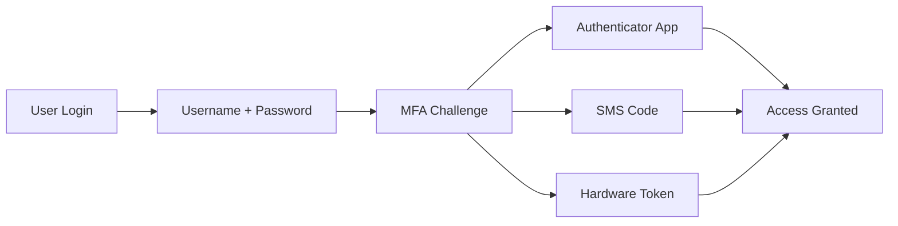

**Supported MFA Methods:**

- **Authenticator Apps**: Microsoft Authenticator, Google Authenticator
- **Hardware Tokens**: YubiKey, FIDO2 security keys
- **Biometric**: Windows Hello, Touch ID, Face ID
- **SMS/Phone Call**: Less secure, backup option

> [!CAUTION]
> Always enable MFA for privileged accounts and production access. SMS-based MFA is vulnerable to SIM swapping attacks; use authenticator apps or hardware tokens for sensitive operations.

### Authorization Models

**Role-Based Access Control (RBAC):**

| Role Type | Scope | Example Roles | Use Case |
|-----------|-------|---------------|----------|
| **Built-in** | Subscription/Resource Group | Owner, Contributor, Reader | Standard permissions |
| **Custom** | Specific resources | Backup Operator, DevOps Engineer | Tailored access |
| **Data Plane** | Resource-level | Storage Blob Data Reader, Key Vault Secrets User | Fine-grained control |

**RBAC Assignment Pattern:**

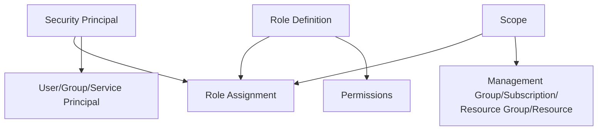

**Best Practices:**

- **Least Privilege**: Grant minimum permissions required for the task
- **Separation of Duties**: No single person should have end-to-end control
- **Time-Bound Access**: Use Privileged Identity Management (PIM) for temporary elevation
- **Regular Audits**: Review and revoke unnecessary permissions

> [!TIP]
> Use Azure AD Privileged Identity Management (PIM) or AWS IAM Access Analyzer to implement just-in-time (JIT) access and regularly audit permissions.

### Service Identities

**Managed Identities (Azure) / IAM Roles (AWS):**

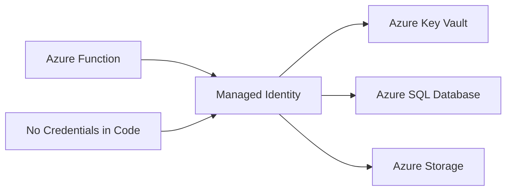

**Types:**

- **System-Assigned**: Lifecycle tied to the resource
- **User-Assigned**: Independent identity shared across resources

**Real-World Example:**

An Azure Function uses system-assigned managed identity to access Azure Key Vault for secrets and Azure Storage for data, eliminating the need to store credentials in code or configuration files.

> [!IMPORTANT]
> Always use managed identities or IAM roles for service-to-service authentication instead of storing credentials. This eliminates credential management and rotation overhead.

## Database Services

Cloud providers offer a wide range of managed database services for relational, NoSQL, and specialized workloads.

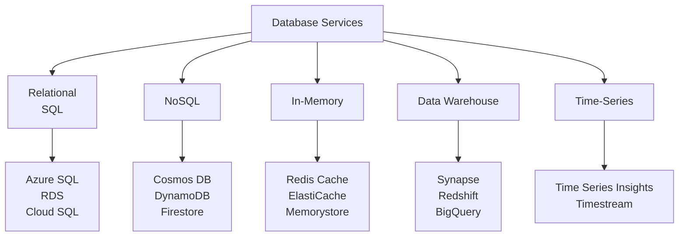

### Relational Databases

**Managed SQL Services:**

| Provider | Service | Engines | High Availability | Backup Retention |
|----------|---------|---------|-------------------|------------------|
| **Azure** | Azure SQL Database | SQL Server | 99.99% SLA, geo-replication | 7-35 days |
| **Azure** | Azure Database for MySQL/PostgreSQL | MySQL, PostgreSQL | Zone-redundant | 7-35 days |
| **AWS** | RDS | MySQL, PostgreSQL, SQL Server, Oracle, MariaDB | Multi-AZ | 7-35 days |
| **Google Cloud** | Cloud SQL | MySQL, PostgreSQL, SQL Server | Regional HA | 7-365 days |

**High Availability Architecture:**

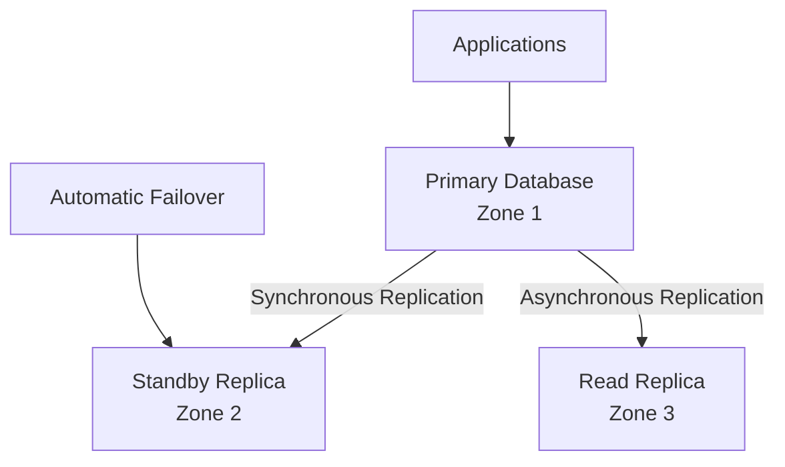

**Real-World Example:**

An e-commerce platform uses Azure SQL Database with zone-redundant configuration for the primary database, read replicas in multiple regions for reporting, and 35-day backup retention for compliance.

> [!TIP]
> Use read replicas to offload reporting and analytics queries from your primary database, improving performance for transactional workloads.

### NoSQL Databases

**Managed NoSQL Services:**

| Provider | Service | Data Model | Global Distribution | Consistency Models |
|----------|---------|------------|---------------------|-------------------|
| **Azure** | Cosmos DB | Document, Key-Value, Graph, Column | Multi-region writes | 5 consistency levels |
| **AWS** | DynamoDB | Key-Value, Document | Global tables | Eventual, strong |
| **Google Cloud** | Firestore | Document | Multi-region | Strong, eventual |

**Cosmos DB Multi-Model:**

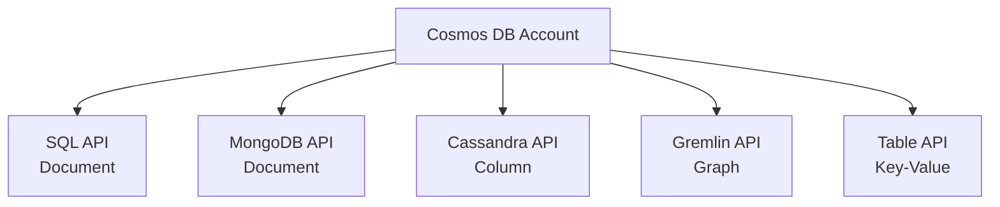

**Use Cases by Data Model:**

- **Document**: Product catalogs, content management, user profiles
- **Key-Value**: Session storage, caching, configuration
- **Graph**: Social networks, recommendation engines, fraud detection
- **Column-Family**: Time-series data, IoT telemetry, event logging

> [!NOTE]
> NoSQL databases excel at horizontal scaling and flexible schemas but sacrifice ACID transactions and complex joins. Choose based on your data access patterns.

### Caching Services

**In-Memory Data Stores:**

| Provider | Service | Engine | Max Memory | Clustering |
|----------|---------|--------|------------|------------|
| **Azure** | Azure Cache for Redis | Redis | 1.2 TB | Yes |
| **AWS** | ElastiCache | Redis, Memcached | 6.38 TB | Yes |
| **Google Cloud** | Memorystore | Redis, Memcached | 300 GB | Yes |

**Caching Architecture Pattern:**

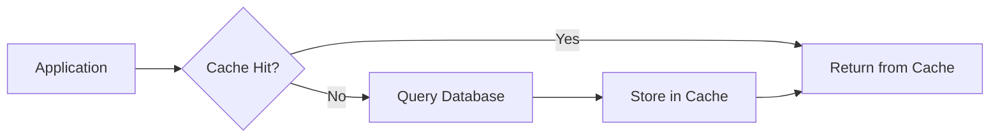

**Real-World Example:**

A news website uses Azure Cache for Redis to store article content and user sessions, reducing database load by 80% and improving page load times from 2s to 200ms.

## Control Plane

The control plane provides unified management, monitoring, and governance across all cloud resources.

```mermaid
graph TB
    subgraph "Control Plane"
        A[Azure Portal/AWS Console] --> B[Resource Management]
        C[CLI/PowerShell/API] --> B
        D[Infrastructure as Code] --> B
        B --> E[Provisioning]
        B --> F[Configuration]
        B --> G[Monitoring]
        B --> H[Security]
    end
```

### Management Tools

**Management Interfaces:**

| Interface | Azure | AWS | Use Case |
|-----------|-------|-----|----------|
| **Web Portal** | Azure Portal | AWS Management Console | Visual resource management |
| **CLI** | Azure CLI | AWS CLI | Scripting, automation |
| **PowerShell** | Azure PowerShell | AWS Tools for PowerShell | Windows automation |
| **SDK** | Azure SDK | AWS SDK | Application integration |
| **REST API** | Azure Resource Manager API | AWS API | Custom integrations |

### Infrastructure as Code (IaC)

**IaC Tools:**

| Tool | Type | Cloud Support | Language |
|------|------|---------------|----------|
| **Terraform** | Declarative | Multi-cloud | HCL |
| **Azure Resource Manager (ARM)** | Declarative | Azure | JSON |
| **AWS CloudFormation** | Declarative | AWS | JSON/YAML |
| **Bicep** | Declarative | Azure | Bicep DSL |
| **Pulumi** | Imperative | Multi-cloud | Python, TypeScript, Go, C# |

**IaC Workflow:**

```mermaid
graph LR
    A[Define Infrastructure<br/>Code] --> B[Version Control<br/>Git]
    B --> C[CI/CD Pipeline]
    C --> D[Terraform Plan]
    D --> E[Review Changes]
    E --> F[Terraform Apply]
    F --> G[Deployed Resources]
```

> [!IMPORTANT]
> Always use Infrastructure as Code for production environments. Store IaC files in version control, implement code reviews, and use CI/CD pipelines for deployments.

### Monitoring and Observability

**Monitoring Services:**

| Provider | Service | Metrics | Logs | Distributed Tracing |
|----------|---------|---------|------|---------------------|
| **Azure** | Azure Monitor | ✅ | Log Analytics | Application Insights |
| **AWS** | CloudWatch | ✅ | CloudWatch Logs | X-Ray |
| **Google Cloud** | Cloud Monitoring | ✅ | Cloud Logging | Cloud Trace |

**Observability Stack:**

```mermaid
graph TB
    A[Applications] --> B[Metrics]
    A --> C[Logs]
    A --> D[Traces]
    B --> E[Azure Monitor]
    C --> E
    D --> E
    E --> F[Dashboards]
    E --> G[Alerts]
    E --> H[Analytics]
```

**Key Metrics to Monitor:**

- **Infrastructure**: CPU, memory, disk I/O, network throughput
- **Application**: Response time, error rate, request volume, availability
- **Business**: Transactions, conversions, user engagement
- **Cost**: Daily spend, budget alerts, resource utilization

> [!TIP]
> Implement the "Three Pillars of Observability": Metrics (what is happening), Logs (why it happened), and Traces (where it happened). Use correlation IDs to link related events across distributed systems.
