# Integration and Data Flow

Integration and data flow patterns enable communication between services, systems, and data sources. This section covers API design, messaging, event-driven architectures, and data pipelines.

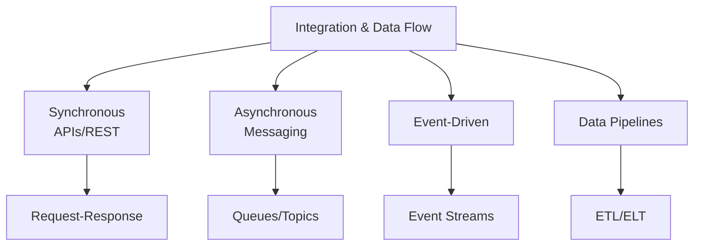

## Data Integration Patterns

Data integration moves data between systems for analytics, synchronization, and processing.

### ETL vs ELT

**ETL (Extract, Transform, Load):**

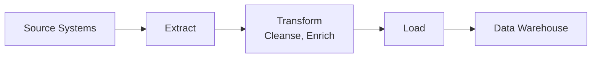

**ELT (Extract, Load, Transform):**

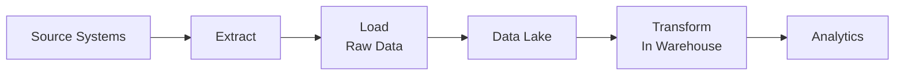

**ETL vs ELT Comparison:**

| Aspect | ETL | ELT |
|--------|-----|-----|
| **Transform Location** | Dedicated server | Target database |
| **Data Volume** | Works with limited resources | Leverages warehouse compute power |
| **Flexibility** | Fixed transformations | Ad-hoc transformations |
| **Speed** | Slower (serial processing) | Faster (parallel processing) |
| **Cost** | ETL server costs | Warehouse compute costs |
| **Use Case** | Traditional data warehouses | Cloud data lakes, big data |

> [!TIP]
> Use ETL for structured, predictable transformations. Use ELT for big data and cloud data lakes where raw data storage is cheap and compute is scalable.

### Data Integration Tools

**Tool Comparison:**

| Tool | Type | Strengths | Use Case |
|------|------|-----------|----------|
| **Azure Data Factory** | Managed ETL/ELT | 90+ connectors, code-free, orchestration | Azure-centric data pipelines |
| **AWS Glue** | Managed ETL | Serverless, auto-schema discovery | AWS data lakes |
| **Apache Airflow** | Orchestration | Flexible Python DAGs, open-source | Complex workflows |
| **Databricks** | Analytics platform | Spark-based, collaborative notebooks | Large-scale analytics |
| **Fivetran** | ELT SaaS | Pre-built connectors, automatic updates | SaaS to warehouse |
| **Talend** | ETL/ELT | Enterprise features, data quality | Hybrid cloud, on-prem |

**Azure Data Factory Pipeline:**

```json
{
  "name": "CopyCustomersToWarehouse",
  "activities": [
    {
      "name": "CopyFromSQL",
      "type": "Copy",
      "inputs": [{"referenceName": "SourceSQL"}],
      "outputs": [{"referenceName": "StagingBlob"}],
      "typeProperties": {
        "source": {
          "type": "SqlSource",
          "sqlReaderQuery": "SELECT * FROM Customers WHERE ModifiedDate > @{formatDateTime(addDays(utcNow(), -1), 'yyyy-MM-dd')}"
        },
        "sink": {"type": "BlobSink"}
      }
    },
    {
      "name": "TransformData",
      "type": "DatabricksNotebook",
      "dependsOn": [{"activity": "CopyFromSQL"}],
      "typeProperties": {
        "notebookPath": "/Transformations/CleanseCustomers"
      }
    },
    {
      "name": "LoadToWarehouse",
      "type": "Copy",
      "dependsOn": [{"activity": "TransformData"}],
      "inputs": [{"referenceName": "TransformedBlob"}],
      "outputs": [{"referenceName": "SynapseWarehouse"}]
    }
  ]
}
```

### Change Data Capture (CDC)

CDC tracks and replicates data changes from source to target systems in real-time.

**CDC Architecture:**

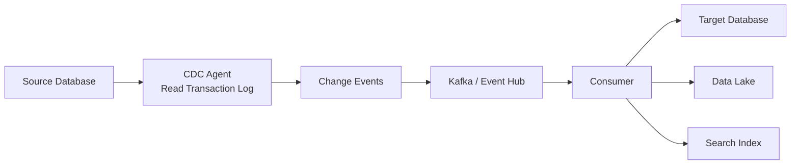

**CDC vs Batch:**

| Aspect | CDC | Batch ETL |
|--------|-----|-----------|
| **Latency** | Near real-time (seconds) | Hours/days |
| **Resource Impact** | Low (log-based) | High (full table scans) |
| **Data Freshness** | Always current | Periodic updates |
| **Complexity** | Higher | Lower |
| **Use Case** | Real-time analytics, sync | Historical reporting |

**CDC Tools:**

| Tool | Sources | Method | Use Case |
|------|---------|--------|----------|
| **Debezium** | MySQL, PostgreSQL, SQL Server, MongoDB | Log-based CDC | Kafka-based streaming |
| **Azure SQL Data Sync** | Azure SQL | Trigger-based sync | Multi-region Azure SQL |
| **AWS DMS** | 20+ databases | Log-based CDC | AWS database migration |
| **Qlik Replicate** | Enterprise databases | Log-based CDC | Enterprise data replication |

> [!NOTE]
> Log-based CDC (reading transaction logs) has minimal performance impact compared to trigger-based or query-based approaches.

**Real-World Example:**

An e-commerce platform uses Debezium for CDC:

- **Source**: PostgreSQL transaction database
- **Destination**: Elasticsearch (search), Snowflake (analytics), Redis (cache)
- **Latency**: <5 seconds from database write to search index
- **Result**: Real-time product search, inventory tracking, and analytics

### Data Replication Strategies

**Replication Patterns:**

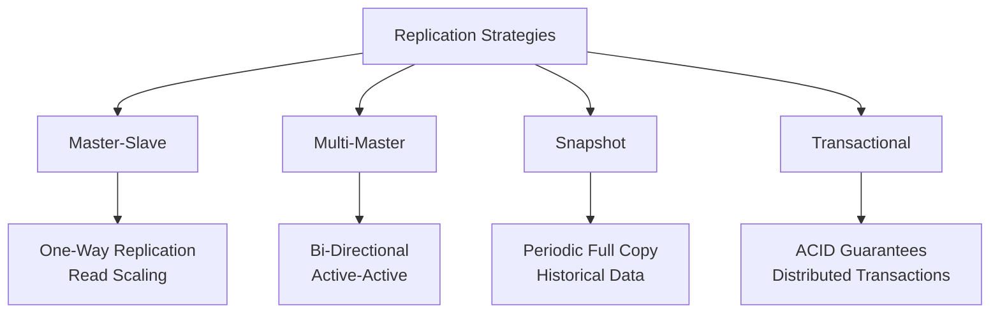

**Replication Comparison:**

| Strategy | Consistency | Latency | Conflict Resolution | Use Case |
|----------|-------------|---------|---------------------|----------|
| **Synchronous** | Strong | High | N/A (blocking) | Financial transactions |
| **Asynchronous** | Eventual | Low | Application-defined | Read replicas, multi-region |
| **Semi-Synchronous** | Strong (one replica) | Medium | N/A | High availability |

> [!IMPORTANT]
> Asynchronous replication risks data loss during failover. Use synchronous replication for critical data, async for read scalability.

## Service Integration

Service integration enables communication between microservices and external systems.

### Integration Patterns

**Common Patterns:**

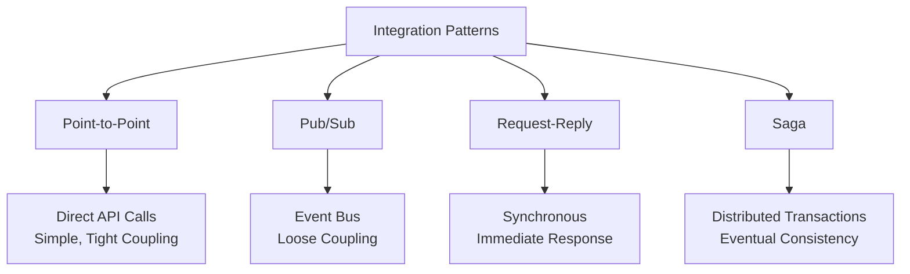

**Pattern Comparison:**

| Pattern | Coupling | Latency | Complexity | Use Case |
|---------|----------|---------|------------|----------|
| **Synchronous API** | Tight | Low | Low | Simple CRUD operations |
| **Async Messaging** | Loose | Medium | Medium | Background processing |
| **Event-Driven** | Very Loose | Variable | High | Complex workflows |
| **Service Mesh** | Loose | Low | High | Microservices communication |

### Messaging Patterns

**Queue vs Topic:**

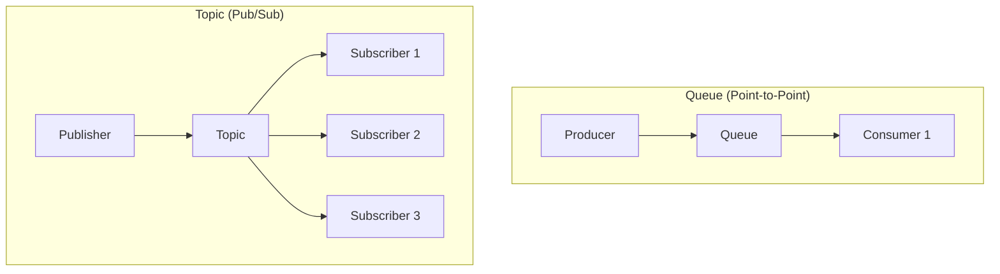

**Messaging Services:**

| Service | Type | Guarantees | Throughput | Use Case |
|---------|------|------------|------------|----------|
| **Azure Service Bus** | Queue + Topic | At-least-once, ordering | Medium (1000 msg/s) | Enterprise messaging |
| **Azure Event Hubs** | Stream | At-least-once | Very high (millions/s) | Telemetry, logs |
| **AWS SQS** | Queue | At-least-once | High (3000 msg/s per API call) | Decoupling services |
| **AWS SNS** | Topic | At-least-once | High | Fan-out notifications |
| **AWS Kinesis** | Stream | At-least-once | Very high (millions/s) | Real-time analytics |
| **Apache Kafka** | Stream | Exactly-once (within transaction) | Very high | Event sourcing, streaming |
| **RabbitMQ** | Queue + Topic | At-least-once, at-most-once | Medium | Flexible routing |

**Message Delivery Guarantees:**

| Guarantee | Description | Trade-off | Implementation |
|-----------|-------------|-----------|----------------|
| **At-most-once** | May lose messages | Fastest | No acks, fire-and-forget |
| **At-least-once** | May duplicate messages | Idempotent consumers needed | Ack after processing |
| **Exactly-once** | No loss, no duplication | Complex, slower | Distributed transactions, deduplication |

> [!TIP]
> Design consumers to be idempotent. At-least-once delivery with idempotent processing is simpler and more reliable than exactly-once semantics.

**Queue Processing Pattern:**

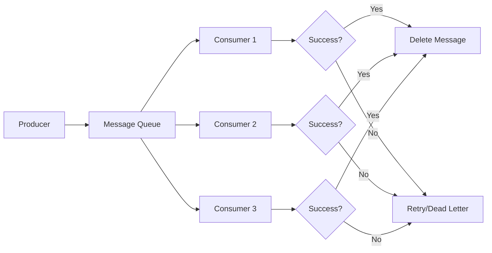

**Example: Azure Service Bus Consumer:**

```csharp
var client = new ServiceBusClient(connectionString);
var processor = client.CreateProcessor(queueName, new ServiceBusProcessorOptions
{
    MaxConcurrentCalls = 10,
    AutoCompleteMessages = false,
    MaxAutoLockRenewalDuration = TimeSpan.FromMinutes(5)
});

processor.ProcessMessageAsync += async args =>
{
    try
    {
        var order = JsonSerializer.Deserialize<Order>(args.Message.Body);
        await ProcessOrderAsync(order);
        
        // Success - complete message
        await args.CompleteMessageAsync(args.Message);
    }
    catch (Exception ex)
    {
        // Failure - message returns to queue for retry
        await args.AbandonMessageAsync(args.Message);
        logger.LogError(ex, "Failed to process order");
    }
};

await processor.StartProcessingAsync();
```

### Dead Letter Queues

Dead letter queues handle messages that fail processing after multiple retries.

**DLQ Pattern:**

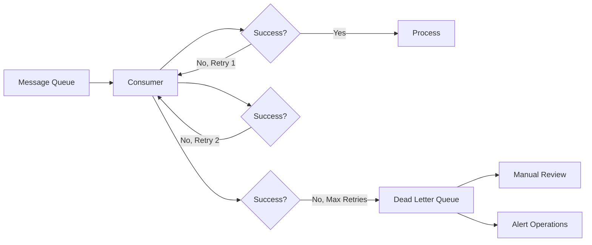

**DLQ Configuration:**

| Parameter | Typical Value | Purpose |
|-----------|---------------|---------|
| **Max Delivery Count** | 5-10 | Number of retries before DLQ |
| **Visibility Timeout** | 30 seconds | Time before retry |
| **Message TTL** | 14 days | Auto-delete old messages |
| **DLQ TTL** | 30 days | Keep failed messages longer |

> [!CAUTION]
> Monitor dead letter queues closely. Messages in DLQ indicate systemic issues that require investigation and manual intervention.

### Saga Pattern

Sagas manage distributed transactions across microservices using compensating transactions.

**Choreography-Based Saga:**

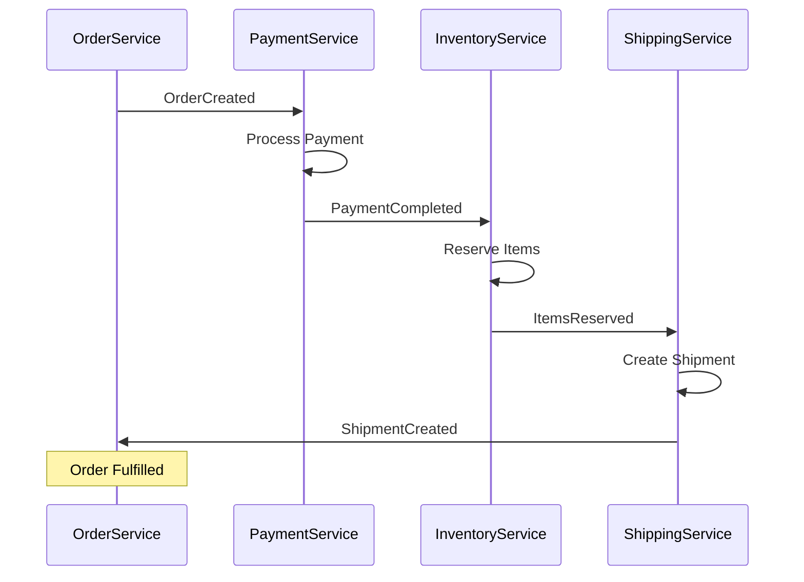

**Compensation (Rollback) Flow:**

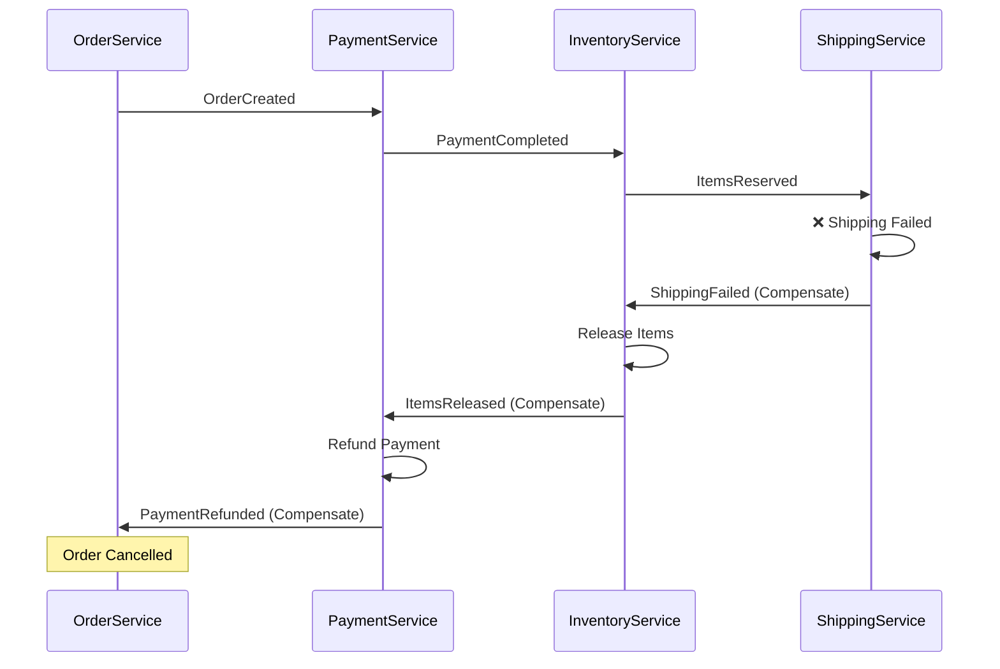

**Saga Orchestration vs Choreography:**

| Approach | Coordination | Complexity | Visibility | Use Case |
|----------|--------------|------------|------------|----------|
| **Choreography** | Event-driven | Lower | Harder to track | Simple workflows |
| **Orchestration** | Central coordinator | Higher | Easy to track | Complex workflows |

> [!NOTE]
> Choreography is simpler but harder to debug. Orchestration (central saga coordinator) provides better visibility for complex multi-step transactions.

## API Management

API management provides a gateway for securing, monitoring, and scaling APIs.

### API Gateway Pattern

**Gateway Responsibilities:**

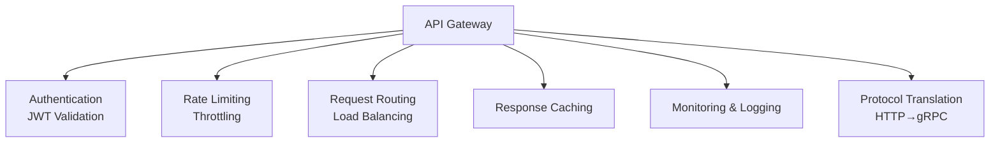

**API Gateway Products:**

| Product | Cloud | Features | Use Case |
|---------|-------|----------|----------|
| **Azure API Management** | Azure | Policies, dev portal, monetization | Enterprise APIs |
| **AWS API Gateway** | AWS | REST/WebSocket/HTTP APIs | AWS serverless |
| **Kong** | Self-hosted | Plugins, open-source | Kubernetes, multi-cloud |
| **Apigee** | Google Cloud | Analytics, developer portal | Large-scale APIs |
| **Tyk** | Self-hosted/Cloud | GraphQL federation, analytics | GraphQL APIs |

**API Management Architecture:**

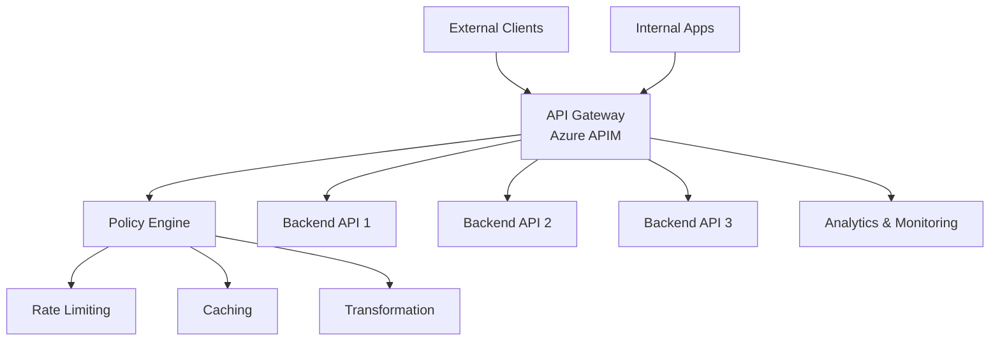

### API Security

**Authentication Methods:**

| Method | How It Works | Security Level | Use Case |
|--------|--------------|----------------|----------|
| **API Key** | Static key in header | Low | Internal/testing |
| **OAuth 2.0** | Token-based authorization | High | Third-party integrations |
| **JWT** | Self-contained tokens | High | Microservices |
| **mTLS** | Mutual TLS certificates | Very high | Service-to-service |

**OAuth 2.0 Flow:**

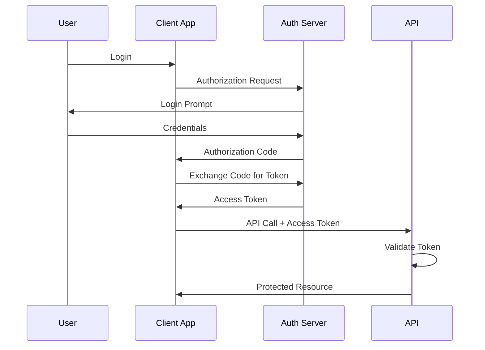

**Azure API Management Policy:**

```xml
<policies>
    <inbound>
        <!-- Validate JWT token -->
        <validate-jwt header-name="Authorization" failed-validation-httpcode="401">
            <openid-config url="https://login.microsoftonline.com/{tenant}/.well-known/openid-configuration" />
            <required-claims>
                <claim name="aud" match="any">
                    <value>https://api.contoso.com</value>
                </claim>
            </required-claims>
        </validate-jwt>
        
        <!-- Rate limiting: 100 calls per minute -->
        <rate-limit calls="100" renewal-period="60" />
        
        <!-- IP filtering -->
        <ip-filter action="allow">
            <address-range from="192.168.1.1" to="192.168.1.255" />
        </ip-filter>
    </inbound>
    
    <backend>
        <forward-request timeout="30" />
    </backend>
    
    <outbound>
        <!-- Remove sensitive headers -->
        <set-header name="X-Powered-By" exists-action="delete" />
        
        <!-- Cache for 1 hour -->
        <cache-store duration="3600" />
    </outbound>
</policies>
```

### Rate Limiting and Throttling

**Rate Limiting Strategies:**

| Strategy | Description | Use Case |
|----------|-------------|----------|
| **Fixed Window** | X requests per time window | Simple, can burst at window boundary |
| **Sliding Window** | X requests per rolling time period | Smoother, prevents boundary bursts |
| **Token Bucket** | Tokens refill at constant rate | Allows bursts, prevents sustained overload |
| **Leaky Bucket** | Smooth request rate | Strict rate enforcement |

**Token Bucket Algorithm:**

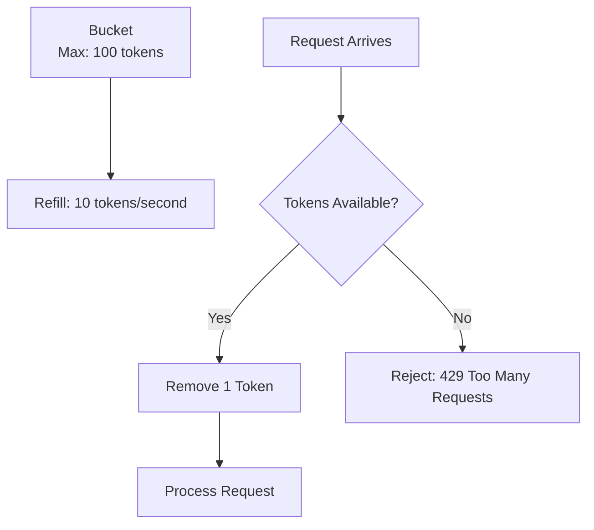

**Rate Limit Headers:**

```http
HTTP/1.1 200 OK
X-RateLimit-Limit: 100
X-RateLimit-Remaining: 45
X-RateLimit-Reset: 1634567890
Retry-After: 30
```

> [!TIP]
> Return rate limit headers (`X-RateLimit-*`) so clients can implement backoff strategies. Use 429 status code with `Retry-After` header.

**Real-World Example:**

Twitter API rate limits:

- **Standard**: 15 requests per 15-minute window
- **Headers**: `x-rate-limit-limit`, `x-rate-limit-remaining`, `x-rate-limit-reset`
- **Response**: 429 Too Many Requests with reset timestamp
- **Client Behavior**: Exponential backoff until reset time

### API Versioning

**Versioning Strategies:**

| Strategy | Example | Pros | Cons | Use Case |
|----------|---------|------|------|----------|
| **URI Path** | `/v1/users`, `/v2/users` | Explicit, easy to route | URL changes | Public APIs |
| **Query Parameter** | `/users?version=2` | No URL change | Less discoverable | Internal APIs |
| **Header** | `Accept: application/vnd.api+json;version=2` | Clean URLs | Hidden version | RESTful purists |
| **Content Negotiation** | `Accept: application/vnd.api.v2+json` | RESTful | Complex | Enterprise APIs |

**Versioning Best Practices:**

1. **Semantic Versioning**: Major version for breaking changes (v1, v2), minor for additions
2. **Deprecation Period**: Maintain old versions for 6-12 months
3. **Documentation**: Clearly document changes between versions
4. **Sunset Header**: Warn clients about upcoming deprecation

```http
Sunset: Sat, 31 Dec 2025 23:59:59 GMT
Link: <https://api.example.com/v2/users>; rel="successor-version"
```

> [!IMPORTANT]
> Never break existing API contracts. Introduce new versions for breaking changes and provide migration guides for consumers.

## Event-Driven Architecture

Event-driven architecture uses events to trigger and communicate between decoupled services.

### Event Sourcing

Event sourcing stores state as a sequence of events rather than current state.

**Traditional vs Event Sourcing:**

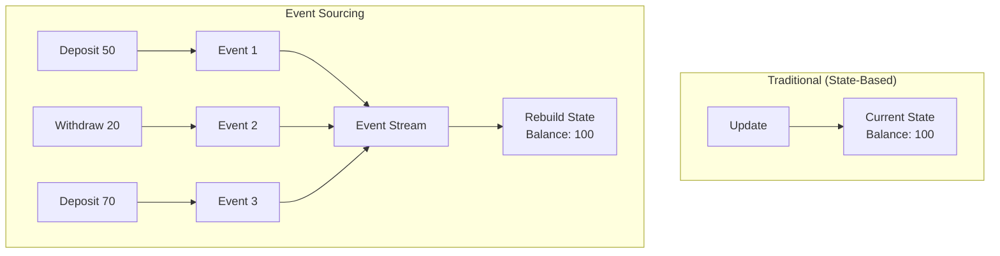

**Event Sourcing Benefits:**

| Benefit | Description |
|---------|-------------|
| **Complete Audit Trail** | Every state change is recorded |
| **Time Travel** | Reconstruct state at any point in time |
| **Debugging** | Replay events to reproduce bugs |
| **Multiple Projections** | Build different views from same events |
| **Eventual Consistency** | Services consume events at their own pace |

**Event Store:**

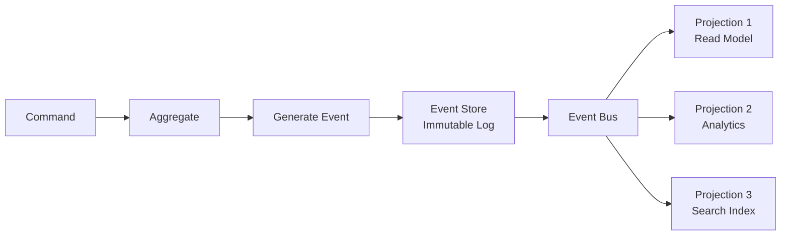

**Example: Bank Account Events:**

```json
[
  {
    "eventId": "e1",
    "eventType": "AccountOpened",
    "aggregateId": "acc-123",
    "timestamp": "2024-01-01T10:00:00Z",
    "data": {"accountHolder": "John Doe", "initialBalance": 0}
  },
  {
    "eventId": "e2",
    "eventType": "MoneyDeposited",
    "aggregateId": "acc-123",
    "timestamp": "2024-01-01T10:05:00Z",
    "data": {"amount": 1000, "source": "Wire Transfer"}
  },
  {
    "eventId": "e3",
    "eventType": "MoneyWithdrawn",
    "aggregateId": "acc-123",
    "timestamp": "2024-01-01T11:00:00Z",
    "data": {"amount": 250, "destination": "ATM"}
  }
]
```

**Replay Events to Calculate Balance:**

```csharp
public decimal CalculateBalance(string accountId)
{
    var events = eventStore.GetEvents(accountId);
    decimal balance = 0;
    
    foreach (var evt in events)
    {
        balance = evt.EventType switch
        {
            "MoneyDeposited" => balance + evt.Data.Amount,
            "MoneyWithdrawn" => balance - evt.Data.Amount,
            _ => balance
        };
    }
    
    return balance;
}
```

> [!NOTE]
> Event sourcing adds complexity. Use for domains where audit trails and temporal queries are critical (finance, healthcare, compliance).

### CQRS (Command Query Responsibility Segregation)

CQRS separates read and write models for optimized performance and scalability.

**CQRS Architecture:**

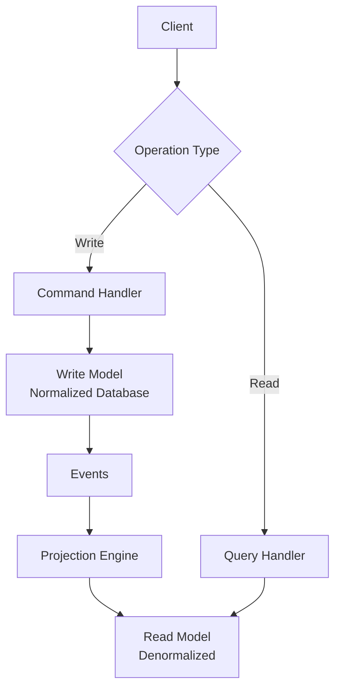

**CQRS Benefits:**

| Aspect | Write Model | Read Model |
|--------|-------------|------------|
| **Optimization** | Transactional integrity | Query performance |
| **Schema** | Normalized | Denormalized |
| **Database** | SQL | NoSQL, cache, search engine |
| **Scaling** | Vertical | Horizontal |
| **Consistency** | Strong | Eventual |

**Example: E-commerce Product Catalog:**

**Write Side (Commands):**

```csharp
public class CreateProductCommand
{
    public string Name { get; set; }
    public decimal Price { get; set; }
    public int Stock { get; set; }
}

public async Task<Result> HandleCreateProduct(CreateProductCommand cmd)
{
    var product = new Product(cmd.Name, cmd.Price, cmd.Stock);
    await dbContext.Products.AddAsync(product);
    await dbContext.SaveChangesAsync();
    
    // Publish event for read model
    await eventBus.PublishAsync(new ProductCreatedEvent
    {
        ProductId = product.Id,
        Name = product.Name,
        Price = product.Price,
        Stock = product.Stock
    });
    
    return Result.Success();
}
```

**Read Side (Query):**

```csharp
// Denormalized read model in Redis
public class ProductReadModel
{
    public string Id { get; set; }
    public string Name { get; set; }
    public decimal Price { get; set; }
    public int Stock { get; set; }
    public string CategoryName { get; set; }  // Joined data
    public decimal AverageRating { get; set; }  // Aggregated data
}

public async Task<ProductReadModel> GetProduct(string productId)
{
    // Fast read from Redis cache
    var cached = await cache.GetAsync<ProductReadModel>($"product:{productId}");
    if (cached != null)
        return cached;
    
    // Fallback to read database
    return await readDatabase.Products.FindAsync(productId);
}
```

> [!TIP]
> Don't use CQRS for simple CRUD applications. Use when read and write patterns differ significantly (e.g., high read volume, complex queries).

### Event Streaming Platforms

**Event Streaming vs Messaging:**

| Aspect | Messaging (Queue/Topic) | Event Streaming (Kafka/Event Hubs) |
|--------|------------------------|-------------------------------------|
| **Retention** | Messages deleted after consumption | Events retained (days/weeks) |
| **Consumers** | Compete for messages | Independent offsets |
| **Replay** | Not possible | Can replay from any offset |
| **Throughput** | Medium (thousands/sec) | Very high (millions/sec) |
| **Use Case** | Task distribution | Event sourcing, analytics, replay |

**Kafka Architecture:**

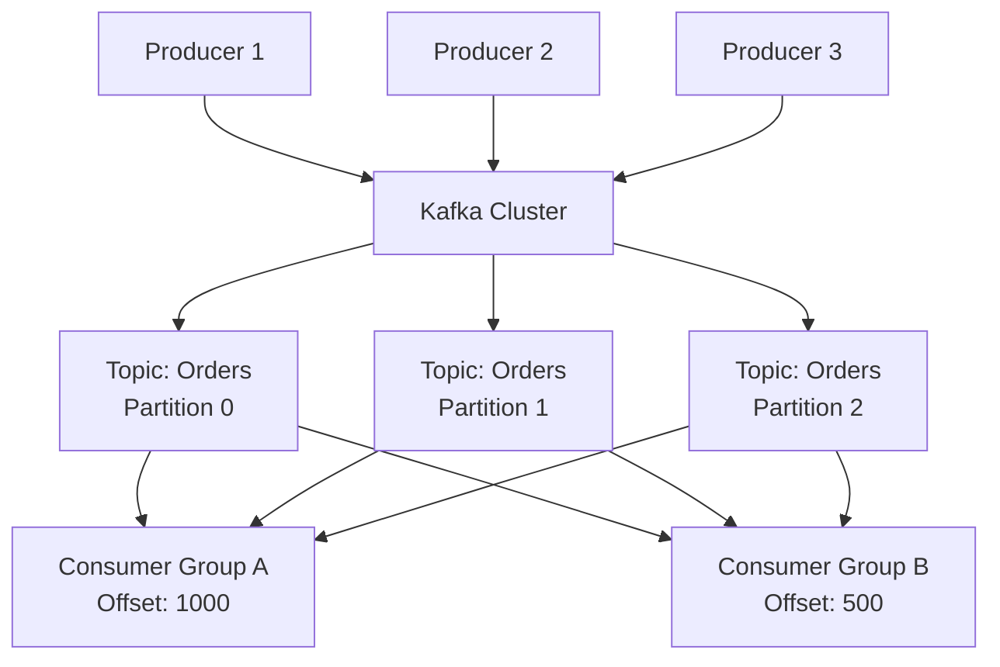

**Kafka vs Azure Event Hubs:**

| Feature | Apache Kafka | Azure Event Hubs |
|---------|--------------|------------------|
| **Deployment** | Self-managed | Fully managed |
| **Protocol** | Kafka protocol | Kafka + AMQP |
| **Retention** | Configurable (days/TB) | 1-90 days |
| **Throughput Units** | Broker count | Throughput units (TU) |
| **Cost** | Infrastructure + operations | Per TU |
| **Ecosystem** | Extensive (Kafka Streams, Connect) | Azure integration |

**Real-World Example:**

Netflix uses Kafka for:

- **User Activity Tracking**: 500 billion events/day
- **Recommendation Engine**: Real-time event processing
- **A/B Testing**: Event streams for experiment tracking
- **Monitoring**: System metrics and logs
- **Result**: Real-time insights, personalized recommendations

> [!IMPORTANT]
> Event streaming platforms (Kafka, Event Hubs) enable real-time data pipelines and event sourcing at massive scale. Use for high-volume event processing and analytics.

### Event Schema Evolution

**Schema Registry:**

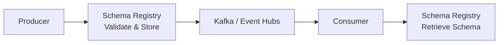

**Schema Evolution Rules:**

| Change Type | Backward Compatible | Forward Compatible | Example |
|-------------|---------------------|-------------------|---------|
| **Add optional field** | ✅ | ✅ | New field with default value |
| **Remove field** | ✅ | ❌ | Old consumers expect field |
| **Rename field** | ❌ | ❌ | Breaking change |
| **Change field type** | ❌ | ❌ | Breaking change |

**Avro Schema Example:**

```json
{
  "type": "record",
  "name": "OrderCreated",
  "namespace": "com.example.events",
  "fields": [
    {"name": "orderId", "type": "string"},
    {"name": "customerId", "type": "string"},
    {"name": "amount", "type": "double"},
    {"name": "currency", "type": "string", "default": "USD"}
  ]
}
```

> [!NOTE]
> Use schema registries (Confluent Schema Registry, Azure Schema Registry) to enforce compatibility rules and prevent breaking changes in event-driven systems.
