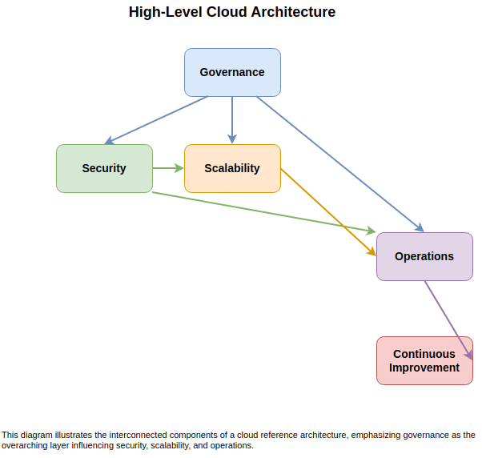
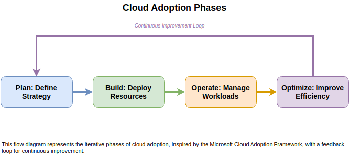

# Introduction

## Purpose and Scope

The purpose of this document is to provide a comprehensive cloud reference architecture that serves as a blueprint for designing, implementing, and managing cloud solutions. This architecture is designed to be industry-agnostic and aligns with established frameworks such as the Microsoft Cloud Adoption Framework, NIST SP 500-291, and ISO/IEC 17788. It addresses key aspects such as scalability, security, governance, and operational excellence.

### Examples

- **Scalability**: Leveraging auto-scaling groups to handle variable workloads, as recommended in the Microsoft Cloud Adoption Framework.

- **Security**: Implementing identity and access management (IAM) policies in alignment with NIST guidelines.

- **Governance**: Establishing resource tagging and cost management practices inspired by the AWS Well-Architected Framework.

## Target Audience

This document is intended for a diverse audience involved in cloud adoption and management, including:

- **Cloud Architects**: To design scalable and secure cloud solutions.

- **Cloud Engineers**: To implement and maintain cloud infrastructure.

- **Decision-Makers**: To understand the strategic value of cloud adoption.

- **Developers**: To build applications optimized for cloud environments.

### Audience Examples

- A cloud architect designing a multi-region deployment strategy.

- A cloud engineer implementing CI/CD pipelines for automated deployments.

- Decision-makers evaluating the cost-benefit analysis of cloud migration.

## Document Structure

This document is organized into the following sections:

1. **Introduction**: Overview of the document's purpose, audience, and structure.

2. **Governance**: Best practices for managing cloud resources, including policies and compliance.

3. **Security**: Strategies for securing cloud environments, including IAM, encryption, and network security.

4. **Scalability and Performance**: Techniques for ensuring applications can handle varying workloads efficiently.

5. **Operations and Reliability**: Approaches for maintaining high availability and disaster recovery.

6. **Case Studies and Use Cases**: Real-world examples of cloud adoption.

## High-Level Cloud Architecture

This diagram illustrates the interconnected components of a cloud reference architecture, emphasizing governance as the overarching layer influencing security, scalability, and operations.

## Cloud Adoption Phases

This flow diagram represents the iterative phases of cloud adoption, inspired by the Microsoft Cloud Adoption Framework, with a feedback loop for continuous improvement.
