# Management and Governance

Cloud governance establishes policies, controls, and practices to manage cloud resources effectively while ensuring compliance, security, and cost optimization.

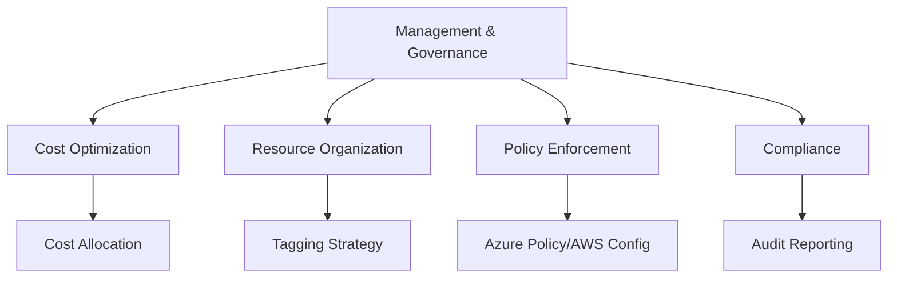

## Cost Management and Optimization

Cloud cost management ensures efficient resource utilization and prevents budget overruns.

### FinOps Framework

Financial Operations (FinOps) is a cultural practice that brings financial accountability to cloud spending.

**FinOps Lifecycle:**

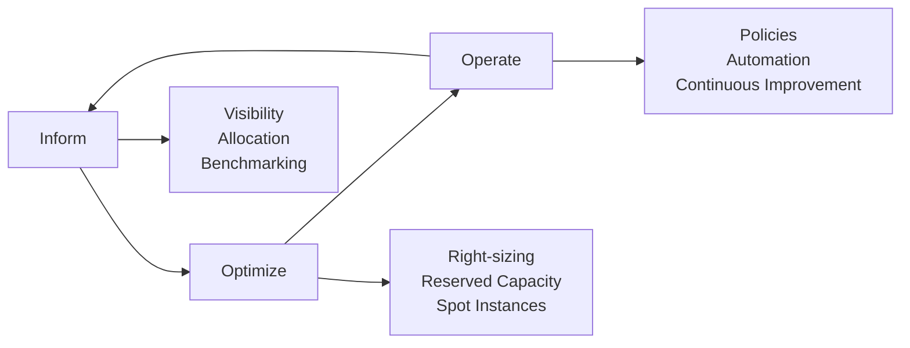

**FinOps Principles:**

| Principle | Description | Implementation |
|-----------|-------------|----------------|
| **Teams Collaborate** | Engineering, finance, business work together | Regular FinOps meetings, shared dashboards |
| **Decisions Driven by Business Value** | Balance speed, cost, and quality | Cost-benefit analysis for resources |
| **Everyone Takes Ownership** | Decentralized cost accountability | Chargeback/showback by team |
| **Accessible and Timely** | Real-time cost visibility | Daily cost dashboards, alerts |
| **Centralized FinOps Team** | Center of excellence for cost optimization | Dedicated FinOps practitioners |
| **Continuous Improvement** | Iterate on cost optimization | Monthly cost reviews |

> [!TIP]
> Implement showback (informational cost allocation) before chargeback (actual billing). This gives teams visibility without sudden budget impact.

### Cost Visibility and Allocation

**Cost Allocation Hierarchy:**

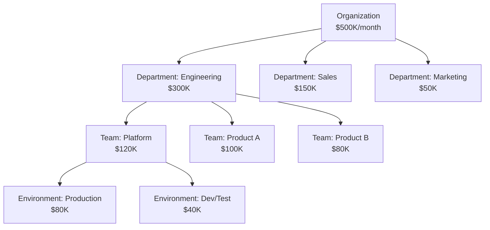

**Azure Cost Management Dashboard:**

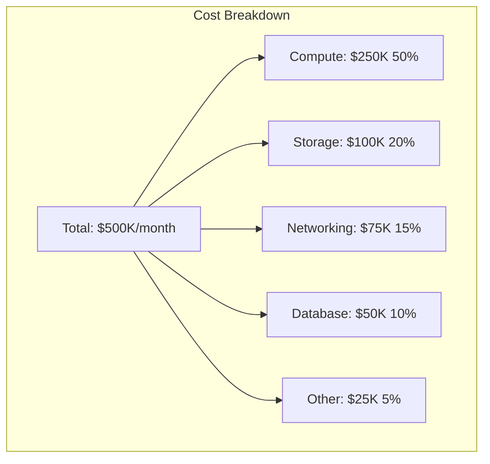

**Cost Allocation Tags:**

| Tag Key | Purpose | Example Values |
|---------|---------|----------------|
| **CostCenter** | Chargeback | CC-1001, CC-1002 |
| **Environment** | Lifecycle | Production, Staging, Dev, Test |
| **Application** | Application ownership | WebApp, API, Database |
| **Owner** | Team responsibility | team-platform, team-product-a |
| **Project** | Project tracking | project-migration, project-mvp |

> [!IMPORTANT]
> Enforce tagging policies from day one. Retroactively tagging resources is time-consuming and error-prone.

### Cost Optimization Strategies

**Compute Optimization:**

| Strategy | Savings | Commitment | Use Case |
|----------|---------|------------|----------|
| **Right-Sizing** | 20-40% | None | Oversized VMs |
| **Reserved Instances (RI)** | 40-72% | 1-3 years | Steady-state workloads |
| **Savings Plans** | 30-66% | 1-3 years | Flexible compute |
| **Spot/Preemptible** | 70-90% | None (can be terminated) | Fault-tolerant workloads |
| **Auto-Shutdown** | 50-75% | None | Dev/test environments |
| **Hibernate** | 90% | None | Infrequent use |

**Reserved Instance Example:**

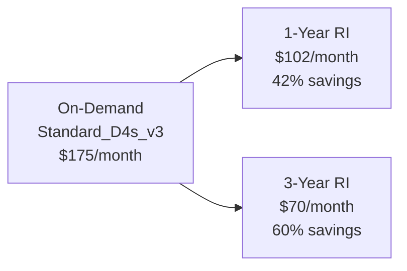

**Azure Reserved VM Instances:**

```bash
# Purchase 3-year RI for Standard_D4s_v3 in East US
az reservations reservation-order purchase \
  --reservation-order-id /providers/Microsoft.Capacity/reservationOrders/12345678-1234-1234-1234-123456789012 \
  --sku Standard_D4s_v3 \
  --location eastus \
  --quantity 10 \
  --term P3Y \
  --billing-plan Monthly
```

**Spot Instance Architecture:**

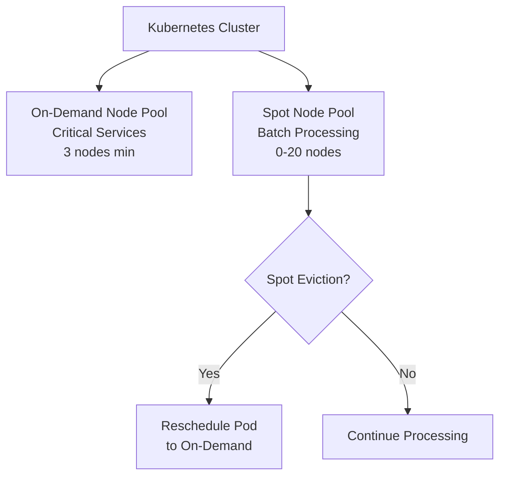

**AKS Spot Node Pool:**

```bash
az aks nodepool add \
  --resource-group myRG \
  --cluster-name myAKS \
  --name spotnodepool \
  --priority Spot \
  --eviction-policy Delete \
  --spot-max-price -1 \
  --enable-cluster-autoscaler \
  --min-count 0 \
  --max-count 20 \
  --node-vm-size Standard_D4s_v3 \
  --labels workload=batch priority=spot
```

> [!CAUTION]
> Spot instances can be terminated with 30 seconds notice. Only use for stateless, fault-tolerant workloads (batch processing, CI/CD, big data).

**Storage Optimization:**

| Strategy | Savings | Trade-off | Use Case |
|----------|---------|-----------|----------|
| **Tiering (Hot/Cool/Archive)** | 50-90% | Higher access cost | Infrequent access |
| **Lifecycle Management** | 30-70% | Automated tiering | Time-based aging |
| **Compression** | 40-60% | CPU overhead | Text, logs |
| **Deduplication** | 30-80% | Processing overhead | Backups, VDI |
| **Delete Unused** | 100% | None | Orphaned disks, snapshots |

**Azure Blob Storage Lifecycle Policy:**

```json
{
  "rules": [
    {
      "name": "MoveToArchive",
      "enabled": true,
      "type": "Lifecycle",
      "definition": {
        "filters": {
          "blobTypes": ["blockBlob"],
          "prefixMatch": ["logs/"]
        },
        "actions": {
          "baseBlob": {
            "tierToCool": {
              "daysAfterModificationGreaterThan": 30
            },
            "tierToArchive": {
              "daysAfterModificationGreaterThan": 90
            },
            "delete": {
              "daysAfterModificationGreaterThan": 365
            }
          }
        }
      }
    }
  ]
}
```

**Database Optimization:**

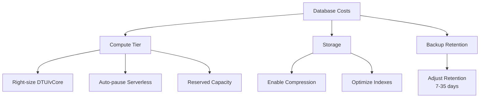

> [!TIP]
> Azure SQL Database serverless automatically pauses during inactivity, charging only for storage. Ideal for dev/test and intermittent workloads (70-90% savings).

**Real-World Example:**

A company reduced cloud costs by 45% through:

- **Reserved Instances**: $80K → $35K/month (56% savings on steady-state VMs)
- **Spot Instances**: Batch processing on 70% cheaper spot nodes
- **Auto-Shutdown**: Dev/test VMs shut down nights/weekends ($15K/month savings)
- **Storage Tiering**: Moved logs to cool/archive tier ($25K/month savings)
- **Right-Sizing**: Downsized 30% of oversized VMs ($20K/month savings)
- **Total**: $500K → $275K/month

### Cost Anomaly Detection

**Anomaly Detection:**

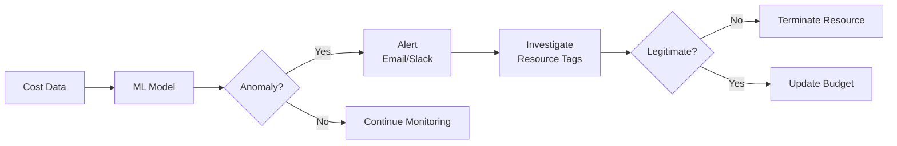

**Azure Cost Anomaly Alert:**

```bash
# Create cost anomaly alert
az monitor alert-rules create \
  --name CostAnomaly \
  --resource-group myRG \
  --condition "total cost > $100 increase from yesterday" \
  --action email admin@company.com
```

**Common Cost Anomalies:**

| Anomaly | Cause | Detection | Prevention |
|---------|-------|-----------|------------|
| **Sudden Spike** | Misconfigured autoscaling | Daily cost comparison | Set max limits |
| **Zombie Resources** | Forgotten test resources | Unused resource scan | Auto-expiry tags |
| **Data Transfer** | Unoptimized architecture | Egress cost analysis | Use private endpoints |
| **Overprovisioning** | Conservative sizing | Utilization monitoring | Right-sizing recommendations |

> [!IMPORTANT]
> Configure budget alerts at 50%, 80%, 100%, and 120% thresholds. Early warnings prevent bill shock and enable proactive optimization.

## Resource Tagging and Management Groups

Resource organization enables governance, cost allocation, and automation.

### Tagging Strategy

**Tag Taxonomy:**

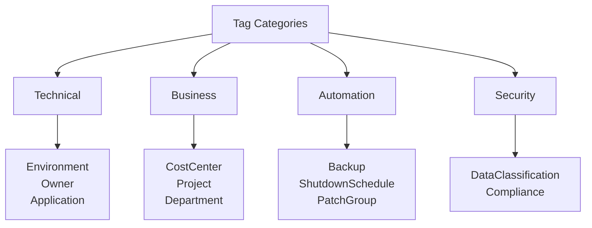

**Required Tags:**

| Tag | Purpose | Example | Enforcement |
|-----|---------|---------|-------------|
| **Environment** | Lifecycle stage | Production, Staging, Dev, Test | Policy enforced |
| **Owner** | Team responsible | team-platform@company.com | Policy enforced |
| **CostCenter** | Billing allocation | CC-1001 | Policy enforced |
| **Application** | Application grouping | webapp-frontend | Policy enforced |
| **DataClassification** | Sensitivity | Public, Internal, Confidential, Restricted | Policy enforced |

**Optional Tags:**

| Tag | Purpose | Example |
|-----|---------|---------|
| **Project** | Project tracking | project-migration-2024 |
| **CreatedBy** | Creator | john.doe@company.com |
| **CreatedDate** | Creation date | 2024-01-15 |
| **ShutdownSchedule** | Auto-shutdown | weeknights-and-weekends |
| **BackupPolicy** | Backup schedule | daily-7days |
| **PatchGroup** | Patching schedule | group-a-sundays |

**Azure Policy for Required Tags:**

```json
{
  "mode": "Indexed",
  "policyRule": {
    "if": {
      "anyOf": [
        {"field": "tags['Environment']", "exists": "false"},
        {"field": "tags['Owner']", "exists": "false"},
        {"field": "tags['CostCenter']", "exists": "false"}
      ]
    },
    "then": {
      "effect": "deny"
    }
  },
  "parameters": {}
}
```

> [!NOTE]
> Tag inheritance is not automatic in Azure. Use Azure Policy `modify` effect to automatically inherit tags from resource groups to resources.

**Tag Inheritance Policy:**

```json
{
  "mode": "Indexed",
  "policyRule": {
    "if": {
      "field": "tags['Environment']",
      "exists": "false"
    },
    "then": {
      "effect": "modify",
      "details": {
        "roleDefinitionIds": [
          "/providers/Microsoft.Authorization/roleDefinitions/b24988ac-6180-42a0-ab88-20f7382dd24c"
        ],
        "operations": [
          {
            "operation": "addOrReplace",
            "field": "tags['Environment']",
            "value": "[resourceGroup().tags['Environment']]"
          }
        ]
      }
    }
  }
}
```

### Management Groups

**Azure Management Group Hierarchy:**

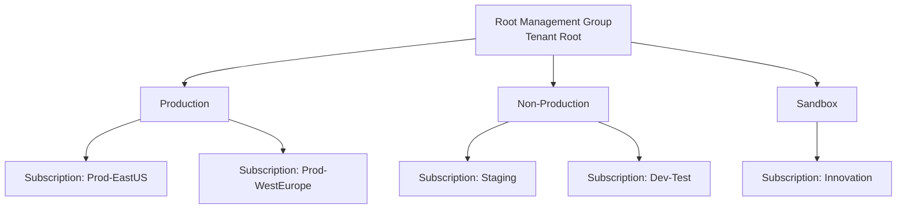

**Management Group Benefits:**

| Benefit | Description | Example |
|---------|-------------|---------|
| **Policy Inheritance** | Policies apply to all child subscriptions | Enforce tagging at root |
| **RBAC Inheritance** | Assign roles once | Security team read access |
| **Cost Aggregation** | View costs across subscriptions | Total production costs |
| **Governance at Scale** | Manage 100s of subscriptions | Enterprise-wide policies |

**AWS Organization Structure:**

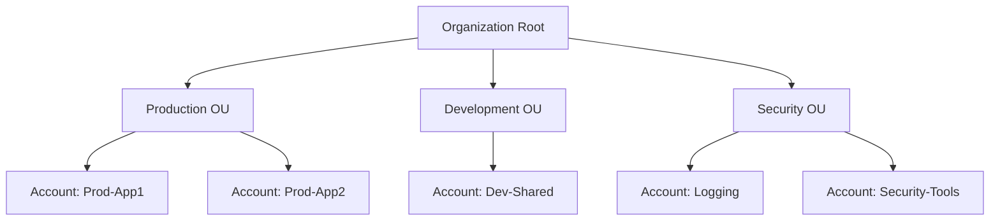

**Service Control Policies (SCP):**

```json
{
  "Version": "2012-10-17",
  "Statement": [
    {
      "Effect": "Deny",
      "Action": [
        "ec2:RunInstances"
      ],
      "Resource": "*",
      "Condition": {
        "StringNotEquals": {
          "ec2:Region": [
            "us-east-1",
            "us-west-2",
            "eu-west-1"
          ]
        }
      }
    }
  ]
}
```

> [!IMPORTANT]
> Design management group hierarchy before deploying resources. Restructuring later is complex and may require resource moves.

## Policy Enforcement

Cloud policies enforce organizational standards for security, compliance, and cost control.

### Azure Policy

**Policy Effects:**

| Effect | Behavior | Use Case |
|--------|----------|----------|
| **Deny** | Block resource creation | Prevent public storage accounts |
| **Audit** | Log non-compliant resources | Identify untagged resources |
| **Append** | Add properties to resources | Add default tags |
| **Modify** | Change resource properties | Inherit tags from resource group |
| **DeployIfNotExists** | Deploy related resources | Enable diagnostics settings |
| **AuditIfNotExists** | Audit missing related resources | Check for backup configuration |

**Policy Assignment Scope:**

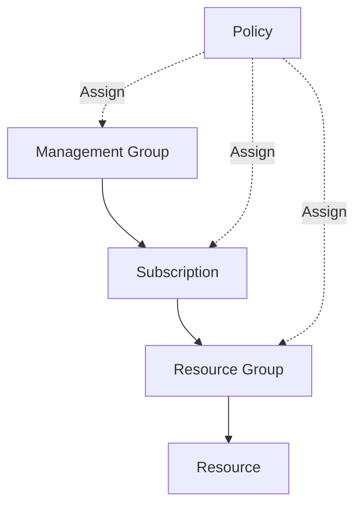

**Example Policies:**

**1. Require HTTPS for Storage Accounts:**

```json
{
  "mode": "All",
  "policyRule": {
    "if": {
      "allOf": [
        {
          "field": "type",
          "equals": "Microsoft.Storage/storageAccounts"
        },
        {
          "field": "Microsoft.Storage/storageAccounts/supportsHttpsTrafficOnly",
          "notEquals": "true"
        }
      ]
    },
    "then": {
      "effect": "deny"
    }
  }
}
```

**2. Enforce Allowed VM SKUs:**

```json
{
  "mode": "Indexed",
  "policyRule": {
    "if": {
      "allOf": [
        {
          "field": "type",
          "equals": "Microsoft.Compute/virtualMachines"
        },
        {
          "not": {
            "field": "Microsoft.Compute/virtualMachines/sku.name",
            "in": "[parameters('allowedSKUs')]"
          }
        }
      ]
    },
    "then": {
      "effect": "deny"
    }
  },
  "parameters": {
    "allowedSKUs": {
      "type": "Array",
      "defaultValue": [
        "Standard_B2s",
        "Standard_D2s_v3",
        "Standard_D4s_v3"
      ]
    }
  }
}
```

**3. Auto-Enable Diagnostic Logs:**

```json
{
  "mode": "Indexed",
  "policyRule": {
    "if": {
      "field": "type",
      "equals": "Microsoft.Sql/servers/databases"
    },
    "then": {
      "effect": "DeployIfNotExists",
      "details": {
        "type": "Microsoft.Insights/diagnosticSettings",
        "existenceCondition": {
          "allOf": [
            {
              "field": "Microsoft.Insights/diagnosticSettings/logs.enabled",
              "equals": "true"
            }
          ]
        },
        "deployment": {
          "properties": {
            "mode": "incremental",
            "template": {
              "$schema": "https://schema.management.azure.com/schemas/2015-01-01/deploymentTemplate.json#",
              "contentVersion": "1.0.0.0",
              "resources": [
                {
                  "type": "Microsoft.Insights/diagnosticSettings",
                  "apiVersion": "2021-05-01-preview",
                  "name": "setByPolicy",
                  "properties": {
                    "workspaceId": "[parameters('logAnalyticsWorkspace')]",
                    "logs": [
                      {
                        "category": "SQLInsights",
                        "enabled": true
                      }
                    ]
                  }
                }
              ]
            }
          }
        }
      }
    }
  }
}
```

> [!TIP]
> Start with `audit` effect to identify non-compliant resources. Switch to `deny` after remediating existing resources to prevent new violations.

### AWS Config Rules

**Managed Config Rules:**

| Rule | Purpose | Remediation |
|------|---------|-------------|
| **encrypted-volumes** | Ensure EBS encryption | AWS Systems Manager |
| **s3-bucket-public-read-prohibited** | Block public S3 buckets | Auto-remediation |
| **iam-password-policy** | Enforce password complexity | Manual |
| **rds-storage-encrypted** | Ensure RDS encryption | Cannot auto-remediate |
| **vpc-flow-logs-enabled** | Enable VPC logging | AWS Systems Manager |

**Custom Config Rule (Lambda):**

```python
import boto3
import json

def lambda_handler(event, context):
    config = boto3.client('config')
    ec2 = boto3.client('ec2')
    
    # Get the configuration item
    configurationItem = json.loads(event['configurationItem'])
    
    # Check if instance has required tags
    required_tags = ['Environment', 'Owner', 'CostCenter']
    instance_tags = {tag['Key']: tag['Value'] for tag in configurationItem['tags']}
    
    missing_tags = [tag for tag in required_tags if tag not in instance_tags]
    
    if missing_tags:
        compliance_type = 'NON_COMPLIANT'
        annotation = f'Missing required tags: {", ".join(missing_tags)}'
    else:
        compliance_type = 'COMPLIANT'
        annotation = 'All required tags present'
    
    # Submit compliance evaluation
    config.put_evaluations(
        Evaluations=[
            {
                'ComplianceResourceType': configurationItem['resourceType'],
                'ComplianceResourceId': configurationItem['resourceId'],
                'ComplianceType': compliance_type,
                'Annotation': annotation,
                'OrderingTimestamp': configurationItem['configurationItemCaptureTime']
            }
        ],
        ResultToken=event['resultToken']
    )
    
    return {'statusCode': 200}
```

### Policy as Code

**Open Policy Agent (OPA) for Kubernetes:**

```rego
package kubernetes.admission

deny[msg] {
    input.request.kind.kind == "Pod"
    image := input.request.object.spec.containers[_].image
    not startswith(image, "myregistry.azurecr.io/")
    msg := sprintf("Image '%v' not from approved registry", [image])
}

deny[msg] {
    input.request.kind.kind == "Pod"
    not input.request.object.spec.securityContext.runAsNonRoot
    msg := "Containers must not run as root"
}

deny[msg] {
    input.request.kind.kind == "Pod"
    container := input.request.object.spec.containers[_]
    not container.resources.limits.cpu
    msg := sprintf("Container '%v' missing CPU limit", [container.name])
}
```

**Terraform Sentinel Policy:**

```hcl
import "tfplan/v2" as tfplan

# Require specific VM sizes
allowed_vm_sizes = [
    "Standard_B2s",
    "Standard_D2s_v3",
    "Standard_D4s_v3"
]

main = rule {
    all tfplan.resource_changes as _, rc {
        rc.type is "azurerm_virtual_machine" implies
        rc.change.after.vm_size in allowed_vm_sizes
    }
}
```

> [!IMPORTANT]
> Policy as code enables GitOps governance. Store policies in version control, test before applying, and audit all changes.

## Governance Framework

A governance framework defines roles, responsibilities, and processes for cloud operations.

### Cloud Governance Model

**Governance Structure:**

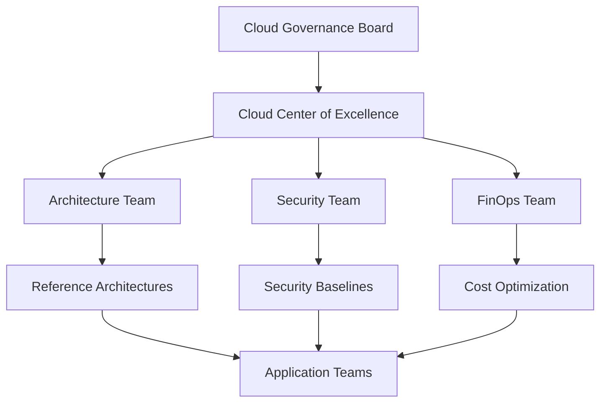

**Governance Disciplines:**

| Discipline | Responsibilities | Tools |
|------------|------------------|-------|
| **Cost Management** | Budgets, cost allocation, optimization | Azure Cost Management, AWS Cost Explorer |
| **Security Baseline** | Identity, network security, encryption | Azure Security Center, AWS Security Hub |
| **Resource Consistency** | Naming, tagging, organization | Azure Policy, AWS Config |
| **Identity Baseline** | Authentication, authorization, RBAC | Microsoft Entra ID, AWS IAM |
| **Deployment Acceleration** | IaC templates, CI/CD pipelines | Terraform, Bicep, CloudFormation |

### Cloud Adoption Framework

**Microsoft Cloud Adoption Framework Phases:**

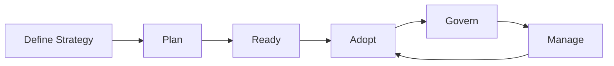

**CAF Governance Pillars:**

| Pillar | Focus | Key Activities |
|--------|-------|----------------|
| **Cost Management** | Financial accountability | Budgets, showback, reserved instances |
| **Security Baseline** | Protect resources | Encryption, network security, identity |
| **Resource Consistency** | Standardization | Naming conventions, tagging, policies |
| **Identity Baseline** | Access control | MFA, RBAC, privileged access |
| **Deployment Acceleration** | Automation | IaC, CI/CD, templates |

**AWS Well-Architected Framework:**

| Pillar | Principles | Best Practices |
|--------|-----------|----------------|
| **Operational Excellence** | Operations as code | IaC, runbooks, automation |
| **Security** | Defense in depth | IAM, encryption, monitoring |
| **Reliability** | Recover from failures | Multi-AZ, backups, chaos engineering |
| **Performance Efficiency** | Right-sizing | Monitoring, auto-scaling |
| **Cost Optimization** | Pay for what you use | Reserved capacity, spot instances |
| **Sustainability** | Minimize environmental impact | Efficient architectures, right-sizing |

> [!NOTE]
> Cloud Adoption Framework and Well-Architected Framework are not one-time activities. Regularly review and update governance practices.

### Landing Zones

**Azure Landing Zone Architecture:**

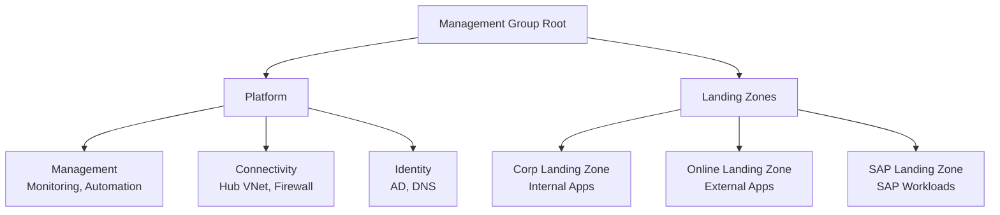

**Landing Zone Components:**

| Component | Purpose | Implementation |
|-----------|---------|----------------|
| **Identity** | Centralized authentication | Microsoft Entra ID tenant |
| **Connectivity** | Network hub | Hub VNet with Azure Firewall |
| **Management** | Centralized monitoring | Log Analytics workspace |
| **Policies** | Governance guardrails | Azure Policy assignments |
| **Subscriptions** | Workload isolation | Separate subs per application |

> [!IMPORTANT]
> Landing zones provide a pre-configured, secure foundation for cloud workloads. Use Azure Landing Zone Accelerator or AWS Control Tower for rapid setup.

## Audit and Compliance Reporting

Audit and compliance reporting demonstrates adherence to regulatory requirements and internal policies.

### Compliance Frameworks

**Regulatory Requirements:**

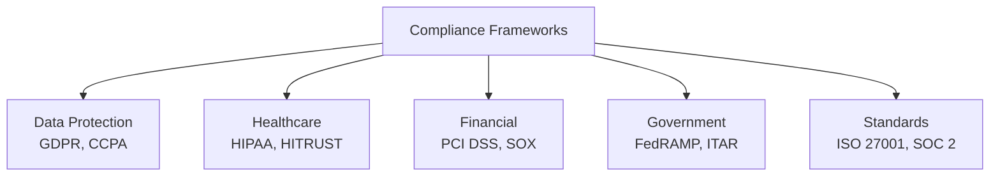

**Cloud Provider Compliance:**

| Certification | Azure | AWS | GCP | Scope |
|---------------|-------|-----|-----|-------|
| **ISO 27001** | ✅ | ✅ | ✅ | Information security |
| **SOC 2 Type II** | ✅ | ✅ | ✅ | Trust services |
| **PCI DSS Level 1** | ✅ | ✅ | ✅ | Payment card data |
| **HIPAA** | ✅ (with BAA) | ✅ (with BAA) | ✅ (with BAA) | Healthcare data |
| **FedRAMP** | ✅ High | ✅ High | ✅ Moderate | US government |
| **GDPR** | ✅ | ✅ | ✅ | EU data protection |

> [!NOTE]
> Cloud provider compliance certifications cover infrastructure. Customers are responsible for application-level compliance (shared responsibility model).

### Audit Logging

**Azure Activity Log:**

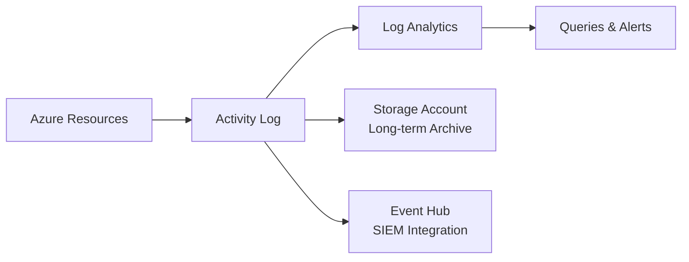

**Critical Events to Log:**

| Event Category | Examples | Retention |
|----------------|----------|-----------|
| **Administrative** | Resource creation, deletion, configuration | 90 days (Activity Log)<br/>1-2 years (Archive) |
| **Security** | Failed authentication, policy violations | 1-7 years (compliance) |
| **Resource Health** | Service outages, degraded performance | 90 days |
| **Data Access** | Database queries, file access | 30-90 days (hot)<br/>1-7 years (archive) |

**Kusto Query for Failed Deployments:**

```kql
AzureActivity
| where TimeGenerated > ago(7d)
| where OperationName has "Microsoft.Resources/deployments"
| where ActivityStatus == "Failed"
| summarize Count=count() by ResourceGroup, Caller, OperationName
| order by Count desc
```

**AWS CloudTrail:**

```json
{
  "eventVersion": "1.08",
  "userIdentity": {
    "type": "IAMUser",
    "principalId": "AIDAI23HXS4EXAMPLE",
    "arn": "arn:aws:iam::123456789012:user/john.doe",
    "accountId": "123456789012",
    "userName": "john.doe"
  },
  "eventTime": "2024-01-15T10:00:00Z",
  "eventSource": "ec2.amazonaws.com",
  "eventName": "RunInstances",
  "awsRegion": "us-east-1",
  "sourceIPAddress": "192.0.2.1",
  "requestParameters": {
    "instanceType": "t3.large",
    "instancesSet": {"items": [{"imageId": "ami-12345678"}]}
  },
  "responseElements": {
    "instancesSet": {"items": [{"instanceId": "i-1234567890abcdef0"}]}
  }
}
```

> [!IMPORTANT]
> Enable audit logging before deploying workloads. Retroactive logging is impossible - you can't log what already happened.

### Compliance Dashboards

**Azure Compliance Dashboard:**

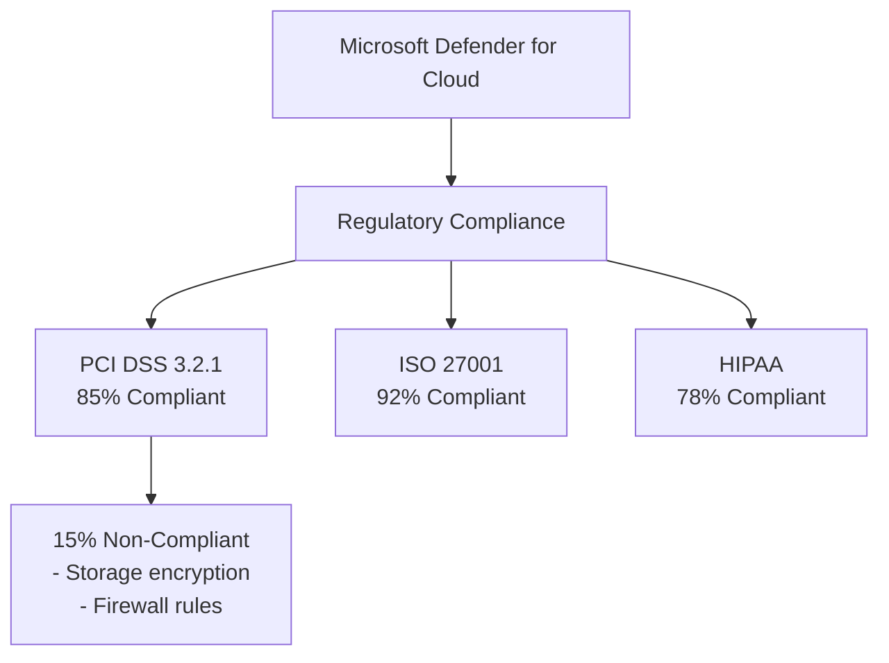

**Compliance Report Structure:**

| Section | Content | Audience |
|---------|---------|----------|
| **Executive Summary** | Overall compliance score, trends | Leadership |
| **Policy Compliance** | Compliant vs non-compliant resources | IT management |
| **Security Posture** | Vulnerabilities, recommendations | Security team |
| **Cost Optimization** | Savings opportunities | FinOps team |
| **Audit Trail** | Access logs, changes | Auditors |
| **Remediation Plan** | Action items, owners, deadlines | All teams |

**Compliance Automation:**

```bash
# Azure Policy compliance report
az policy state summarize \
  --management-group "Production" \
  --filter "policyDefinitionId eq '/providers/Microsoft.Authorization/policyDefinitions/1e30110a-5ceb-460c-a204-c1c3969c6d62'" \
  --query "results.policyAssignments[].{Name:policyAssignmentName, Compliant:results[?complianceState=='Compliant'].resourceCount | [0], NonCompliant:results[?complianceState=='NonCompliant'].resourceCount | [0]}" \
  --output table
```

> [!TIP]
> Automate compliance reporting. Generate daily/weekly reports showing compliance trends, new violations, and remediation progress.

**Real-World Example:**

A healthcare company implemented comprehensive governance:

- **Tagging**: 99% resource coverage (enforced via policy)
- **Cost Allocation**: Showback by department, project, environment
- **Compliance**: 95% HIPAA compliance (tracked via Microsoft Defender for Cloud)
- **Audit**: 2-year CloudTrail retention, automated compliance reports
- **Policies**: 50+ Azure Policies (80% deny, 20% audit/modify)
- **Result**: Passed HIPAA audit with zero findings, 30% cost reduction through optimization
