# Operations and Reliability

Operational excellence ensures systems run smoothly, scale effectively, and recover quickly from failures. This section covers SRE principles, monitoring, incident response, and business continuity strategies.

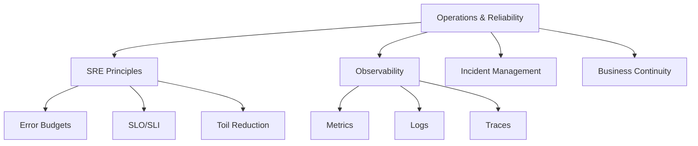

## Resource Provisioning and Management

Infrastructure as Code (IaC) enables consistent, repeatable, and version-controlled resource provisioning.

### Infrastructure as Code

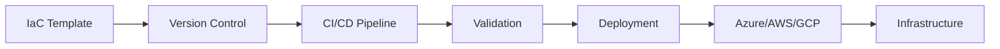

**IaC Tools Comparison:**

| Tool | Type | Strengths | Best For | Language |
|------|------|-----------|----------|----------|
| **Terraform** | Declarative | Multi-cloud, large ecosystem | Complex multi-cloud deployments | HCL |
| **ARM/Bicep** | Declarative | Native Azure integration | Azure-focused infrastructure | JSON/Bicep |
| **CloudFormation** | Declarative | Native AWS integration | AWS-focused infrastructure | JSON/YAML |
| **Pulumi** | Imperative | Use existing programming languages | Developer-friendly, complex logic | Python, TypeScript, Go, C# |
| **Ansible** | Imperative | Configuration management | Post-deployment configuration | YAML |

**Terraform Workflow:**

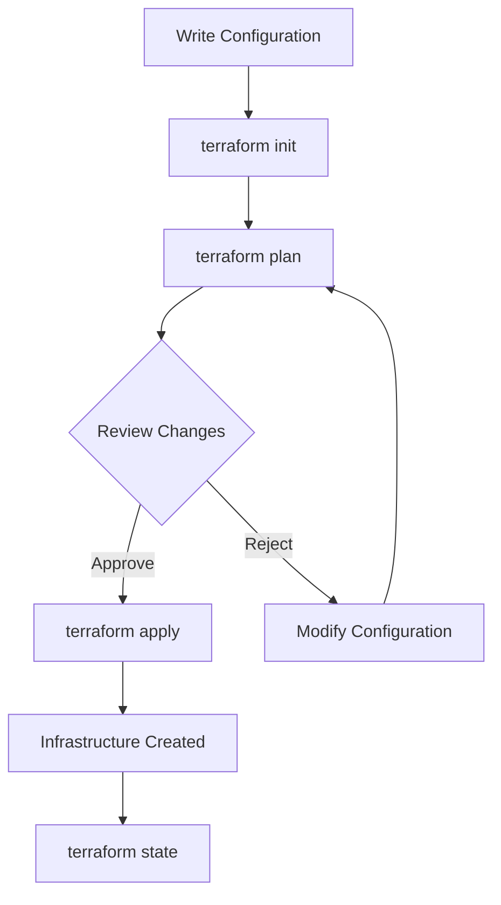

**Example: Azure Resources with Terraform:**

```hcl
resource "azurerm_resource_group" "example" {
  name     = "rg-production"
  location = "East US"
}

resource "azurerm_kubernetes_cluster" "example" {
  name                = "aks-production"
  location            = azurerm_resource_group.example.location
  resource_group_name = azurerm_resource_group.example.name
  dns_prefix          = "aks-prod"

  default_node_pool {
    name       = "default"
    node_count = 3
    vm_size    = "Standard_D2_v2"
  }

  identity {
    type = "SystemAssigned"
  }
}
```

> [!TIP]
> Store Terraform state remotely (Azure Storage, S3, Terraform Cloud) and enable state locking to prevent concurrent modifications.

### GitOps and Configuration Management

**GitOps Principles:**

1. **Declarative Configuration**: Infrastructure and apps defined declaratively
2. **Git as Source of Truth**: All changes via Git commits
3. **Automated Delivery**: Tools sync Git state to cluster
4. **Continuous Reconciliation**: Detect and correct drift

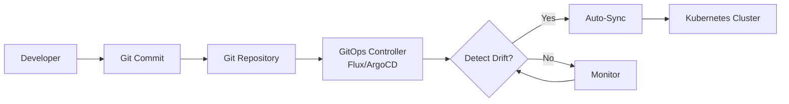

**GitOps Tools:**

| Tool | Focus | Key Features | Use Case |
|------|-------|--------------|----------|
| **Flux CD** | Kubernetes | GitOps Toolkit, Helm support | Kubernetes-native deployments |
| **Argo CD** | Kubernetes | UI, RBAC, multi-tenancy | Enterprise Kubernetes |
| **Jenkins X** | CI/CD + GitOps | Preview environments, promotion | Full development lifecycle |
| **Terraform Cloud** | Infrastructure | Remote state, policy as code | Multi-cloud infrastructure |

**Real-World Example:**

A fintech company uses ArgoCD with:

- **Git Repository**: All manifests versioned (dev, staging, prod branches)
- **Auto-Sync**: Production syncs every 3 minutes
- **Notifications**: Slack alerts on deployment success/failure
- **Rollback**: Git revert triggers automatic rollback
- **Result**: 10x faster deployments, zero configuration drift

> [!IMPORTANT]
> GitOps enables disaster recovery through Git history. Any environment can be recreated from Git repository state.

### Configuration Drift Detection

**Drift Detection Pattern:**

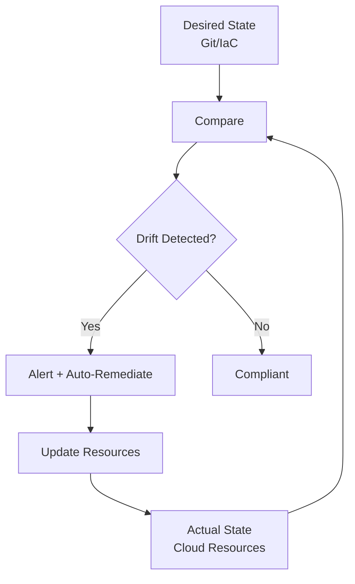

**Drift Detection Tools:**

| Tool | Cloud | Detection Method | Remediation |
|------|-------|------------------|-------------|
| **Azure Policy** | Azure | Periodic compliance scan | Deny, Audit, DeployIfNotExists |
| **AWS Config** | AWS | Configuration change tracking | Auto-remediation via SSM |
| **Terraform Cloud** | Multi-cloud | Terraform plan comparison | Manual approval required |
| **Cloud Custodian** | Multi-cloud | Policy-as-code rules | Automated actions |

**Azure Policy Example:**

```json
{
  "policyRule": {
    "if": {
      "allOf": [
        {
          "field": "type",
          "equals": "Microsoft.Storage/storageAccounts"
        },
        {
          "field": "Microsoft.Storage/storageAccounts/supportsHttpsTrafficOnly",
          "notEquals": "true"
        }
      ]
    },
    "then": {
      "effect": "deny"
    }
  }
}
```

> [!NOTE]
> Combine preventive controls (Azure Policy deny) with detective controls (Config Rules) for comprehensive drift management.

## Monitoring and Logging

Observability provides visibility into system health through metrics, logs, and distributed tracing.

### The Three Pillars of Observability

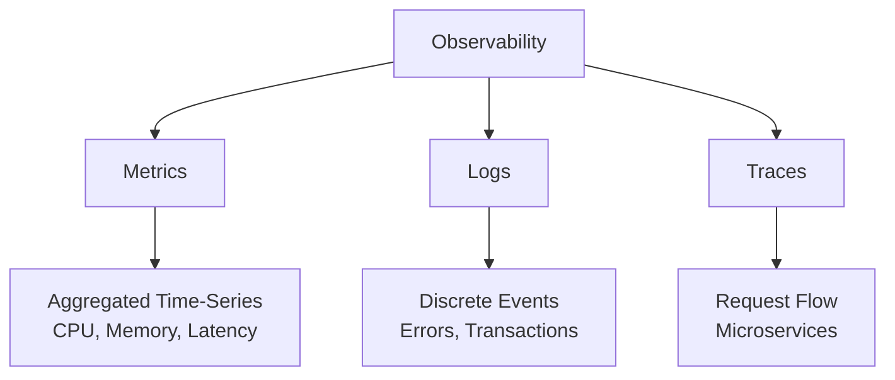

**Pillar Comparison:**

| Pillar | Data Type | Cardinality | Query Pattern | Best For |
|--------|-----------|-------------|---------------|----------|
| **Metrics** | Numeric time-series | Low | Aggregations (avg, sum, p99) | Performance trending, alerts |
| **Logs** | Structured/unstructured text | High | Full-text search, filters | Debugging, forensics |
| **Traces** | Request spans across services | Medium | Dependency mapping, latency | Distributed systems, bottlenecks |

### Metrics and Alerting

**Golden Signals (SRE):**

| Signal | Definition | Example Metric | Threshold |
|--------|------------|----------------|-----------|
| **Latency** | Request duration | API response time (p99) | Alert if p99 > 500ms |
| **Traffic** | Request volume | Requests per second | Alert if drops >20% |
| **Errors** | Failed requests | HTTP 5xx error rate | Alert if >1% |
| **Saturation** | Resource utilization | CPU, memory, disk usage | Alert if >80% |

**Metrics Architecture:**

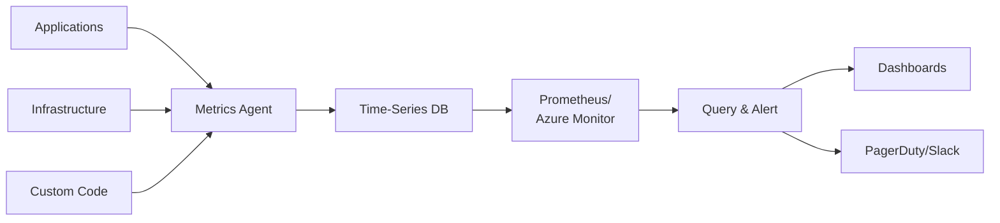

**Alerting Best Practices:**

1. **Alert on Symptoms, Not Causes**: Alert on customer impact (latency, errors) not disk space
2. **Reduce Noise**: Aggregate similar alerts, use smart thresholds
3. **Actionable Alerts**: Every alert should require human action
4. **Escalation Policies**: Define primary, secondary, and escalation contacts

**Alert Fatigue Prevention:**

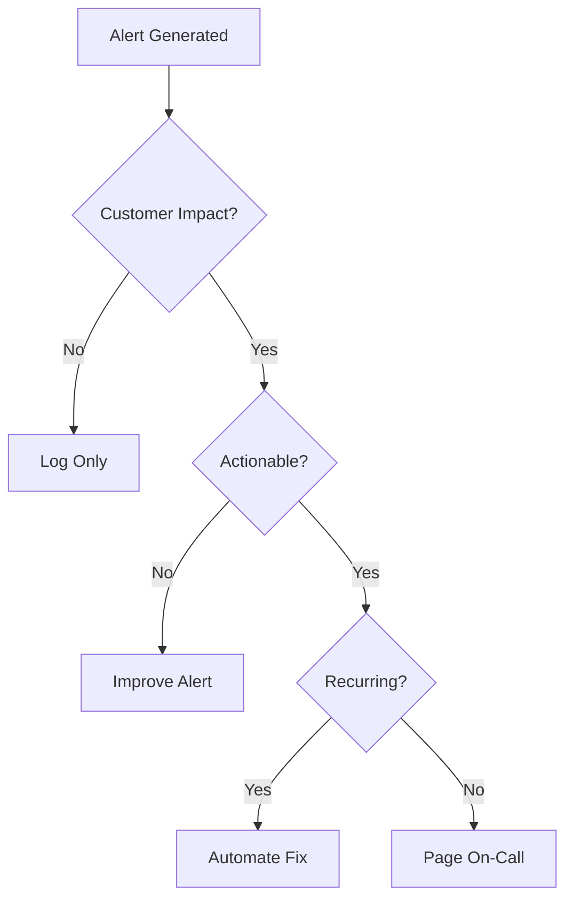

> [!CAUTION]
> Alert fatigue reduces response effectiveness. Only alert on customer-impacting issues that require immediate human intervention.

**Example: Azure Monitor Alert Rule:**

```json
{
  "name": "High API Latency",
  "criteria": {
    "allOf": [
      {
        "metricName": "Http Server Requests Duration",
        "dimensions": [],
        "operator": "GreaterThan",
        "threshold": 500,
        "timeAggregation": "Average",
        "criterionType": "StaticThresholdCriterion"
      }
    ]
  },
  "windowSize": "PT5M",
  "evaluationFrequency": "PT1M",
  "severity": 2,
  "actions": [
    {
      "actionGroupId": "/subscriptions/.../actionGroups/pagerduty"
    }
  ]
}
```

### Logging Strategy

**Log Levels:**

| Level | Purpose | Example | Action Required |
|-------|---------|---------|-----------------|
| **TRACE** | Very detailed flow | "Entering method X with param Y" | None (development only) |
| **DEBUG** | Diagnostic information | "Cache miss for key ABC" | None (troubleshooting) |
| **INFO** | General information | "User login successful" | None |
| **WARN** | Potential issues | "API rate limit at 80%" | Monitor |
| **ERROR** | Error conditions | "Database connection failed" | Investigate |
| **FATAL** | Critical failures | "Application crash" | Immediate action |

**Structured Logging:**

```json
{
  "timestamp": "2024-01-15T10:30:00Z",
  "level": "ERROR",
  "service": "payment-api",
  "traceId": "abc123",
  "userId": "user-456",
  "message": "Payment processing failed",
  "error": {
    "type": "GatewayTimeout",
    "code": "PAYMENT_001",
    "details": "Stripe API timeout after 30s"
  },
  "context": {
    "amount": 99.99,
    "currency": "USD",
    "gateway": "stripe"
  }
}
```

**Benefits of Structured Logging:**

- **Queryable**: Filter by fields (`service=payment-api AND error.code=PAYMENT_001`)
- **Aggregatable**: Count errors by type, service, user
- **Correlated**: Link logs via `traceId`
- **Machine-Readable**: No regex parsing required

> [!TIP]
> Always use structured logging (JSON) in production. Include trace IDs for correlation across microservices.

**Log Aggregation Architecture:**

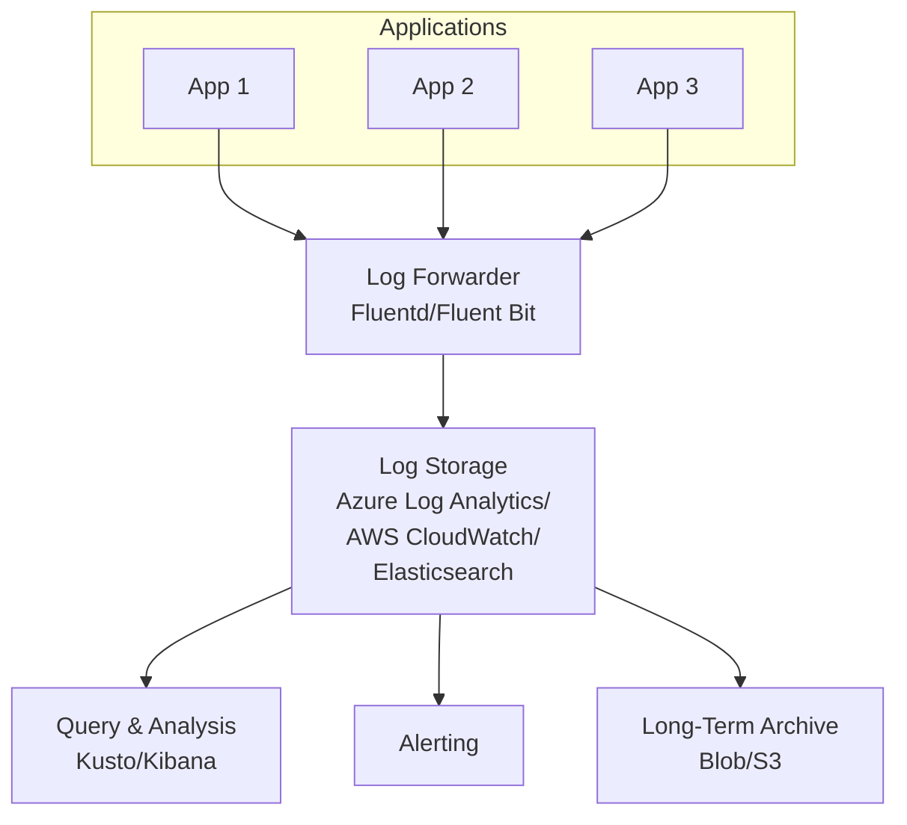

**Log Retention Strategy:**

| Period | Storage Tier | Cost | Use Case |
|--------|--------------|------|----------|
| **0-7 days** | Hot (indexed) | High | Active troubleshooting |
| **7-30 days** | Warm (indexed) | Medium | Recent incident investigation |
| **30-90 days** | Cold (compressed) | Low | Compliance, auditing |
| **90+ days** | Archive (blob storage) | Very low | Long-term compliance |

> [!NOTE]
> Balance log retention costs with compliance requirements. Use tiered storage to optimize costs while maintaining accessibility.

### Distributed Tracing

Distributed tracing tracks requests across microservices, identifying bottlenecks and failures.

**Trace Anatomy:**

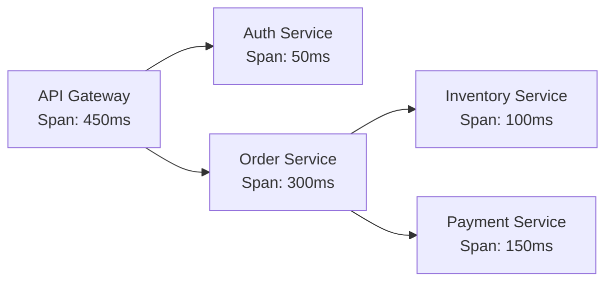

**OpenTelemetry Trace:**

```
TraceID: abc123
├─ Span: API Gateway (450ms)
│  ├─ Span: Auth Service (50ms)
│  └─ Span: Order Service (300ms)
│     ├─ Span: Inventory Service (100ms)
│     └─ Span: Payment Service (150ms)
```

**Trace Context Propagation:**

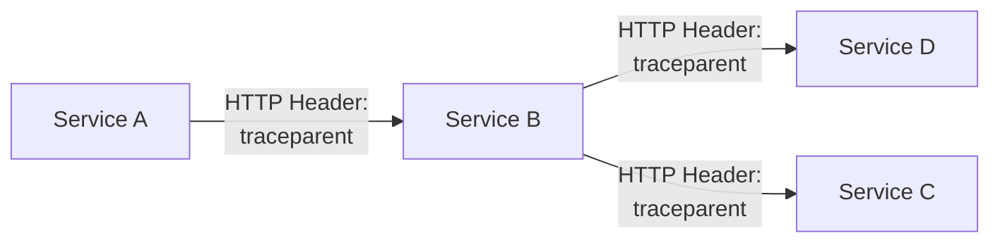

**Tracing Tools:**

| Tool | Type | Cloud Integration | Key Features |
|------|------|-------------------|--------------|
| **Jaeger** | Open-source | Self-hosted | Root cause analysis, dependency graph |
| **Zipkin** | Open-source | Self-hosted | Simple UI, wide library support |
| **Azure Application Insights** | Managed | Azure | Auto-instrumentation, Live Metrics |
| **AWS X-Ray** | Managed | AWS | Service map, trace analysis |
| **Datadog APM** | SaaS | Multi-cloud | Full-stack observability |

**Real-World Example:**

An e-commerce platform uses Application Insights to discover:

- **Issue**: Checkout latency spiked to 3 seconds
- **Trace Analysis**: Payment service taking 2.8s (normally 200ms)
- **Root Cause**: Database connection pool exhausted
- **Fix**: Increased pool size from 10 to 50 connections
- **Result**: Checkout latency reduced to 400ms

> [!IMPORTANT]
> Implement distributed tracing early in microservices development. Retrofitting tracing is significantly more difficult.

### Dashboards and Visualization

**Dashboard Types:**

| Type | Audience | Update Frequency | Metrics |
|------|----------|------------------|---------|
| **Executive** | Leadership | Daily/Weekly | Revenue, SLA attainment, incidents |
| **Operations** | SRE team | Real-time | Error rate, latency, saturation |
| **Developer** | Engineering | Real-time | Build status, deployment frequency, lead time |
| **Business** | Product/Sales | Hourly/Daily | User growth, feature adoption, conversion |

**Operations Dashboard Example:**

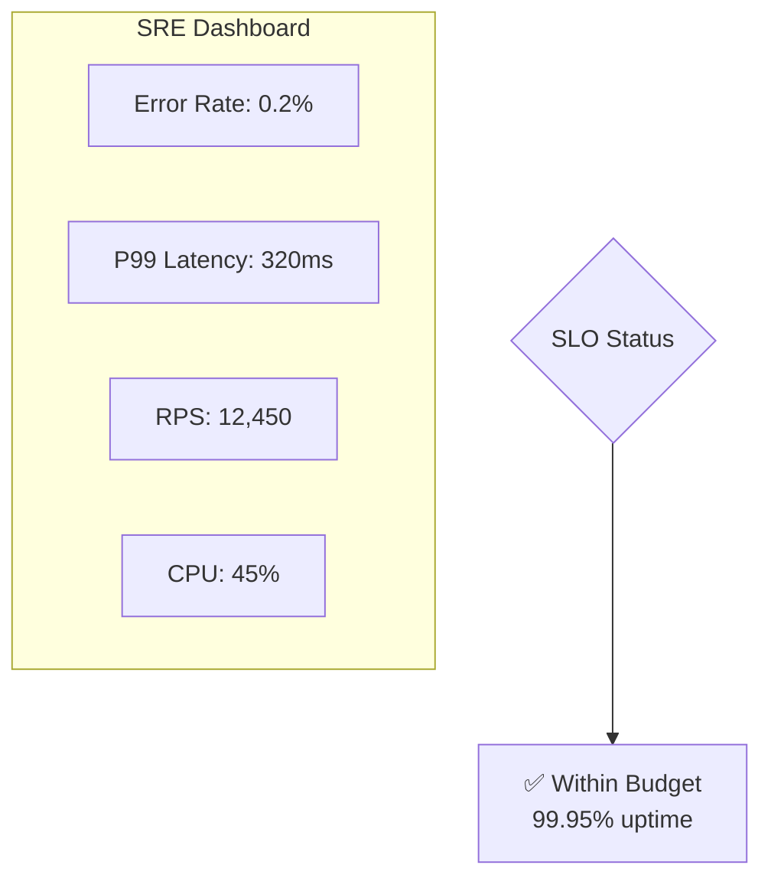

**Dashboard Best Practices:**

1. **Above the Fold**: Most critical metrics visible without scrolling
2. **Color Coding**: Green (healthy), yellow (warning), red (critical)
3. **Actionable**: Link to runbooks for common issues
4. **Context**: Show trends (hour-over-hour, day-over-day)
5. **Relevant**: Tailor to audience (executives vs engineers)

> [!TIP]
> Create role-specific dashboards. Operations teams need real-time metrics; executives need high-level trends and SLA compliance.

## Automation and Orchestration

Automation reduces toil, improves consistency, and accelerates incident response.

### Reducing Toil

**Toil Definition (SRE):**

Work that is manual, repetitive, automatable, tactical, no enduring value, scales linearly with service growth.

**Toil Quadrant:**

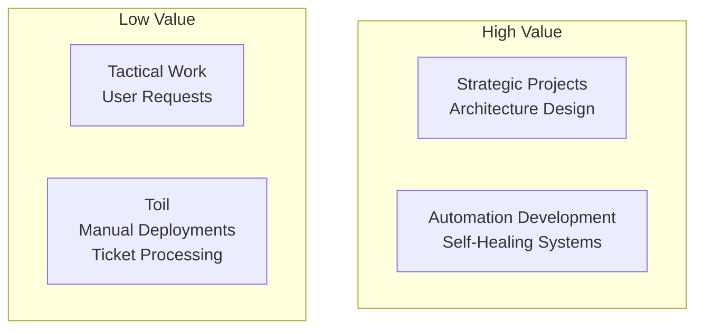

**Toil Reduction Strategies:**

| Toil Example | Automation Solution | Time Savings |
|--------------|---------------------|--------------|
| Manual deployments | CI/CD pipelines | 2 hours → 5 minutes |
| Log file analysis | Centralized logging + queries | 30 minutes → 2 minutes |
| Certificate renewal | Automated cert management (Let's Encrypt) | 1 hour/month → 0 |
| Resource provisioning | Infrastructure as Code | 1 day → 30 minutes |
| Incident ticket creation | Auto-ticketing from alerts | 10 minutes → 0 |

**SRE Goal**: Keep toil below 50% of team time. Invest savings in reliability improvements and automation.

> [!NOTE]
> Not all manual work is toil. Complex troubleshooting and strategic planning are valuable manual work.

### CI/CD Pipelines

**CI/CD Stages:**

```mermaid
graph LR
    A[Code Commit] --> B[Build]
    B --> C[Unit Tests]
    C --> D[Integration Tests]
    D --> E[Security Scan]
    E --> F[Deploy to Dev]
    F --> G[Smoke Tests]
    G --> H[Deploy to Staging]
    H --> I[E2E Tests]
    I --> J[Manual Approval]
    J --> K[Deploy to Prod]
    K --> L[Monitoring]
```

**Deployment Strategies:**

| Strategy | How It Works | Rollback Time | Risk | Use Case |
|----------|--------------|---------------|------|----------|
| **Blue-Green** | Two identical environments, switch traffic | Instant | Low | Zero-downtime deployments |
| **Canary** | Route small % of traffic to new version | Minutes | Very low | High-risk changes |
| **Rolling** | Update instances incrementally | Varies | Medium | Standard deployments |
| **Recreate** | Stop old, start new | None (downtime) | High | Development environments |

**Canary Deployment:**

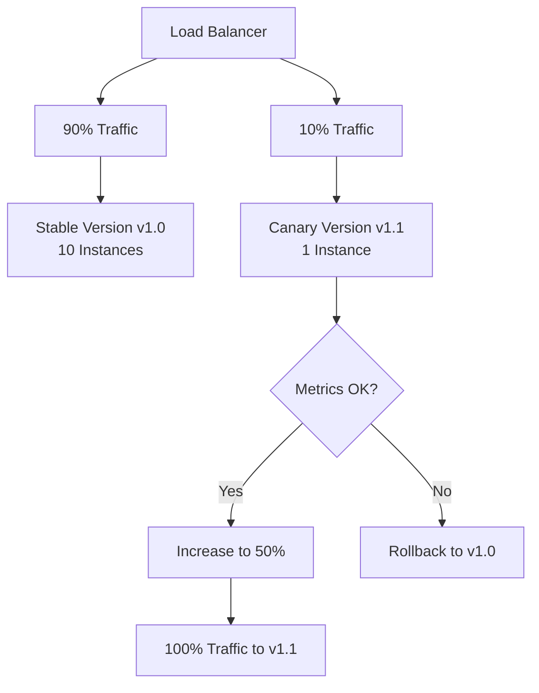

**GitOps CI/CD Example:**

```yaml
# .github/workflows/deploy.yml
name: Deploy to Production

on:
  push:
    branches: [main]

jobs:
  deploy:
    runs-on: ubuntu-latest
    steps:
      - uses: actions/checkout@v2
      
      - name: Build Docker Image
        run: docker build -t myapp:${{ github.sha }} .
      
      - name: Run Tests
        run: docker run myapp:${{ github.sha }} npm test
      
      - name: Security Scan
        run: trivy image myapp:${{ github.sha }}
      
      - name: Push to Registry
        run: docker push myapp:${{ github.sha }}
      
      - name: Update Kubernetes Manifest
        run: |
          sed -i 's|image:.*|image: myapp:${{ github.sha }}|' k8s/deployment.yaml
          git commit -am "Deploy ${{ github.sha }}"
          git push
```

> [!IMPORTANT]
> Automate deployment testing (smoke tests, integration tests) to catch regressions before production rollout.

### Auto-Remediation and Self-Healing

**Self-Healing Pattern:**

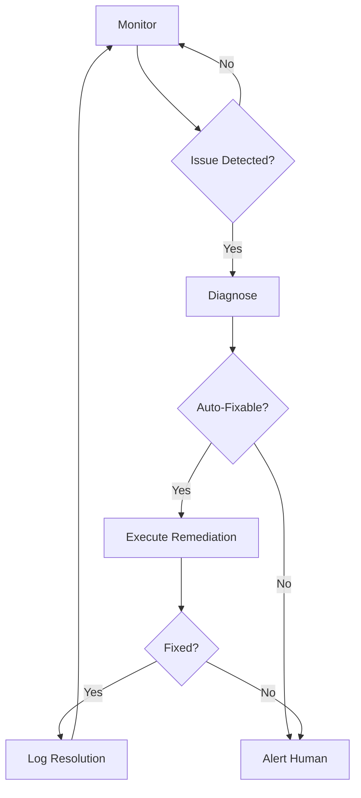

**Common Auto-Remediation Scenarios:**

| Issue | Detection | Remediation | Tool |
|-------|-----------|-------------|------|
| **Pod crash loop** | Kubernetes readiness failure | Restart pod, rollback if persists | Kubernetes liveness probes |
| **High memory** | Memory >90% for 5 minutes | Restart application, scale up | Azure Monitor + Runbook |
| **Disk full** | Disk >95% | Clean logs, expand disk | AWS Systems Manager |
| **Certificate expiry** | Cert expires in 7 days | Renew via cert-manager | cert-manager (K8s) |
| **Failed health check** | HTTP 503 response | Remove from load balancer | ALB/App Gateway health probes |

**Azure Automation Example:**

```powershell
# Auto-remediation runbook
param([string]$ResourceGroupName, [string]$VMName)

# Triggered by Azure Monitor alert
$vm = Get-AzVM -ResourceGroupName $ResourceGroupName -Name $VMName

if ($vm.StatusCode -eq "PowerState/deallocated") {
    Write-Output "VM $VMName is stopped. Starting..."
    Start-AzVM -ResourceGroupName $ResourceGroupName -Name $VMName
    Write-Output "VM started successfully."
}
```

> [!TIP]
> Start with safe auto-remediation (restarts, scaling) before implementing complex automation. Always log automated actions for audit trails.

**Chaos Engineering:**

Deliberately inject failures to test auto-remediation and system resilience.

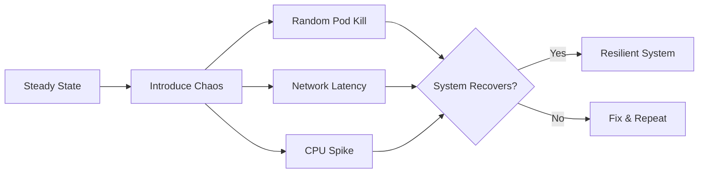

**Chaos Engineering Tools:**

- **Chaos Monkey**: Random instance termination (Netflix)
- **Gremlin**: Comprehensive chaos platform (SaaS)
- **Chaos Mesh**: Kubernetes-native chaos testing
- **Azure Chaos Studio**: Managed chaos experiments (Azure)

## Disaster Recovery and Business Continuity

Disaster recovery ensures business continuity through backups, failover mechanisms, and tested recovery procedures.

### RTO and RPO

**Recovery Objectives:**

| Metric | Definition | Example | Cost |
|--------|------------|---------|------|
| **RTO** | Recovery Time Objective<br/>(How long until restored?) | 4 hours | Higher RTO = Lower cost |
| **RPO** | Recovery Point Objective<br/>(How much data loss acceptable?) | 15 minutes | Lower RPO = Higher cost |

**RTO/RPO Trade-offs:**

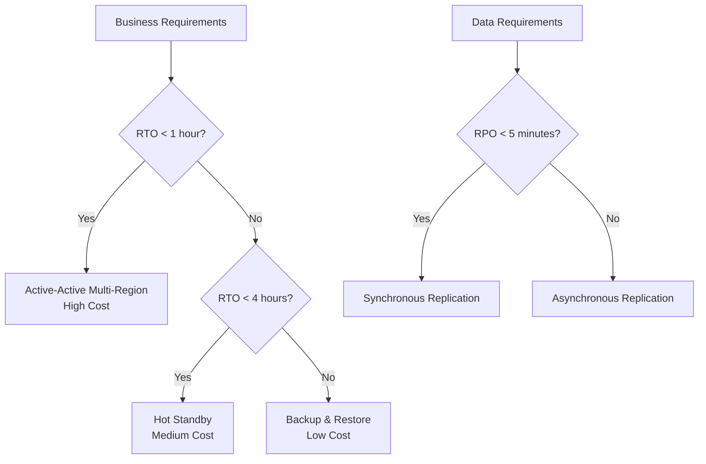

**Disaster Recovery Tiers:**

| Tier | RTO | RPO | Strategy | Cost | Use Case |
|------|-----|-----|----------|------|----------|
| **Tier 0** | <1 hour | <5 minutes | Active-Active | Very High | Mission-critical (banking, healthcare) |
| **Tier 1** | 1-4 hours | 15-60 minutes | Hot Standby | High | Business-critical applications |
| **Tier 2** | 4-24 hours | 1-4 hours | Warm Standby | Medium | Important but not time-sensitive |
| **Tier 3** | 24-72 hours | 4-24 hours | Cold Standby | Low | Non-critical systems |
| **Tier 4** | >72 hours | >24 hours | Backup Only | Very Low | Archival data |

### Backup Strategies

**3-2-1 Backup Rule:**

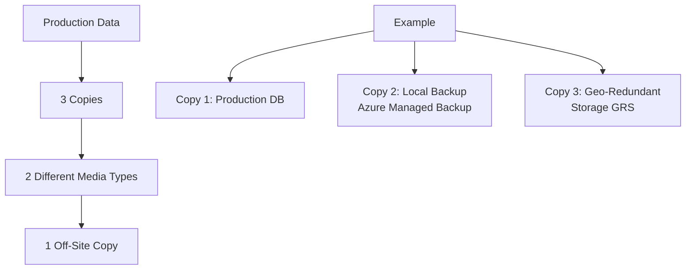

**Backup Types:**

| Type | Method | Duration | Use Case |
|------|--------|----------|----------|
| **Full** | Complete data copy | Long | Weekly baseline |
| **Incremental** | Changes since last backup | Short | Daily changes |
| **Differential** | Changes since last full | Medium | Faster restore than incremental |
| **Snapshot** | Point-in-time state | Instant | Quick recovery, frequent backups |

**Azure Backup Architecture:**

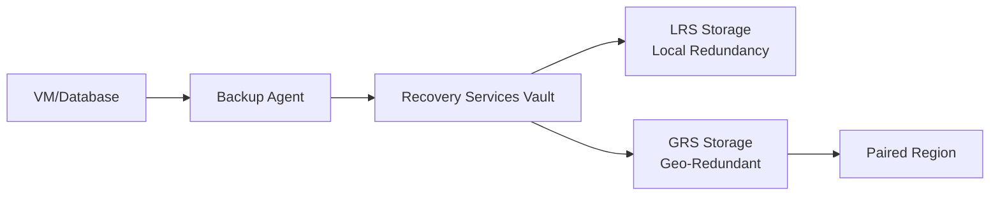

**Backup Retention Policy:**

| Data Type | Daily | Weekly | Monthly | Yearly | Rationale |
|-----------|-------|--------|---------|--------|-----------|
| **Databases** | 7 days | 4 weeks | 12 months | 7 years | Compliance, point-in-time recovery |
| **File Shares** | 30 days | 12 weeks | 12 months | 3 years | Version history, accidental deletion |
| **VMs** | 7 days | 4 weeks | 6 months | 1 year | Disaster recovery |
| **Logs** | 30 days | - | 12 months | 7 years | Auditing, compliance |

> [!CAUTION]
> Test backups regularly. Untested backups are not backups. Schedule quarterly disaster recovery drills.

### Failover and Failback

**Multi-Region Failover:**

```mermaid
graph TB
    subgraph "Primary Region: East US"
        A[App Service]
        B[SQL Database Primary]
    end
    
    subgraph "Secondary Region: West US"
        C[App Service Standby]
        D[SQL Database Replica]
    end
    
    E[Traffic Manager] --> A
    A --> B
    B -.Async Replication.-> D
    
    F[Failover Event] --> G[Traffic Manager]
    G --> C
    C --> D
```

**Failover Strategies:**

| Strategy | Complexity | Data Loss Risk | Cost | Use Case |
|----------|------------|----------------|------|----------|
| **Active-Active** | High | None (sync replication) | Very High | Global applications, 99.99%+ SLA |
| **Active-Passive (Hot)** | Medium | Minimal (async replication) | High | Business-critical applications |
| **Pilot Light** | Medium | Some (backup restore) | Medium | Important applications |
| **Backup & Restore** | Low | Significant | Low | Non-critical systems |

**Active-Active Multi-Region:**

```mermaid
graph TB
    A[Global Traffic Manager<br/>Azure Front Door / AWS Route53]
    
    A --> B[Region 1: East US]
    A --> C[Region 2: West Europe]
    A --> D[Region 3: Southeast Asia]
    
    B --> E[Cosmos DB<br/>Multi-Master]
    C --> E
    D --> E
```

**Benefits:**

- Zero RTO (no failover needed)
- Load distribution across regions
- Best user experience (lowest latency)

**Challenges:**

- Data consistency (CAP theorem)
- Complex deployment
- Higher cost

> [!IMPORTANT]
> Active-active requires conflict resolution strategy for write conflicts. Use last-write-wins, custom merge logic, or operational transforms.

**Failback Procedure:**

```mermaid
graph LR
    A[Disaster Occurs] --> B[Failover to DR]
    B --> C[Run on DR Site]
    C --> D[Primary Site Restored]
    D --> E{Ready for Failback?}
    E -->|Yes| F[Sync Data to Primary]
    F --> G[Validate Data Integrity]
    G --> H[Failback Traffic]
    H --> I[Resume Normal Operations]
    E -->|No| C
```

### Disaster Recovery Testing

**DR Test Schedule:**

| Test Type | Frequency | Scope | Participants |
|-----------|-----------|-------|--------------|
| **Tabletop Exercise** | Quarterly | Procedure review | Key stakeholders |
| **Partial Failover** | Bi-annually | Non-production DR | Operations team |
| **Full Failover** | Annually | Production DR (off-hours) | All teams |
| **Backup Restore** | Monthly | Sample restore | Database admins |

**DR Test Checklist:**

- [ ] Notify stakeholders of DR test
- [ ] Document current state (baseline)
- [ ] Initiate failover procedure
- [ ] Verify application functionality
- [ ] Test data integrity
- [ ] Measure RTO (time to restore)
- [ ] Measure RPO (data loss)
- [ ] Perform failback
- [ ] Document lessons learned
- [ ] Update DR runbooks

> [!TIP]
> Schedule DR tests during low-traffic periods. Use feature flags to test DR without full failover when possible.

**Real-World Example:**

A SaaS company conducts quarterly DR drills:

- **Q1**: Tabletop exercise - discuss procedures, identify gaps
- **Q2**: Partial test - fail over staging environment
- **Q3**: Backup restore - restore production backup to test environment
- **Q4**: Full DR test - fail over production to DR region (Saturday 2 AM)
- **Result**: RTO reduced from 6 hours to 45 minutes over 2 years

### Business Continuity Planning

**BCP Components:**

```mermaid
graph TB
    A[Business Continuity Plan] --> B[Risk Assessment]
    A --> C[Business Impact Analysis]
    A --> D[Recovery Strategies]
    A --> E[Communication Plan]
    A --> F[Training & Testing]
    
    C --> G[Critical Business Functions]
    G --> H[Recovery Priorities]
```

**Business Impact Analysis:**

| System | Criticality | RTO Target | RPO Target | Dependencies |
|--------|-------------|------------|------------|--------------|
| **Payment Processing** | Tier 0 | 30 minutes | 5 minutes | Payment gateway, database |
| **Customer Portal** | Tier 1 | 2 hours | 30 minutes | Auth service, API gateway |
| **Reporting System** | Tier 2 | 8 hours | 4 hours | Data warehouse |
| **Internal Wiki** | Tier 3 | 24 hours | 24 hours | None |

**Communication Plan:**

1. **Incident Detection**: Monitoring alerts operations team
2. **Initial Assessment**: Operations manager notifies stakeholders
3. **Customer Communication**: Status page updated within 15 minutes
4. **Regular Updates**: Every 30 minutes until resolution
5. **Post-Incident**: Root cause analysis published within 72 hours

> [!NOTE]
> Transparent communication during incidents builds customer trust. Use status pages (Statuspage.io, Azure Status) for real-time updates.

## Performance Management
