# Scalability and Performance

Scalability ensures systems handle growing demand while maintaining performance. This section covers scaling strategies, load balancing, caching, and performance optimization techniques.

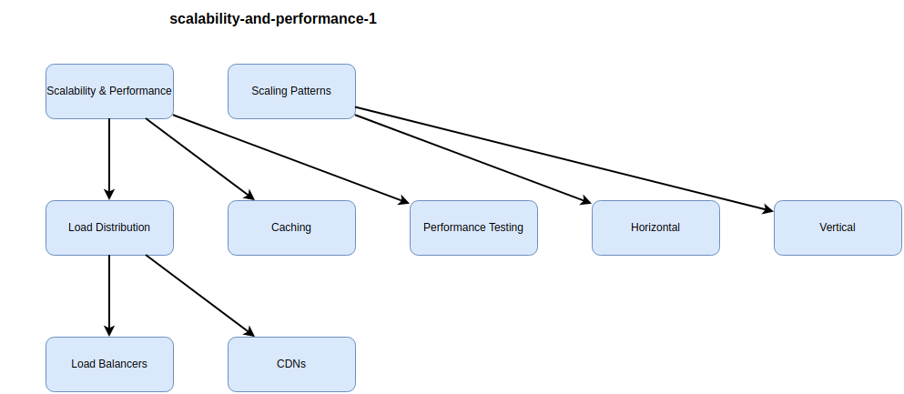


## Elasticity and Scalability Patterns

Elasticity is the ability to automatically scale resources based on demand, while scalability is the capacity to handle increased load.

### Vertical vs Horizontal Scaling

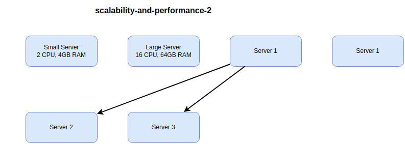


**Scaling Comparison:**

| Aspect | Vertical Scaling | Horizontal Scaling |
|--------|------------------|-------------------|
| **Method** | Add more power (CPU, RAM) | Add more instances |
| **Limit** | Hardware maximum | Virtually unlimited |
| **Downtime** | Often requires restart | Zero-downtime possible |
| **Complexity** | Simple | Complex (load balancing, state management) |
| **Cost** | Non-linear (diminishing returns) | Linear scaling |
| **Use Case** | Monolithic apps, databases | Stateless apps, microservices |

> [!TIP]
> Prefer horizontal scaling for web tiers and stateless services. Use vertical scaling for databases and stateful applications until horizontal becomes necessary.

### Auto-Scaling Patterns

**Auto-Scaling Architecture:**

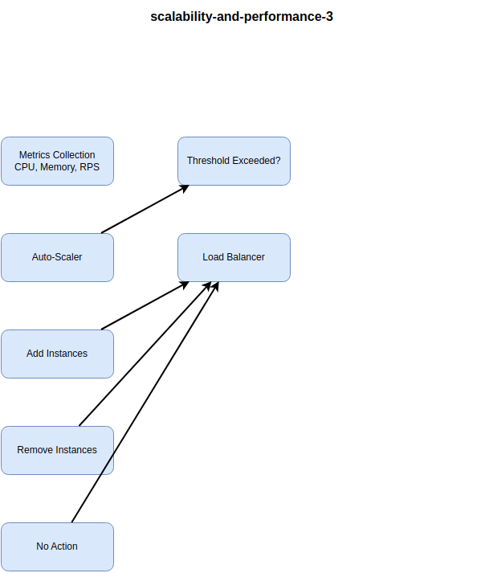


**Scaling Triggers:**

| Metric | Scale Out Trigger | Scale In Trigger | Use Case |
|--------|-------------------|------------------|----------|
| **CPU Utilization** | >70% for 5 minutes | <30% for 10 minutes | CPU-bound workloads |
| **Memory** | >80% for 5 minutes | <40% for 10 minutes | Memory-intensive apps |
| **Request Count** | >1000 RPS per instance | <100 RPS per instance | Web applications |
| **Queue Depth** | >1000 messages | <100 messages | Background workers |
| **Custom Metric** | API latency >500ms | API latency <200ms | Application-specific |

**Azure Virtual Machine Scale Sets:**

```json
{
  "name": "autoscale-rule-cpu",
  "metricTrigger": {
    "metricName": "Percentage CPU",
    "metricResourceUri": "/subscriptions/.../vmScaleSets/webapp",
    "timeGrain": "PT1M",
    "statistic": "Average",
    "timeWindow": "PT5M",
    "timeAggregation": "Average",
    "operator": "GreaterThan",
    "threshold": 70
  },
  "scaleAction": {
    "direction": "Increase",
    "type": "ChangeCount",
    "value": "2",
    "cooldown": "PT5M"
  }
}
```

**AWS Auto Scaling Policy:**

```yaml
TargetTrackingScaling:
  TargetValue: 70.0
  PredefinedMetricSpecification:
    PredefinedMetricType: ASGAverageCPUUtilization
  ScaleInCooldown: 300
  ScaleOutCooldown: 60
```

> [!IMPORTANT]
> Set cooldown periods to prevent scaling thrashing. Scale out quickly (1-2 minutes), scale in slowly (5-10 minutes) to handle traffic spikes gracefully.

**Scaling Best Practices:**

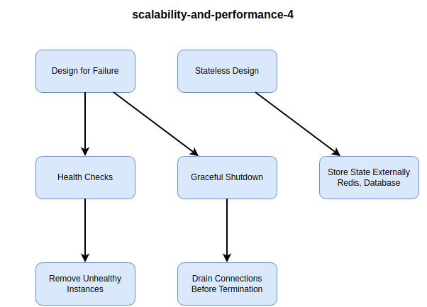


1. **Stateless Applications**: Store session state in Redis/DynamoDB, not in-memory
2. **Health Checks**: Implement `/health` endpoint for load balancer probes
3. **Graceful Shutdown**: Handle SIGTERM to finish requests before termination
4. **Fast Startup**: Optimize container/VM boot time for quick scaling
5. **Pre-warming**: Scale out before known traffic spikes (e.g., sales events)

**Real-World Example:**

An e-commerce site uses predictive auto-scaling:

- **Normal Traffic**: 10 instances (baseline)
- **Detected Pattern**: Traffic spikes 50% every Friday 6 PM
- **Pre-Warming**: Scale to 20 instances at Friday 5:30 PM
- **Reactive Scaling**: Scale beyond 20 if needed based on CPU/RPS
- **Result**: Zero latency spikes during peak hours

### Scaling Database Tier

**Database Scaling Strategies:**

| Strategy | How It Works | Pros | Cons | Use Case |
|----------|--------------|------|------|----------|
| **Read Replicas** | Async replication for read queries | Easy, no app changes | Replication lag | Read-heavy workloads |
| **Vertical Scaling** | Bigger database instance | Simple | Limited, expensive | Initial growth |
| **Sharding** | Horizontal partitioning | Unlimited scaling | Complex, rebalancing | Massive scale (Twitter, Facebook) |
| **Caching** | Cache frequent queries | Dramatic speedup | Cache invalidation complexity | Most applications |
| **CQRS** | Separate read/write models | Optimized for each | Eventual consistency | Complex domains |

**Read Replica Architecture:**

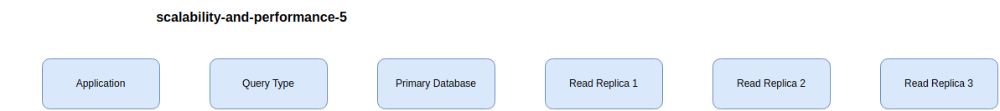


**Sharding (Horizontal Partitioning):**

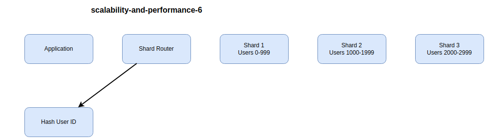


**Sharding Challenges:**

1. **Cross-Shard Queries**: Queries spanning shards are expensive
2. **Rebalancing**: Moving data between shards is complex
3. **Hot Shards**: Uneven data distribution causes bottlenecks
4. **Transactions**: Distributed transactions across shards are difficult

> [!CAUTION]
> Sharding is complex and should be a last resort. Exhaust other options (caching, read replicas, vertical scaling) before implementing sharding.

**Cosmos DB Global Distribution:**

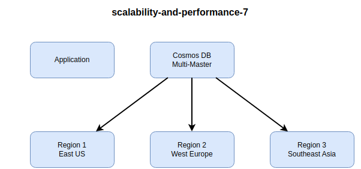


**Benefits:**

- Sub-10ms read/write latency anywhere
- Multi-master writes (no single bottleneck)
- Automatic conflict resolution
- 99.999% availability SLA

> [!NOTE]
> Globally distributed databases like Cosmos DB, DynamoDB Global Tables solve scalability and latency but cost more than single-region databases.

### Serverless Scaling

Serverless platforms automatically scale from zero to thousands of concurrent executions.

**Serverless Auto-Scaling:**

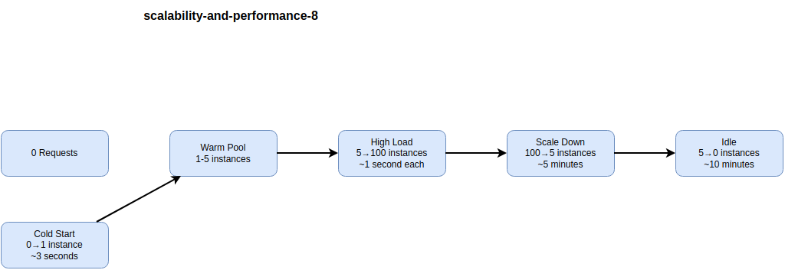


**Serverless Scaling Limits:**

| Platform | Concurrent Executions | Max Duration | Cold Start | Use Case |
|----------|----------------------|--------------|------------|----------|
| **Azure Functions (Consumption)** | 200 per function | 10 minutes | 1-3 seconds | Event processing, APIs |
| **AWS Lambda** | 1,000 (default, can increase) | 15 minutes | 100ms-5s | Microservices, data processing |
| **Google Cloud Functions** | 1,000 per region | 9 minutes | 100ms-3s | HTTP APIs, pub/sub |
| **Azure Functions (Premium)** | Pre-warmed instances | Unlimited | <1 second | Production APIs |

**Cold Start Mitigation:**

1. **Provisioned Concurrency**: Keep instances warm (Azure Functions Premium, Lambda Provisioned)
2. **Reduce Package Size**: Smaller deployments start faster
3. **Connection Pooling**: Reuse database connections across invocations
4. **Initialization Outside Handler**: Load dependencies once, not per request

**Example: Azure Functions with Warm Instances:**

```json
{
  "version": "2.0",
  "extensionBundle": {
    "id": "Microsoft.Azure.Functions.ExtensionBundle",
    "version": "[4.*, 5.0.0)"
  },
  "functionAppScaleLimit": 200,
  "preWarmedInstanceCount": 5
}
```

> [!TIP]
> Use serverless for variable workloads (APIs, event processing). For steady high traffic, containers or VMs are more cost-effective.

## Load Balancing and Traffic Management

Load balancers distribute traffic across multiple servers, improving availability and performance.

### Load Balancer Types

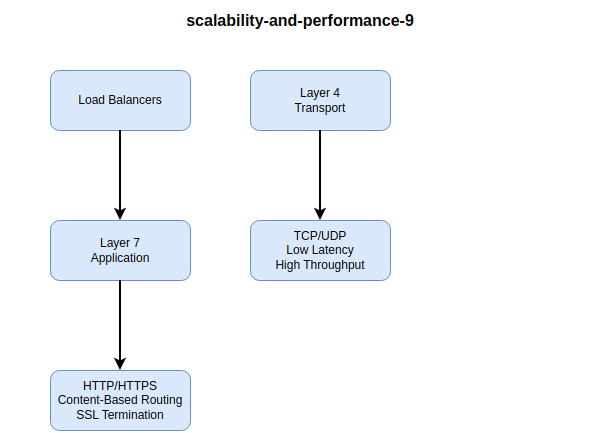


**Load Balancer Comparison:**

| Type | OSI Layer | Protocol | Features | Use Case | Examples |
|------|-----------|----------|----------|----------|----------|
| **Layer 4** | Transport | TCP/UDP | Fast, low latency | High-performance apps | Azure Load Balancer, AWS NLB |
| **Layer 7** | Application | HTTP/HTTPS | URL routing, SSL offload, WAF | Web applications | Azure App Gateway, AWS ALB |
| **Global** | Application | HTTP/HTTPS | Multi-region routing, DDoS | Global applications | Azure Front Door, AWS CloudFront |
| **DNS** | Application | DNS | Geographic routing, failover | Multi-region DR | Azure Traffic Manager, AWS Route 53 |

### Load Balancing Algorithms

**Algorithm Comparison:**

| Algorithm | How It Works | Pros | Cons | Use Case |
|-----------|--------------|------|------|----------|
| **Round Robin** | Distribute requests sequentially | Simple, even distribution | Ignores server load | Identical servers |
| **Least Connections** | Send to server with fewest connections | Better for long-lived connections | Slightly more overhead | Varying request duration |
| **IP Hash** | Hash client IP to server | Session persistence | Uneven distribution | Stateful sessions |
| **Weighted** | Route based on server capacity | Handles different server sizes | Manual configuration | Mixed instance types |
| **Least Response Time** | Send to fastest server | Optimal performance | Requires health metrics | Performance-sensitive |

**Round Robin:**

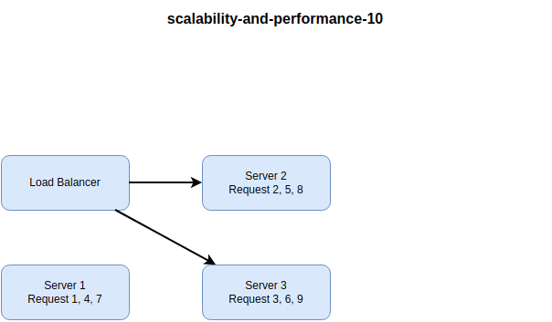


**Least Connections:**

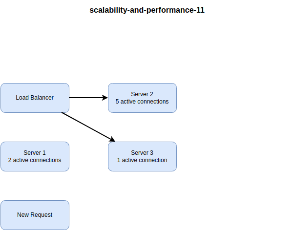


> [!NOTE]
> Choose round robin for short-lived HTTP requests. Use least connections for WebSockets or long-polling where connection duration varies significantly.

### Health Checks and Failover

**Health Check Types:**

| Type | Method | Frequency | Use Case |
|------|--------|-----------|----------|
| **HTTP** | GET /health returns 200 | 5-30 seconds | Web applications |
| **TCP** | Open socket connection | 5-30 seconds | Non-HTTP services |
| **Custom Script** | Execute health check script | 30-60 seconds | Complex validation |

**Health Check Endpoint:**

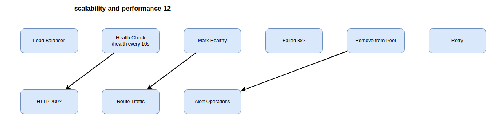


**Example Health Check Implementation:**

```csharp
// ASP.NET Core health check
app.MapHealthChecks("/health", new HealthCheckOptions
{
    ResponseWriter = async (context, report) =>
    {
        var result = new
        {
            status = report.Status.ToString(),
            checks = report.Entries.Select(e => new
            {
                name = e.Key,
                status = e.Value.Status.ToString(),
                duration = e.Value.Duration.TotalMilliseconds
            })
        };
        
        context.Response.ContentType = "application/json";
        await context.Response.WriteAsync(JsonSerializer.Serialize(result));
    }
});

services.AddHealthChecks()
    .AddCheck("database", () => CheckDatabase())
    .AddCheck("cache", () => CheckRedis())
    .AddCheck("storage", () => CheckBlobStorage());
```

**Health Check Best Practices:**

1. **Shallow Checks**: Quick response (<1 second), don't run expensive queries
2. **Dependency Checks**: Verify critical dependencies (database, cache)
3. **Fail Fast**: Mark unhealthy immediately if critical dependency fails
4. **Different Endpoints**: `/health/liveness` (restart needed?) vs `/health/readiness` (ready for traffic?)

> [!IMPORTANT]
> Implement separate liveness and readiness probes. Liveness = restart if fails. Readiness = remove from load balancer if fails.

### Session Persistence

**Session Affinity (Sticky Sessions):**

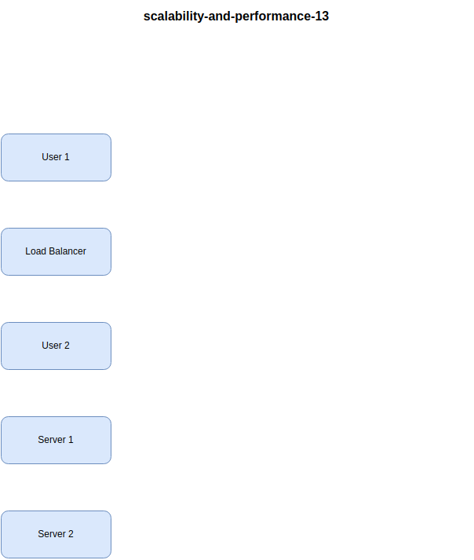


**Session Storage Options:**

| Option | Pros | Cons | Use Case |
|--------|------|------|----------|
| **In-Memory (Sticky)** | Fast, simple | Single server failure loses sessions | Development only |
| **Redis/Memcached** | Fast, distributed | External dependency | Production apps |
| **Database** | Durable, queryable | Slower than cache | Long-lived sessions |
| **JWT Tokens** | Stateless, no storage | Larger payload, can't revoke easily | Microservices, APIs |

**Redis Session Architecture:**

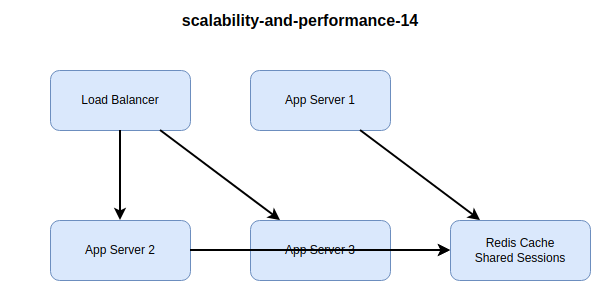


> [!TIP]
> Avoid sticky sessions when possible - design stateless applications. Use external session storage (Redis) for true scalability and resilience.

### Traffic Splitting and Canary Deployments

**Traffic Splitting:**

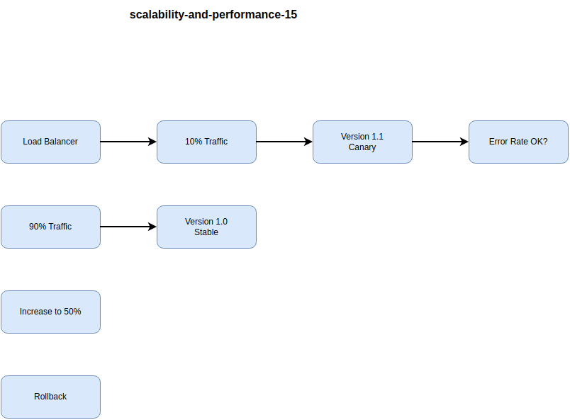


**Azure Application Gateway URL Routing:**

```json
{
  "urlPathMaps": [
    {
      "name": "api-routing",
      "defaultBackendAddressPool": "stable-pool",
      "pathRules": [
        {
          "name": "canary-rule",
          "paths": ["/api/*"],
          "backendAddressPool": "canary-pool",
          "trafficPercent": 10
        }
      ]
    }
  ]
}
```

**AWS ALB Weighted Target Groups:**

```yaml
Listener:
  DefaultActions:
    - Type: forward
      ForwardConfig:
        TargetGroups:
          - TargetGroupArn: !Ref StableTargetGroup
            Weight: 90
          - TargetGroupArn: !Ref CanaryTargetGroup
            Weight: 10
```

> [!NOTE]
> Use traffic splitting for gradual rollouts. Start with 5-10% canary traffic, monitor for 30-60 minutes, then increase to 50%, then 100%.

## Caching Strategies

Caching dramatically improves performance by serving frequently accessed data from fast storage.

### Cache-Aside Pattern

**How It Works:**

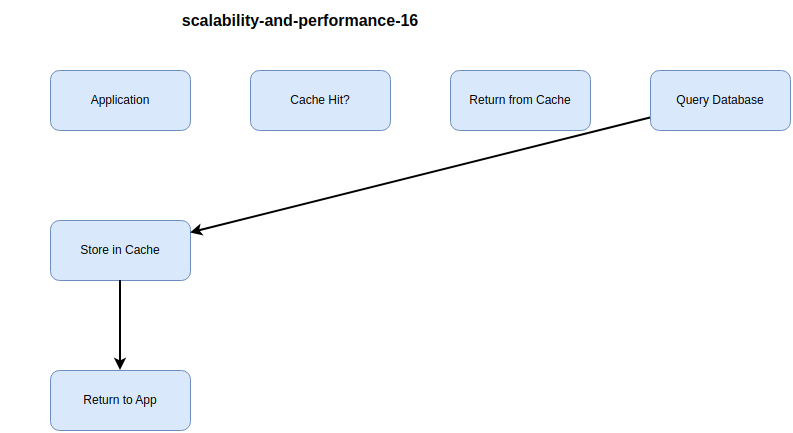


**Cache-Aside Implementation:**

```csharp
public async Task<Product> GetProductAsync(int productId)
{
    string cacheKey = $"product:{productId}";
    
    // Try cache first
    var cached = await cache.GetStringAsync(cacheKey);
    if (cached != null)
        return JsonSerializer.Deserialize<Product>(cached);
    
    // Cache miss - query database
    var product = await database.Products.FindAsync(productId);
    
    // Store in cache for 1 hour
    await cache.SetStringAsync(
        cacheKey,
        JsonSerializer.Serialize(product),
        new DistributedCacheEntryOptions
        {
            AbsoluteExpirationRelativeToNow = TimeSpan.FromHours(1)
        }
    );
    
    return product;
}
```

**Cache-Aside Best Practices:**

1. **Set Expiration**: Always set TTL to prevent stale data
2. **Cache Warming**: Pre-populate cache with hot data
3. **Graceful Degradation**: If cache fails, query database
4. **Invalidation**: Delete or update cache on writes

> [!TIP]
> Use cache-aside for read-heavy workloads. Set TTL based on acceptable staleness (minutes for product catalog, seconds for stock prices).

### Write Strategies

**Write-Through Cache:**

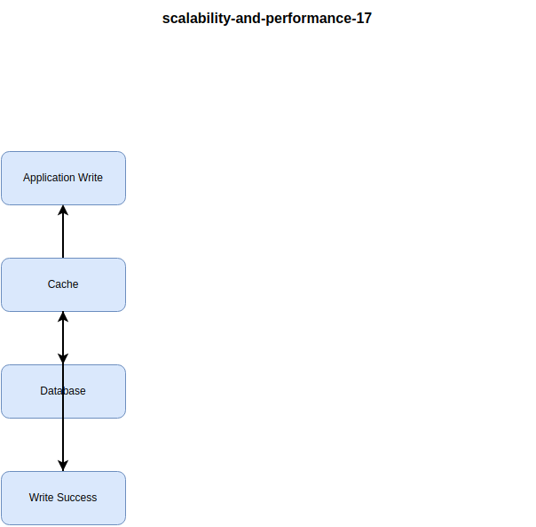


**Write-Behind (Write-Back) Cache:**

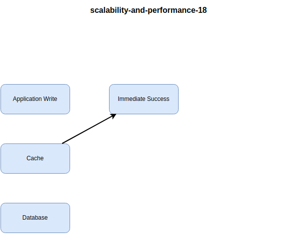


**Cache Strategy Comparison:**

| Strategy | Latency | Consistency | Complexity | Use Case |
|----------|---------|-------------|------------|----------|
| **Cache-Aside** | Read: Low<br/>Write: High | Eventual | Low | Most applications |
| **Write-Through** | Write: High | Strong | Medium | Strongly consistent data |
| **Write-Behind** | Write: Low | Eventual | High | High write volume, can tolerate data loss |
| **Refresh-Ahead** | Read: Very Low | Eventual | Medium | Predictable access patterns |

> [!CAUTION]
> Write-behind cache risks data loss if cache crashes before database sync. Only use when acceptable (e.g., view counts, analytics).

### Cache Eviction Policies

**Eviction Algorithms:**

| Policy | How It Works | Best For | Redis/Memcached |
|--------|--------------|----------|-----------------|
| **LRU** | Least Recently Used | General caching | Redis: `allkeys-lru` |
| **LFU** | Least Frequently Used | Hot data retention | Redis: `allkeys-lfu` |
| **TTL** | Time-based expiration | Time-sensitive data | Redis: `volatile-ttl` |
| **Random** | Random eviction | Simple, low overhead | Redis: `allkeys-random` |
| **No Eviction** | Reject writes when full | Critical cache data | Redis: `noeviction` |

**LRU Cache Behavior:**

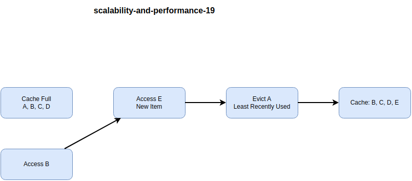


> [!NOTE]
> LRU is the default and works well for most scenarios. Use LFU if you have distinct hot/cold data patterns.

### Distributed Caching

**Redis Architecture:**

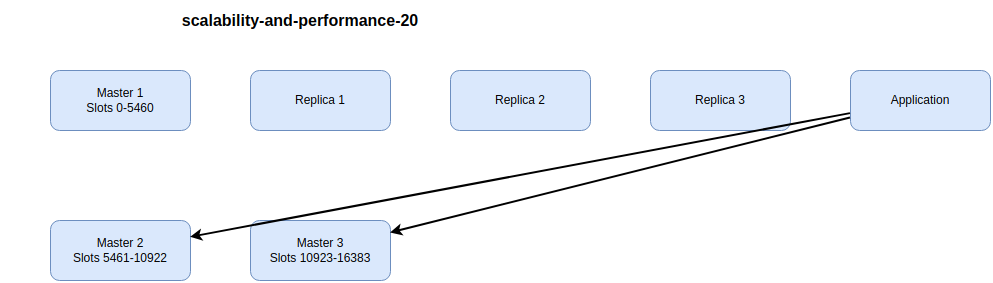


**Redis vs Memcached:**

| Feature | Redis | Memcached |
|---------|-------|-----------|
| **Data Structures** | Strings, lists, sets, hashes, sorted sets | Key-value only |
| **Persistence** | Optional (RDB, AOF) | No |
| **Replication** | Master-replica, Sentinel | No (use consistent hashing) |
| **Clustering** | Built-in | Client-side sharding |
| **Max Value Size** | 512 MB | 1 MB |
| **Use Case** | Complex caching, pub/sub, leaderboards | Simple key-value cache |

**Real-World Example:**

A media site uses Redis for:

- **Cache**: Article HTML (1 hour TTL)
- **Session Store**: User sessions (24 hour TTL)
- **Rate Limiting**: API throttling (1 minute window)
- **Leaderboard**: Sorted set of user scores
- **Result**: 95% cache hit rate, 10x performance improvement

> [!IMPORTANT]
> Configure Redis persistence (RDB snapshots) for critical cache data. For pure caching, persistence is optional and reduces performance.

### Cache Invalidation

"There are only two hard things in Computer Science: cache invalidation and naming things." - Phil Karlton

**Invalidation Strategies:**

| Strategy | How It Works | Consistency | Complexity | Use Case |
|----------|--------------|-------------|------------|----------|
| **TTL Expiration** | Auto-expire after time | Eventual | Low | Acceptable staleness |
| **Event-Based** | Invalidate on write events | Strong | Medium | Critical data |
| **Versioned Keys** | Change key on update | Strong | Low | Immutable data |
| **Cache Tags** | Group related entries | Strong | High | Complex dependencies |

**Event-Based Invalidation:**

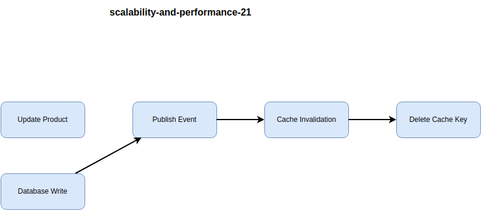


**Example: Event-Driven Cache Invalidation:**

```csharp
public async Task UpdateProductAsync(Product product)
{
    // Update database
    await database.Products.UpdateAsync(product);
    
    // Invalidate cache
    await cache.RemoveAsync($"product:{product.Id}");
    await cache.RemoveAsync($"products:category:{product.CategoryId}");
    
    // Publish event for other services
    await eventBus.PublishAsync(new ProductUpdatedEvent
    {
        ProductId = product.Id,
        CategoryId = product.CategoryId
    });
}
```

> [!TIP]
> Use TTL for most data. Add event-based invalidation only for critical data where staleness is unacceptable.

## Content Delivery Networks (CDNs)

CDNs cache static content at edge locations worldwide, reducing latency and origin load.

### CDN Architecture

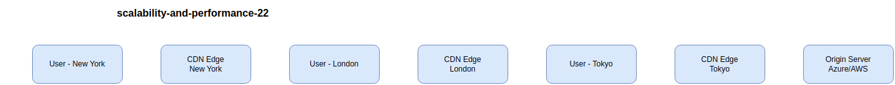


**CDN Benefits:**

| Benefit | Description | Impact |
|---------|-------------|--------|
| **Reduced Latency** | Serve content from nearby edge | 10x faster for global users |
| **Lower Bandwidth** | Offload traffic from origin | 70-95% reduction |
| **Better Availability** | Cached content survives origin outage | Improved uptime |
| **DDoS Protection** | Absorb attacks at edge | Built-in security |
| **SEO Improvement** | Faster page loads | Higher rankings |

### CDN Providers

**Provider Comparison:**

| Provider | Edge Locations | Special Features | Best For |
|----------|----------------|------------------|----------|
| **Azure CDN** | 100+ PoPs | Azure integration, Verizon/Akamai tiers | Azure workloads |
| **AWS CloudFront** | 400+ PoPs | Lambda@Edge, Shield DDoS | AWS workloads |
| **Cloudflare** | 275+ cities | Free tier, Argo routing | Small to medium sites |
| **Akamai** | 4,100+ PoPs | Most extensive network | Enterprise, media |
| **Fastly** | 60+ PoPs | Real-time purging, edge compute | Dynamic content |

**Azure CDN Configuration:**

```json
{
  "name": "cdn-profile",
  "sku": "Standard_Microsoft",
  "endpoint": {
    "name": "myapp",
    "originHostHeader": "myapp.azurewebsites.net",
    "origins": [
      {
        "name": "origin1",
        "hostName": "myapp.azurewebsites.net"
      }
    ],
    "deliveryPolicy": {
      "rules": [
        {
          "name": "CacheImages",
          "match": {
            "urlPath": "*.jpg,*.png,*.gif"
          },
          "actions": [
            {
              "name": "CacheExpiration",
              "duration": "7.00:00:00"
            }
          ]
        }
      ]
    }
  }
}
```

> [!NOTE]
> Choose CDN based on your primary cloud provider for best integration. For multi-cloud, Cloudflare offers provider-agnostic global distribution.

### Cache Control Headers

**HTTP Cache Headers:**

| Header | Purpose | Example |
|--------|---------|---------|
| **Cache-Control** | Caching directives | `max-age=3600, public` |
| **Expires** | Absolute expiration | `Wed, 21 Oct 2025 07:28:00 GMT` |
| **ETag** | Version identifier | `"33a64df551425fcc55e4d42a148795d9f25f89d4"` |
| **Last-Modified** | Last change timestamp | `Wed, 15 Nov 2023 12:45:26 GMT` |

**Cache-Control Directives:**


**Best Practices by Content Type:**

| Content Type | Cache-Control | Duration | Reasoning |
|--------------|---------------|----------|-----------|
| **Images, CSS, JS (versioned)** | `public, max-age=31536000, immutable` | 1 year | File name changes on update |
| **HTML** | `public, max-age=3600` | 1 hour | Balances freshness and performance |
| **API Responses** | `private, max-age=300` | 5 minutes | User-specific, moderate staleness |
| **User Profile** | `private, no-cache` | Revalidate | Must be fresh |
| **Payment Info** | `private, no-store` | Never | Security requirement |

**Example: Setting Cache Headers:**

```csharp
// ASP.NET Core
app.UseStaticFiles(new StaticFileOptions
{
    OnPrepareResponse = ctx =>
    {
        // Cache static files for 1 year
        if (ctx.File.Name.EndsWith(".css") || 
            ctx.File.Name.EndsWith(".js") ||
            ctx.File.Name.EndsWith(".jpg"))
        {
            ctx.Context.Response.Headers.CacheControl = 
                "public,max-age=31536000,immutable";
        }
    }
});
```

> [!TIP]
> Use content hashing (e.g., `app.12a3b45c.js`) with long cache durations (1 year). Changed content gets a new filename, automatically invalidating cache.

### CDN Purging and Invalidation

**Purge Types:**

| Type | Scope | Speed | Use Case |
|------|-------|-------|----------|
| **Single URL** | One file | Fast (minutes) | Hot fix |
| **Wildcard** | Path pattern | Medium (5-10 min) | Directory |
| **Full Purge** | Everything | Slow (30-60 min) | Major release |
| **Tag-Based** | Tagged resources | Medium | Related content |

**Azure CDN Purge:**

```bash
az cdn endpoint purge \
  --resource-group myResourceGroup \
  --profile-name myCdnProfile \
  --name myEndpoint \
  --content-paths '/images/*' '/css/style.css'
```

**CloudFlare API Purge:**

```bash
curl -X POST "https://api.cloudflare.com/client/v4/zones/{zone_id}/purge_cache" \
  -H "Authorization: Bearer {api_token}" \
  -H "Content-Type: application/json" \
  --data '{"files":["https://example.com/style.css"]}'
```

> [!CAUTION]
> Full CDN purges can cause origin load spikes as all content re-caches. Use targeted purges and cache tags when possible.

### Edge Computing

Modern CDNs support code execution at edge locations for dynamic content.

**Edge Compute Platforms:**

| Platform | Language | Use Case |
|----------|----------|----------|
| **Cloudflare Workers** | JavaScript, WASM | API routing, A/B testing |
| **AWS Lambda@Edge** | Node.js, Python | Request/response transformation |
| **Azure Functions (Premium)** | C#, Node.js, Python | Geo-distributed APIs |
| **Fastly Compute@Edge** | Rust, JavaScript, Go | High-performance edge logic |

**Use Cases:**

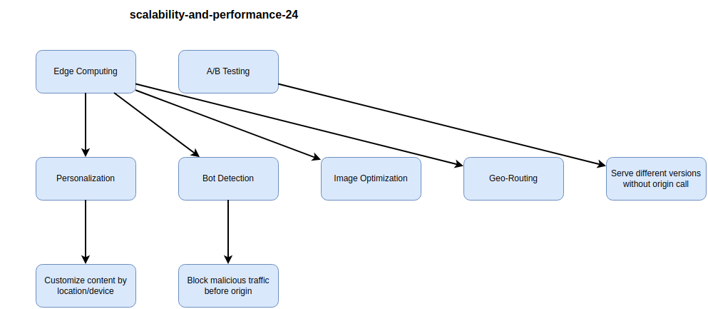


**Example: Cloudflare Worker for A/B Testing:**

```javascript
addEventListener('fetch', event => {
  event.respondWith(handleRequest(event.request))
})

async function handleRequest(request) {
  const url = new URL(request.url)
  
  // 50% to variant A, 50% to variant B
  const variant = Math.random() < 0.5 ? 'A' : 'B'
  
  url.pathname = `/variants/${variant}${url.pathname}`
  
  const response = await fetch(url)
  
  // Add variant header for analytics
  const newResponse = new Response(response.body, response)
  newResponse.headers.set('X-Variant', variant)
  
  return newResponse
}
```

> [!IMPORTANT]
> Edge computing reduces latency for dynamic content but adds complexity. Use for high-value scenarios (personalization, security) where origin requests would be too slow.

**Performance Impact:**

| Approach | Latency | Origin Load | Use Case |
|----------|---------|-------------|----------|
| **Static CDN** | 10-50ms | Very low | Images, CSS, JS |
| **Edge Compute** | 50-100ms | Low | Dynamic APIs, personalization |
| **Origin** | 100-500ms | High | Complex business logic |

**Real-World Example:**

A news site uses edge computing for:

- **Geo-Targeting**: Redirect to regional domain (example.de, example.fr)
- **Device Detection**: Serve mobile-optimized images
- **Paywall Logic**: Check subscription status at edge
- **Bot Filtering**: Block scrapers without touching origin
- **Result**: 60% reduction in origin requests, 200ms faster page loads
