# Security and Compliance

Security and compliance form the foundation of trust in cloud environments. This section covers essential security controls, data protection strategies, and regulatory compliance frameworks.

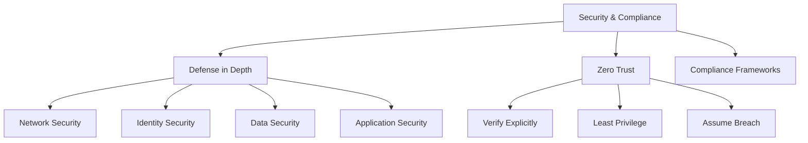

## Security Baseline

A security baseline establishes the minimum security controls required for cloud resources, ensuring consistent protection across the environment.

### Defense in Depth

Defense in depth implements multiple layers of security controls to protect against various attack vectors.

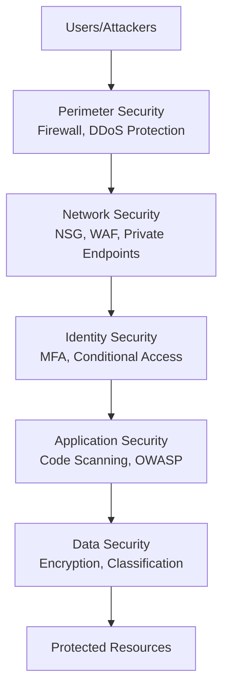

**Security Layers:**

| Layer | Controls | Azure Examples | AWS Examples |
|-------|----------|----------------|--------------|
| **Perimeter** | DDoS protection, firewall | Azure DDoS Protection, Azure Firewall | AWS Shield, AWS WAF |
| **Network** | Segmentation, traffic filtering | Network Security Groups, Private Link | Security Groups, VPC Endpoints |
| **Identity** | Authentication, authorization | Microsoft Entra ID, RBAC | IAM, Cognito |
| **Application** | Code security, WAF | Application Gateway WAF, Defender for Cloud | WAF, GuardDuty |
| **Data** | Encryption, classification | Azure Information Protection, Storage encryption | KMS, Macie |

**Real-World Example:**

A financial services application implements:
- **Perimeter**: Azure DDoS Protection Standard for volumetric attack mitigation
- **Network**: Private endpoints for Azure SQL, NSGs blocking all public access
- **Identity**: Conditional access requiring MFA from unmanaged devices
- **Application**: OWASP Top 10 vulnerability scanning in CI/CD pipeline
- **Data**: TDE for databases, AES-256 for storage, customer-managed keys

> [!IMPORTANT]
> Defense in depth ensures that if one security layer is breached, additional layers continue to protect resources. Never rely on a single security control.

### Zero Trust Architecture

Zero Trust assumes no implicit trust and verifies every access request regardless of origin.

**Core Principles:**

1. **Verify Explicitly**: Always authenticate and authorize based on all available data points
2. **Use Least Privilege Access**: Limit user access with Just-In-Time and Just-Enough-Access (JIT/JEA)
3. **Assume Breach**: Minimize blast radius and segment access

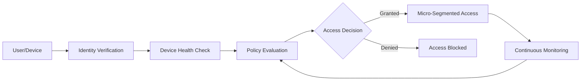

**Zero Trust Implementation:**

| Component | Purpose | Tools |
|-----------|---------|-------|
| **Identity Verification** | Strong authentication | Microsoft Entra ID, Okta, AWS IAM Identity Center |
| **Device Compliance** | Endpoint health validation | Microsoft Intune, Jamf, VMware Workspace ONE |
| **Conditional Access** | Context-based policies | Entra Conditional Access, AWS IAM Conditions |
| **Micro-Segmentation** | Network isolation | Azure Private Link, AWS PrivateLink, NSGs |
| **Continuous Monitoring** | Real-time threat detection | Microsoft Sentinel, AWS Security Hub, Splunk |

**Conditional Access Policy Example:**

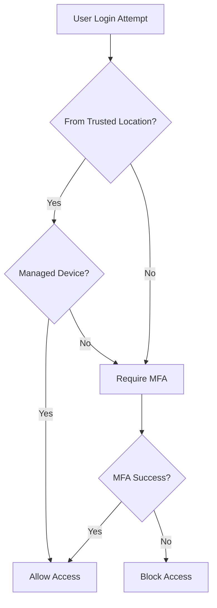

> [!TIP]
> Start Zero Trust implementation with identity (MFA, conditional access), then expand to network (micro-segmentation) and data (encryption, DLP).

### Security Benchmarks

**Industry Security Standards:**

| Benchmark | Focus | Cloud Coverage |
|-----------|-------|----------------|
| **CIS Benchmarks** | Configuration hardening | Azure, AWS, GCP, Kubernetes |
| **NIST Cybersecurity Framework** | Risk management | Technology-agnostic |
| **Azure Security Benchmark** | Azure-specific controls | Azure services |
| **AWS Foundational Security Best Practices** | AWS-specific controls | AWS services |

**CIS Control Categories:**

1. Inventory and Control of Hardware Assets
2. Inventory and Control of Software Assets
3. Continuous Vulnerability Management
4. Controlled Use of Administrative Privileges
5. Secure Configuration for Hardware and Software
6. Maintenance, Monitoring, and Analysis of Audit Logs
7. Email and Web Browser Protections
8. Malware Defenses
9. Limitation and Control of Network Ports
10. Data Recovery Capabilities

> [!NOTE]
> Microsoft Defender for Cloud and AWS Security Hub provide automated compliance checks against CIS benchmarks and cloud-specific baselines.

## Data Privacy and Protection

Data protection ensures confidentiality, integrity, and availability of sensitive information through encryption, classification, and access controls.

### Data Classification

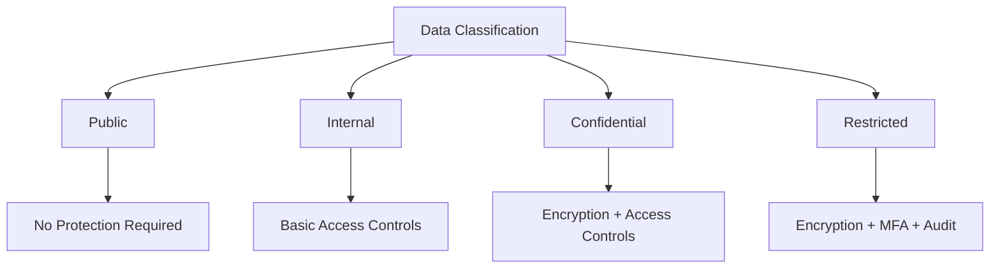

**Classification Levels:**

| Level | Description | Examples | Protection Requirements |
|-------|-------------|----------|------------------------|
| **Public** | Freely shareable | Marketing materials, public documentation | None |
| **Internal** | Business use only | Internal memos, general business data | Access controls |
| **Confidential** | Sensitive business data | Financial reports, contracts | Encryption at rest, RBAC |
| **Restricted** | Highly sensitive | PII, PHI, payment data, secrets | Encryption (rest & transit), MFA, audit logging |

**Data Classification Tools:**

- **Azure Purview**: Automated data discovery and classification
- **AWS Macie**: ML-powered sensitive data discovery in S3
- **Microsoft Information Protection**: Sensitivity labels and DLP policies

> [!CAUTION]
> Always classify data before storing it in the cloud. Over-classification increases costs; under-classification creates security risks.

### Encryption

**Encryption States:**

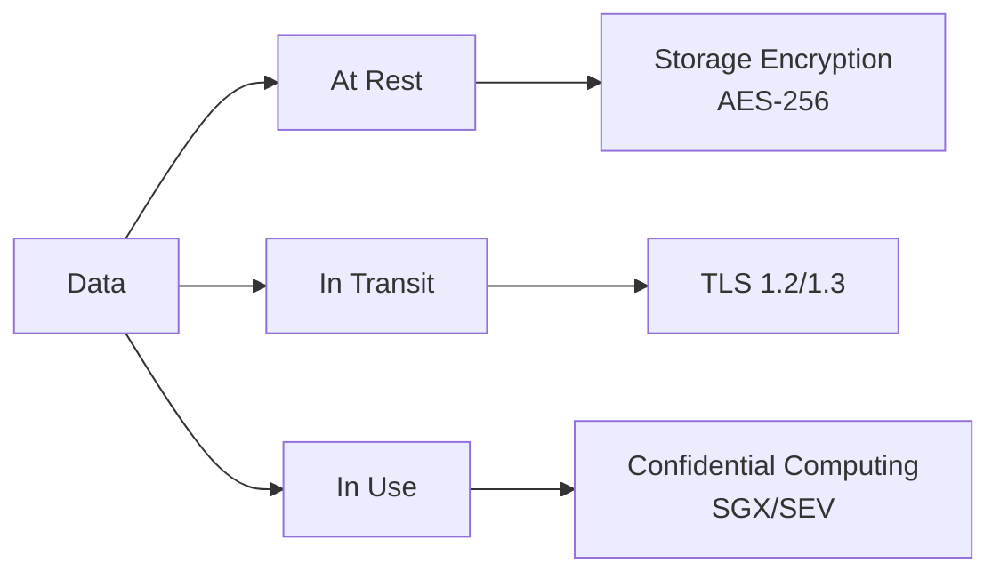

**Encryption at Rest:**

| Service Type | Azure | AWS | Encryption Method |
|--------------|-------|-----|-------------------|
| **Block Storage** | Azure Managed Disks | EBS | AES-256, platform or customer-managed keys |
| **Object Storage** | Blob Storage | S3 | SSE-S3, SSE-KMS, SSE-C |
| **Databases** | SQL Database, Cosmos DB | RDS, DynamoDB | TDE, at-rest encryption |
| **File Storage** | Azure Files | EFS | SMB 3.0 encryption, AES-256 |

**Key Management Hierarchy:**

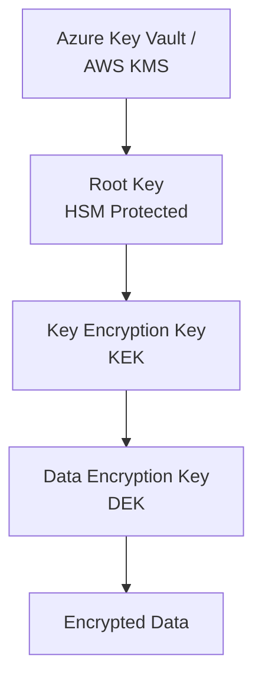

**Customer-Managed Keys (CMK) vs Platform-Managed Keys (PMK):**

| Aspect | Platform-Managed Keys | Customer-Managed Keys |
|--------|----------------------|----------------------|
| **Management** | Fully automated | Customer controlled |
| **Rotation** | Automatic | Manual or automated |
| **Access Control** | Built-in | RBAC/IAM policies |
| **Compliance** | Most regulations | Strict compliance requirements |
| **Cost** | Included | Additional charges for key operations |
| **Use Case** | General workloads | Regulatory compliance, data sovereignty |

**Real-World Example:**

A healthcare provider uses customer-managed keys in Azure Key Vault with HSM protection for HIPAA compliance, enabling them to:
- Rotate encryption keys on their schedule
- Revoke access to data by disabling keys
- Maintain audit logs of all key operations
- Meet regulatory requirements for key custody

> [!IMPORTANT]
> Enable encryption by default for all data stores. Use customer-managed keys (CMK) when regulatory compliance requires key custody control.

**Encryption in Transit:**

| Protocol | Version | Use Case | Configuration |
|----------|---------|----------|---------------|
| **TLS** | 1.2+ (1.3 recommended) | HTTPS, API calls | Enforce minimum TLS version |
| **IPsec** | IKEv2 | VPN connections | Site-to-site, point-to-site VPN |
| **MACsec** | IEEE 802.1AE | ExpressRoute, Direct Connect | Layer 2 encryption |

> [!TIP]
> Disable TLS 1.0 and 1.1 - they have known vulnerabilities. Enforce TLS 1.2 minimum, preferably TLS 1.3.

### Data Loss Prevention (DLP)

DLP policies prevent unauthorized data exfiltration and enforce compliance requirements.

**DLP Policy Workflow:**

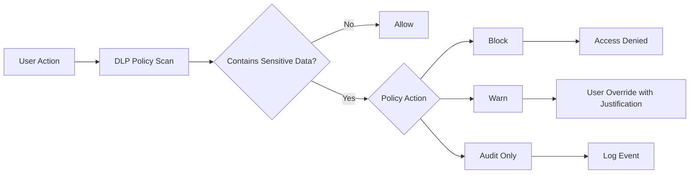

**DLP Scenarios:**

| Scenario | Detection | Action | Tools |
|----------|-----------|--------|-------|
| **Credit card sharing** | Pattern matching (regex) | Block email, log event | Microsoft Purview DLP, AWS Macie |
| **Confidential file download** | Sensitivity labels | Require justification | Microsoft Information Protection |
| **Database export** | Query pattern analysis | Alert security team | Cloud SIEM, database activity monitoring |
| **Unencrypted storage** | Configuration scan | Auto-remediate or alert | Azure Policy, AWS Config |

> [!NOTE]
> DLP effectiveness depends on accurate data classification. Implement classification first, then layer DLP policies on top.

## Regulatory Compliance

Cloud environments must comply with various regulatory frameworks depending on industry and geography.

### Major Compliance Frameworks

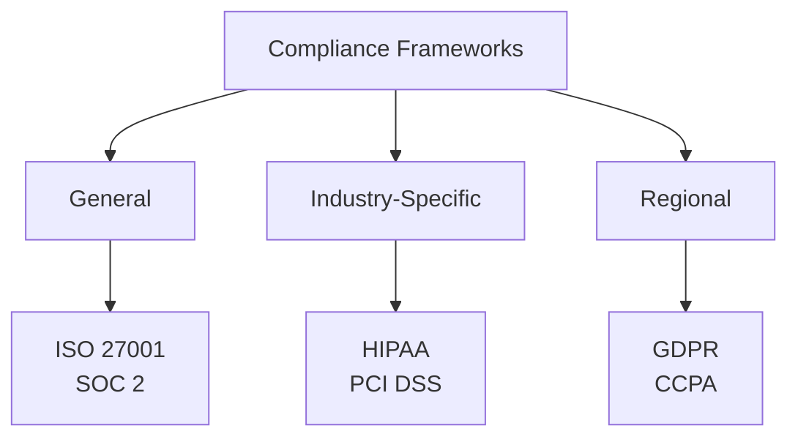

**Framework Comparison:**

| Framework | Scope | Key Requirements | Cloud Responsibility |
|-----------|-------|------------------|---------------------|
| **GDPR** | EU data protection | Data privacy, consent, right to deletion | Shared: Data processing agreements, encryption |
| **HIPAA** | US healthcare | PHI protection, access controls, audit logs | Customer: Application-level controls |
| **PCI DSS** | Payment card data | Network segmentation, encryption, monitoring | Shared: Infrastructure and application controls |
| **SOC 2** | Trust services | Security, availability, confidentiality | Provider: Infrastructure, Customer: Application |
| **ISO 27001** | Information security management | ISMS, risk assessment, controls | Shared: Both parties maintain certification |
| **FedRAMP** | US government | Stringent security controls, continuous monitoring | Provider: Infrastructure certification |

### GDPR Compliance

**GDPR Requirements for Cloud:**

1. **Data Privacy by Design**: Build privacy into architecture from the start
2. **Data Minimization**: Collect only necessary data
3. **Consent Management**: Track and honor user consent
4. **Right to Access**: Users can request their data
5. **Right to Deletion**: Users can request data deletion
6. **Data Portability**: Export data in machine-readable format
7. **Breach Notification**: Report breaches within 72 hours

**GDPR Architecture Pattern:**

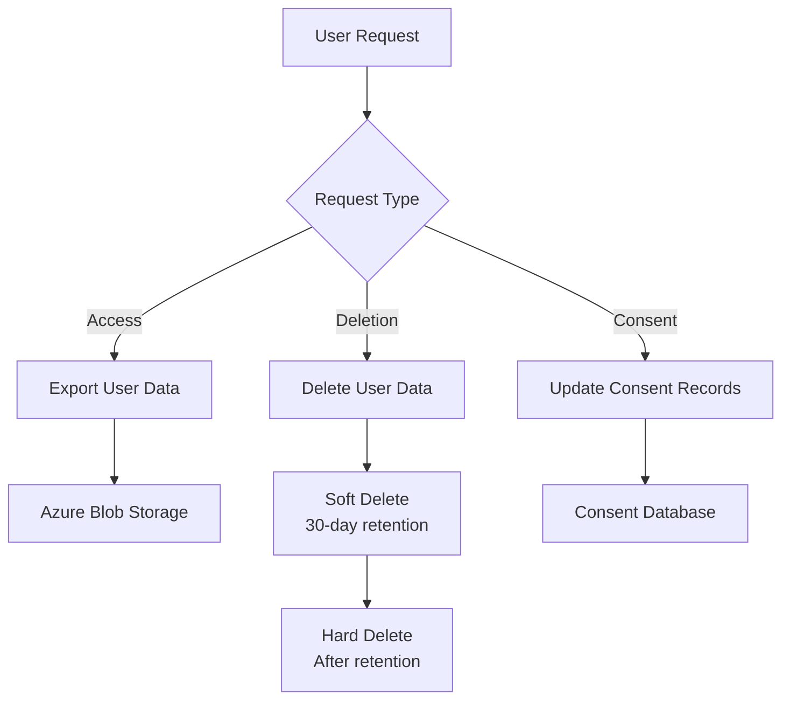

**GDPR-Compliant Data Handling:**

| Requirement | Implementation | Azure Services | AWS Services |
|-------------|----------------|----------------|--------------|
| **Data Residency** | Store data in EU regions | West Europe, North Europe | eu-west-1, eu-central-1 |
| **Encryption** | Encrypt at rest and in transit | Storage encryption, TLS | S3 encryption, TLS |
| **Access Logging** | Audit all data access | Azure Monitor, Log Analytics | CloudTrail, CloudWatch |
| **Data Deletion** | Automated deletion workflows | Azure Functions, Logic Apps | Lambda, Step Functions |
| **Pseudonymization** | Hash/tokenize PII | Azure Key Vault | AWS KMS, DynamoDB |

> [!CAUTION]
> GDPR violations can result in fines up to €20 million or 4% of global revenue. Implement privacy controls before collecting EU citizen data.

### HIPAA Compliance

**HIPAA Technical Safeguards:**

1. **Access Control**: Unique user IDs, automatic logoff, encryption
2. **Audit Controls**: Log all PHI access
3. **Integrity Controls**: Detect unauthorized PHI modification
4. **Transmission Security**: Encrypt PHI in transit

**HIPAA-Compliant Architecture:**

```mermaid
graph TB
    subgraph "HIPAA Compliant Zone"
        A[Healthcare App] --> B[Private Endpoint]
        B --> C[Azure SQL Database<br/>TDE Enabled]
        B --> D[Blob Storage<br/>Encrypted]
        E[Audit Logs] --> F[Log Analytics]
        G[Azure Key Vault<br/>HSM] --> C
        G --> D
    end
    
    H[Public Internet] -.X.-|Blocked| B
```

**HIPAA Controls Mapping:**

| HIPAA Requirement | Azure Implementation | AWS Implementation |
|-------------------|---------------------|-------------------|
| **PHI Encryption** | Storage Service Encryption, TDE | S3 encryption, RDS encryption |
| **Access Controls** | RBAC, Conditional Access | IAM policies, resource policies |
| **Audit Logs** | Azure Monitor, Log Analytics | CloudTrail, CloudWatch Logs |
| **Network Isolation** | Private Link, NSGs | PrivateLink, Security Groups |
| **BAA** | Microsoft BAA required | AWS BAA required |

> [!IMPORTANT]
> Cloud providers offer HIPAA-compliant infrastructure, but customers are responsible for implementing application-level controls and signing Business Associate Agreements (BAA).

### PCI DSS Compliance

**PCI DSS Requirements:**

1. Install and maintain firewall configuration
2. Do not use vendor-supplied defaults
3. Protect stored cardholder data
4. Encrypt transmission of cardholder data
5. Use and regularly update anti-virus software
6. Develop and maintain secure systems
7. Restrict access to cardholder data
8. Assign unique ID to each person with computer access
9. Restrict physical access to cardholder data
10. Track and monitor all access to network resources
11. Regularly test security systems
12. Maintain a policy that addresses information security

**PCI DSS Network Segmentation:**

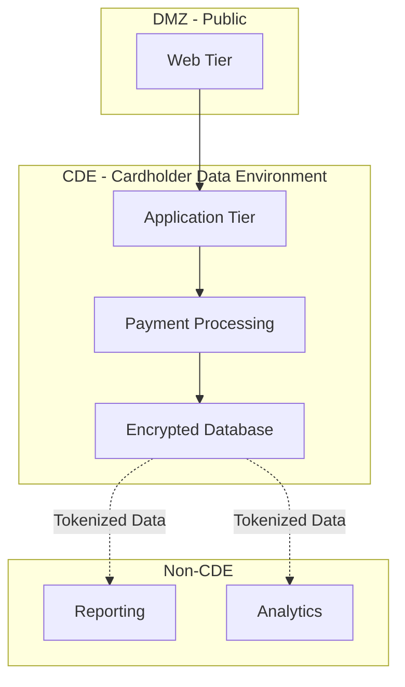

**Tokenization vs Encryption:**

| Approach | How It Works | PCI Scope | Use Case |
|----------|--------------|-----------|----------|
| **Tokenization** | Replace card data with token | Reduces scope significantly | E-commerce, recurring billing |
| **Encryption** | Encrypt card data with keys | CDE must be PCI compliant | When you need actual card data |
| **P2PE** | Point-to-point encryption | Minimal scope | Physical terminals |

**Real-World Example:**

An e-commerce platform uses:
- **Stripe/Adyen** as payment gateway (PCI Level 1 certified)
- **Tokenization** to store payment methods without handling card data
- **Minimal CDE** - only API calls to payment gateway touch card data
- **Result**: 90% reduction in PCI DSS compliance scope

> [!TIP]
> Use third-party PCI-compliant payment processors (Stripe, Adyen, Braintree) to minimize your PCI DSS compliance scope. Never store CVV codes.

## Identity and Access Control

Identity and access management (IAM) controls who can access resources and what actions they can perform.

### Identity Management

**Identity Architecture:**

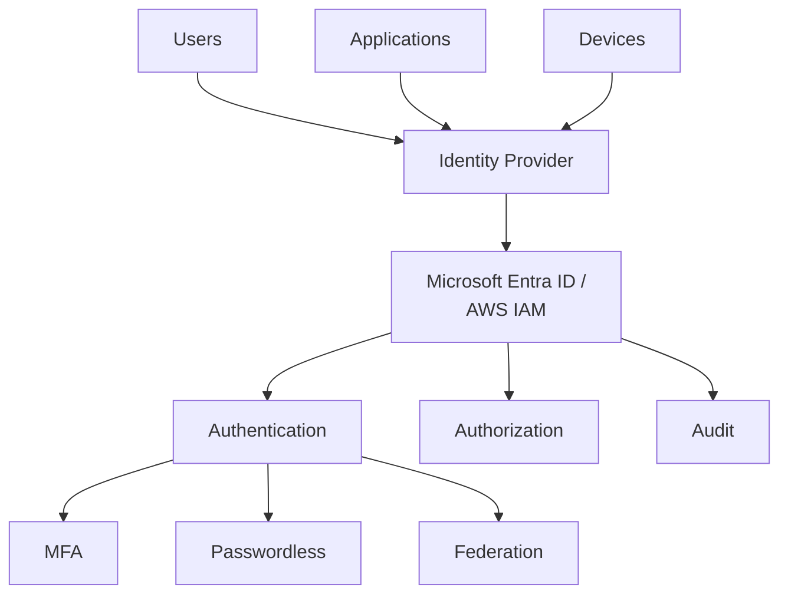

**Identity Types:**

| Type | Description | Examples | Use Case |
|------|-------------|----------|----------|
| **User Identity** | Human users | Employees, contractors | Interactive access |
| **Service Identity** | Applications, services | Managed identities, service principals | Automated access |
| **Device Identity** | Endpoints | Company laptops, mobile devices | Conditional access |
| **Workload Identity** | Cloud resources | VM, container, function | Resource-to-resource |

**Passwordless Authentication:**

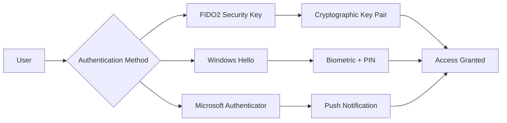

**Benefits of Passwordless:**

- **More Secure**: No passwords to phish or steal
- **Better UX**: Faster login, no password resets
- **Reduced Cost**: Lower helpdesk tickets for password issues

> [!TIP]
> Implement passwordless authentication using FIDO2 security keys, Windows Hello, or biometric authentication to eliminate password-based attacks.

### Access Control Models

**RBAC vs ABAC:**

| Model | How It Works | Pros | Cons | Use Case |
|-------|--------------|------|------|----------|
| **RBAC** | Role-Based Access Control<br/>Permissions assigned to roles | Simple, easy to manage | Role explosion for complex scenarios | Most cloud environments |
| **ABAC** | Attribute-Based Access Control<br/>Permissions based on attributes | Fine-grained, flexible | Complex to implement and debug | Advanced scenarios, compliance |

**RBAC Assignment:**

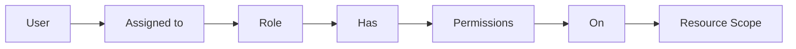

**Common Cloud Roles:**

| Role | Permissions | Use Case |
|------|-------------|----------|
| **Owner** | Full access including access management | Subscription/account administrators |
| **Contributor** | Create and manage resources, no access management | Developers, operations teams |
| **Reader** | View resources only | Auditors, managers |
| **Custom** | Specific permissions | DevOps Engineer, Backup Operator |

**Principle of Least Privilege:**

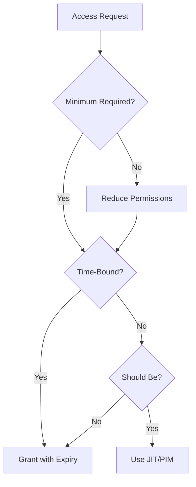

> [!IMPORTANT]
> Always start with the minimum required permissions and add more only when necessary. Use Just-In-Time (JIT) access for privileged operations.

### Privileged Access Management

**Just-In-Time Access:**

| Feature | Azure PIM | AWS IAM Access Analyzer | Purpose |
|---------|-----------|------------------------|---------|
| **Time-Bound Activation** | ✅ | ⚠️ (via temporary credentials) | Temporary elevation |
| **Approval Workflow** | ✅ | ❌ | Require justification |
| **Access Reviews** | ✅ | ✅ | Periodic certification |
| **Alert on Activation** | ✅ | ✅ | Security monitoring |

**PIM Workflow:**

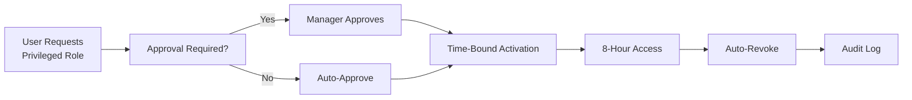

**Real-World Example:**

A company implements Azure PIM requiring:
- **Global Administrator**: 3-hour activation, requires two approvers, MFA verification
- **Subscription Owner**: 8-hour activation, requires one approver
- **Resource Group Contributor**: Self-activation, 4-hour duration
- **Result**: 95% reduction in standing privileged access, full audit trail

> [!CAUTION]
> Standing privileged access is a major security risk. Implement JIT access using Azure PIM or AWS temporary credentials for all administrative operations.

### Service Accounts and Managed Identities

**Managed Identity Benefits:**

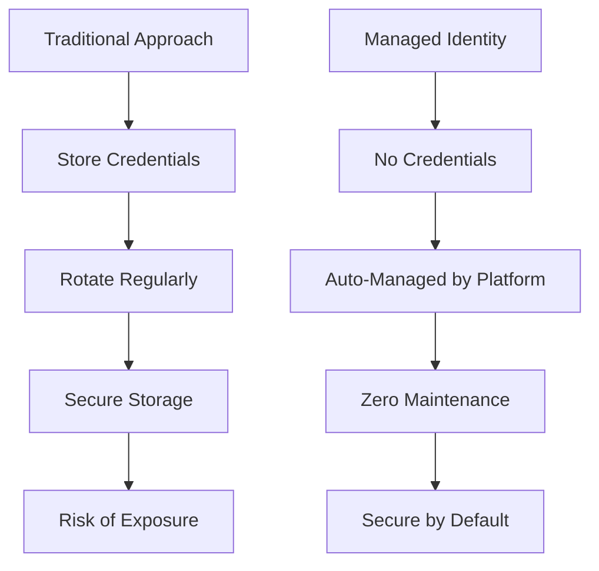

**Managed Identity Types:**

| Type | Lifecycle | Use Case | Configuration |
|------|-----------|----------|---------------|
| **System-Assigned** | Tied to resource | Single resource access | Enabled per resource |
| **User-Assigned** | Independent | Shared across resources | Created separately |

**Example: Azure Function accessing Key Vault:**

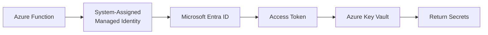

**No Credentials Required:**
- No connection strings in code
- No certificates to rotate
- No passwords to manage
- Automatic token refresh

> [!IMPORTANT]
> Always use managed identities or IAM roles for service-to-service authentication. Never embed credentials in code or configuration files.

## Network Security

## Data Encryption and Key Management

## Threat Detection and Response
